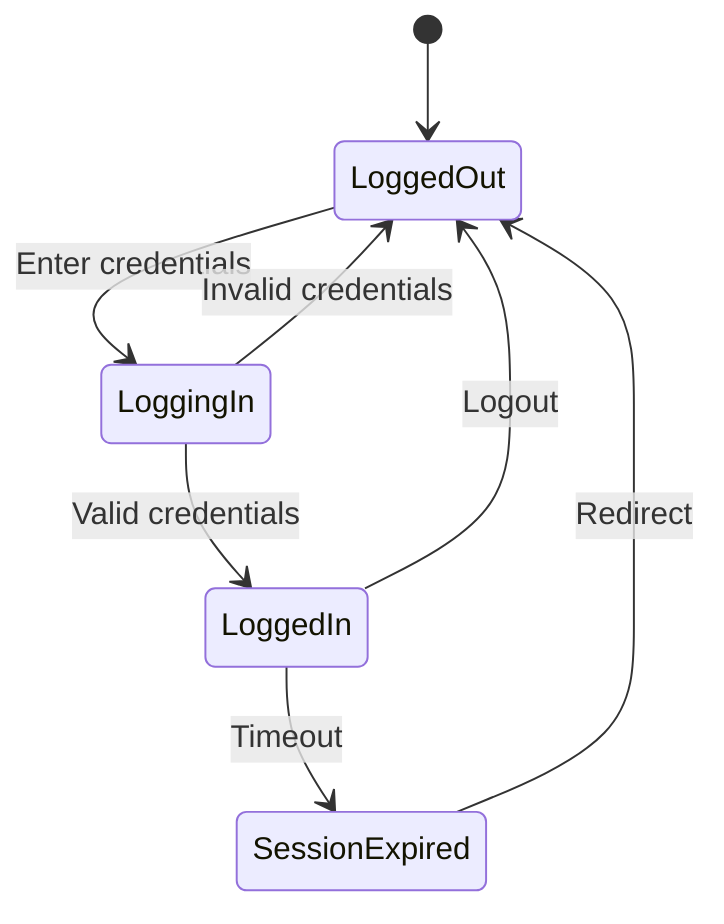

# 🔍 Manual Testing Excellence Guide

> "Automation assists, but human insight discovers"

## 🎯 The Value of Manual Testing

### When Manual Testing is Irreplaceable
- **Exploratory Testing:** Discovering unknown unknowns
- **Usability Testing:** Human perception and experience
- **Ad-hoc Testing:** Creative boundary pushing
- **Visual Testing:** Layout and design validation
- **New Feature Testing:** First-time validation
- **Edge Cases:** Unusual user behaviors

## 🧠 Exploratory Testing Mastery

### Session-Based Test Management (SBTM)

#### Charter Creation Template
```markdown
## Exploratory Testing Charter

**Mission:** Explore [feature/area] to discover [risks/issues]
**Areas:**
- Primary: [Main focus area]
- Secondary: [Related areas]

**Duration:** 90 minutes
**Tester:** [Name]
**Date:** [Date]

**Strategy:**
- Personas to simulate
- Data variations to try
- Environments to test

**Risks to Investigate:**
- Security vulnerabilities
- Performance issues
- Data integrity
- User experience problems
```

#### Testing Heuristics (SFDPOT)
- **S**tructure - What the product is
- **F**unction - What the product does
- **D**ata - What it processes
- **P**latform - What it depends on
- **O**perations - How it's used
- **T**ime - When it's used

### Exploratory Testing Techniques

#### 1. Tours Method
```markdown
## Testing Tours

### 🏙️ Landmark Tour
Visit all major features
- Home page
- Main navigation
- Core functions
- Key workflows

### 💰 Money Tour
Test revenue-generating features
- Payment processing
- Subscription management
- Premium features

### 🗑️ Garbage Collector Tour
Test bad data handling
- Invalid inputs
- Boundary values
- Special characters
- SQL injection attempts

### 🌙 After-Hours Tour
Test time-sensitive features
- Scheduled jobs
- Time zone handling
- Session timeouts
- Date calculations

### 🔥 Saboteur Tour
Try to break things
- Rapid clicking
- Browser back button
- Network interruption
- Concurrent operations
```

#### 2. Mind Mapping Approach
```
         Feature
            |
    +-------+-------+
    |       |       |
  Happy   Error   Edge
  Path    Cases   Cases
    |       |       |
  +-+-+   +-+-+   +-+-+
  | | |   | | |   | | |
```

#### 3. Personas Testing
```markdown
## User Personas

### 👴 Novice Norman
- First-time user
- Unfamiliar with technology
- Needs guidance
- Makes mistakes

### 🚀 Power User Paula
- Keyboard shortcuts
- Bulk operations
- Advanced features
- Efficiency focused

### 😈 Hacker Harry
- Tries to break security
- SQL injection
- XSS attempts
- Authorization bypass

### 📱 Mobile Mary
- Small screen
- Touch interface
- Intermittent connection
- App switching
```

## 🎨 Visual & UX Testing

### Visual Inspection Checklist
```markdown
## Visual Testing Checklist

### Layout & Alignment
- [ ] Elements properly aligned
- [ ] Consistent spacing
- [ ] No overlapping content
- [ ] Responsive breakpoints work

### Typography
- [ ] Readable font sizes
- [ ] Consistent font families
- [ ] Proper line height
- [ ] Text truncation handled

### Colors & Contrast
- [ ] Brand colors consistent
- [ ] Sufficient contrast (WCAG)
- [ ] Color-blind friendly
- [ ] Dark mode support

### Images & Icons
- [ ] Images load properly
- [ ] Alt text present
- [ ] Icons meaningful
- [ ] Proper resolution

### Interactive Elements
- [ ] Buttons clickable
- [ ] Hover states work
- [ ] Focus indicators visible
- [ ] Loading states shown
```

### Cross-Browser Testing Matrix
| Feature | Chrome | Firefox | Safari | Edge |
|---------|--------|---------|--------|------|
| Login | ✅ | ✅ | ⚠️ | ✅ |
| Dashboard | ✅ | ✅ | ✅ | ✅ |
| Forms | ✅ | ❌ | ✅ | ✅ |
| Printing | ✅ | ✅ | ❌ | ✅ |

## 📋 Test Case Design Excellence

### Effective Test Case Structure
```markdown
## Test Case Template

**Test ID:** TC_001
**Title:** Verify user login with valid credentials
**Priority:** P1
**Type:** Functional

**Preconditions:**
1. User account exists
2. Browser cache cleared
3. Application accessible

**Test Steps:**
| Step | Action | Expected Result |
|------|--------|-----------------|
| 1 | Navigate to login page | Login page displays |
| 2 | Enter valid username | Username accepted |
| 3 | Enter valid password | Password masked |
| 4 | Click login button | User logged in successfully |

**Postconditions:**
- User session created
- Dashboard displayed
- Login timestamp recorded

**Test Data:**
- Username: test@example.com
- Password: Test123!
```

### Test Design Techniques

#### State Transition Testing


#### Decision Table
| Conditions | Rule 1 | Rule 2 | Rule 3 | Rule 4 |
|------------|--------|--------|--------|--------|
| Valid User | Y | Y | N | N |
| Valid Pass | Y | N | Y | N |
| **Actions** |  |  |  |  |
| Login Success | ✅ | ❌ | ❌ | ❌ |
| Show Error | ❌ | ✅ | ✅ | ✅ |

## 🐛 Bug Hunting Strategies

### Systematic Bug Discovery

#### Input Field Testing
```markdown
## Input Testing Checklist

### Text Fields
- [ ] Empty input
- [ ] Single character
- [ ] Maximum length
- [ ] Maximum length + 1
- [ ] Special characters (!@#$%^&*)
- [ ] Unicode characters (émojis 😀)
- [ ] HTML tags (<script>)
- [ ] SQL injection ('; DROP TABLE)
- [ ] Leading/trailing spaces
- [ ] Copy-paste behavior

### Numeric Fields
- [ ] Zero
- [ ] Negative numbers
- [ ] Decimals
- [ ] Very large numbers
- [ ] Scientific notation
- [ ] Non-numeric input
```

#### Boundary Testing Examples
```javascript
// Age field: 18-65
Test cases:
17 (below minimum) - Should reject
18 (minimum boundary) - Should accept
19 (above minimum) - Should accept
64 (below maximum) - Should accept
65 (maximum boundary) - Should accept
66 (above maximum) - Should reject
```

#### Time-Based Testing
```markdown
## Time-Sensitive Testing

### Scenarios to Test
- [ ] Session timeout behavior
- [ ] Token expiration
- [ ] Scheduled job execution
- [ ] Time zone changes
- [ ] Daylight saving transitions
- [ ] Leap year handling
- [ ] Date picker edge cases
- [ ] Concurrent user actions
- [ ] Rate limiting
```

## 🔄 Regression Testing Strategy

### Risk-Based Selection
```markdown
## Regression Test Selection Matrix

| Module | Change Frequency | User Impact | Business Critical | Test Priority |
|--------|-----------------|-------------|-------------------|---------------|
| Payment | Low | High | Yes | P1 - Always |
| Search | High | Medium | Yes | P1 - Always |
| Profile | Medium | Low | No | P2 - Often |
| Reports | Low | Low | No | P3 - Sometimes |
```

### Regression Test Checklist
```markdown
## Core Regression Suite

### Critical Business Flows
- [ ] User registration
- [ ] Login/logout
- [ ] Password reset
- [ ] Payment processing
- [ ] Data export
- [ ] Search functionality

### Integration Points
- [ ] API endpoints
- [ ] Database operations
- [ ] Third-party services
- [ ] File uploads/downloads

### Previously Fixed Bugs
- [ ] Bug #123 - Login issue
- [ ] Bug #456 - Data corruption
- [ ] Bug #789 - Performance degradation
```

## 🎯 Usability Testing

### Usability Heuristics (Nielsen)
1. **Visibility of System Status**
   - Loading indicators
   - Progress bars
   - Status messages

2. **Match System to Real World**
   - Familiar terminology
   - Logical flow
   - Natural mappings

3. **User Control & Freedom**
   - Undo/redo
   - Cancel options
   - Clear exits

4. **Consistency & Standards**
   - Platform conventions
   - Internal consistency
   - Predictable behavior

5. **Error Prevention**
   - Confirmation dialogs
   - Input validation
   - Clear constraints

### Usability Testing Script
```markdown
## Usability Test Script

### Introduction (2 min)
"We're testing the application, not you. Please think aloud as you work."

### Tasks
1. **Task 1:** Create a new account (5 min)
   - Observe: Confusion points
   - Note: Time taken
   - Ask: "What did you expect?"

2. **Task 2:** Find and purchase an item (10 min)
   - Observe: Navigation path
   - Note: Errors made
   - Ask: "Was anything unclear?"

### Debrief (5 min)
- What was most frustrating?
- What did you like?
- Any suggestions?
```

## 📱 Mobile Testing Specifics

### Mobile Testing Checklist
```markdown
## Mobile Testing Areas

### Device-Specific
- [ ] Different screen sizes
- [ ] Portrait/landscape rotation
- [ ] Touch gestures (swipe, pinch, tap)
- [ ] Hardware buttons
- [ ] Camera integration
- [ ] GPS functionality

### Network Conditions
- [ ] WiFi
- [ ] 3G/4G/5G
- [ ] Airplane mode
- [ ] Network switching
- [ ] Low bandwidth
- [ ] Connection loss

### App Lifecycle
- [ ] Installation
- [ ] Updates
- [ ] Background/foreground
- [ ] Push notifications
- [ ] Memory management
- [ ] Battery consumption
```

## 🛠️ Manual Testing Tools

### Essential Toolkit
```markdown
## Manual Tester's Toolbox

### Browser Tools
- Developer Console (F12)
- Network Inspector
- Mobile Emulator
- Cookie Editor
- JSON Viewer

### Testing Utilities
- Postman (API testing)
- BrowserStack (Cross-browser)
- LambdaTest (Device testing)
- NVDA/JAWS (Accessibility)
- Color Contrast Analyzer

### Documentation Tools
- Screen recorders (OBS, Loom)
- Screenshot tools (Snagit, ShareX)
- Bug tracking (JIRA, Azure DevOps)
- Mind mapping (XMind, MindMeister)
- Note-taking (Notion, OneNote)
```

## 📊 Manual Test Reporting

### Test Execution Report Template
```markdown
# Test Execution Report

## Summary
- **Date:** [Date]
- **Build:** [Version]
- **Environment:** [Staging/Production]
- **Tester:** [Name]

## Results Overview
- Total Cases: 50
- Passed: 45 (90%)
- Failed: 3 (6%)
- Blocked: 2 (4%)

## Failed Test Details
| Test ID | Title | Failure Reason | Severity |
|---------|-------|----------------|----------|
| TC_015 | Login validation | Error message incorrect | Medium |
| TC_023 | Payment flow | Gateway timeout | Critical |
| TC_041 | Report export | PDF corrupt | High |

## Blocked Tests
- TC_018: Environment not ready
- TC_029: Dependency on TC_023

## Risks & Recommendations
1. Payment gateway instability - needs immediate attention
2. Consider rollback if payment issue not resolved
3. Additional testing needed for report module
```

## 🏆 Advanced Manual Testing

### Accessibility Testing
```markdown
## Accessibility Checklist

### Keyboard Navigation
- [ ] Tab order logical
- [ ] All elements reachable
- [ ] Skip links present
- [ ] Focus indicators visible

### Screen Reader
- [ ] Proper heading hierarchy
- [ ] Alt text for images
- [ ] ARIA labels correct
- [ ] Form labels associated

### Visual
- [ ] Color contrast sufficient
- [ ] Text resizable to 200%
- [ ] No color-only information
- [ ] Animations pauseable
```

### Security Testing (Manual)
```markdown
## Security Test Scenarios

### Authentication
- [ ] Brute force protection
- [ ] Password complexity enforced
- [ ] Session management
- [ ] Multi-factor authentication

### Authorization
- [ ] Role-based access
- [ ] Direct object reference
- [ ] Privilege escalation
- [ ] Cross-tenant access

### Input Validation
- [ ] XSS attempts
- [ ] SQL injection
- [ ] Command injection
- [ ] Path traversal
```

## 💡 Best Practices

### Do's and Don'ts

#### ✅ DO:
- Document everything
- Think like a user
- Question assumptions
- Verify fixes
- Share knowledge
- Be systematic
- Stay curious

#### ❌ DON'T:
- Test without context
- Skip documentation
- Assume anything
- Test in production (without permission)
- Ignore "small" bugs
- Work in isolation

## 🎓 Continuous Improvement

### Skill Development Path
```markdown
## Manual Testing Mastery Levels

### Level 1: Novice
- Execute test cases
- Report bugs clearly
- Basic tool usage

### Level 2: Intermediate
- Design test cases
- Exploratory testing
- Domain expertise

### Level 3: Advanced
- Test strategy creation
- Mentoring others
- Tool expertise

### Level 4: Expert
- Process improvement
- Innovation in testing
- Thought leadership
```

### Learning Resources
- **Books:** "Explore It!" by Elisabeth Hendrickson
- **Courses:** ISTQB Foundation
- **Communities:** Ministry of Testing
- **Practice:** Testing challenges, Bug bounties

---

*"The best tester isn't the one who finds the most bugs, but the one who helps ship better software."*