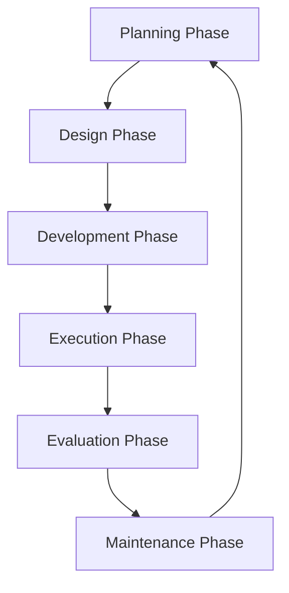
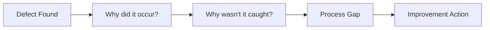

# 🔄 Complete Testing Phases & Methodologies

## 📊 Testing Phases Overview



## 🎯 Phase 1: Test Planning

### Objectives
- Define testing scope and objectives
- Identify risks and mitigation strategies
- Allocate resources and timeline
- Establish success criteria

### Key Deliverables
1. **Test Strategy Document**
   - High-level approach
   - Testing types to implement
   - Tools and frameworks selection
   - Risk assessment matrix

2. **Test Plan**
   - Detailed scope
   - Test scenarios
   - Resource allocation
   - Timeline and milestones

### Planning Best Practices
```markdown
✅ DO:
- Involve stakeholders early
- Define clear exit criteria
- Plan for test environment needs
- Consider test data requirements

❌ DON'T:
- Skip risk assessment
- Underestimate time needs
- Ignore dependencies
- Plan in isolation
```

## 🔍 Phase 2: Test Design

### Test Case Development Approach

#### 1. Requirements Analysis
```gherkin
Given a requirement
When analyzing for testability
Then identify:
  - Happy path scenarios
  - Edge cases
  - Error conditions
  - Performance criteria
  - Security considerations
```

#### 2. Test Design Techniques

**Equivalence Partitioning:**
```
Input Range: 1-100
Partitions:
- Valid: 1-100
- Invalid: <1, >100, non-numeric
Test Cases: 50 (valid), 0 (invalid), 101 (invalid), "abc" (invalid)
```

**Boundary Value Analysis:**
```
Boundaries: 1, 100
Test Cases: 0, 1, 2, 99, 100, 101
```

**Decision Table Testing:**
| Condition | Rule 1 | Rule 2 | Rule 3 | Rule 4 |
|-----------|--------|--------|--------|--------|
| Login Valid | Y | Y | N | N |
| Password Valid | Y | N | Y | N |
| **Action** | **Login** | **Error** | **Error** | **Error** |

**State Transition Testing:**
```
States: [Logged Out] -> [Logging In] -> [Logged In] -> [Logged Out]
Test: Valid transitions + Invalid attempts
```

## 🏗️ Phase 3: Test Development

### Test Pyramid Implementation

```
         E2E Tests (10%)
        /---------------\
       /                 \
      /  Integration (30%) \
     /---------------------\
    /                       \
   /     Unit Tests (60%)    \
  /---------------------------\
```

### Unit Testing
**Purpose:** Validate individual components

```javascript
describe('Calculator', () => {
  it('should add two numbers correctly', () => {
    expect(add(2, 3)).toBe(5);
  });

  it('should handle negative numbers', () => {
    expect(add(-1, 1)).toBe(0);
  });
});
```

**Coverage Goals:**
- Line Coverage: 80%+
- Branch Coverage: 75%+
- Function Coverage: 90%+

### Integration Testing
**Purpose:** Validate component interactions

```java
@Test
public void testUserServiceIntegration() {
    // Test service layer with database
    User user = userService.createUser("John", "john@test.com");
    assertNotNull(user.getId());

    // Verify database persistence
    User retrieved = userService.getUserById(user.getId());
    assertEquals("John", retrieved.getName());
}
```

**Focus Areas:**
- API contracts
- Database transactions
- Service communication
- Message queues
- External dependencies

### System Testing
**Purpose:** Validate complete system behavior

**Types:**
1. **Functional Testing**
   - Feature validation
   - User journey testing
   - Cross-browser testing

2. **Non-Functional Testing**
   - Performance testing
   - Security testing
   - Usability testing
   - Accessibility testing

### End-to-End Testing
**Purpose:** Validate complete user workflows

```javascript
test('Complete purchase flow', async () => {
  await loginAsUser();
  await searchForProduct('laptop');
  await addToCart();
  await checkout();
  await verifyOrderConfirmation();
});
```

## 🚀 Phase 4: Test Execution

### Execution Strategy

#### Manual Execution
1. **Exploratory Testing Sessions**
   - Time-boxed sessions (90 minutes)
   - Charter-based exploration
   - Bug hunting focus
   - Note-taking discipline

2. **Ad-hoc Testing**
   - Intuition-based
   - Random scenarios
   - Edge case discovery

3. **Scripted Testing**
   - Step-by-step execution
   - Expected results validation
   - Evidence collection

#### Automated Execution
```yaml
# CI/CD Pipeline Integration
stages:
  - unit-tests:
      parallel: true
      timeout: 5m

  - integration-tests:
      parallel: false
      timeout: 15m

  - e2e-tests:
      parallel: true
      browsers: [chrome, firefox, safari]
      timeout: 30m
```

### Execution Best Practices
1. **Test Environment Management**
   - Environment parity
   - Data refresh strategies
   - Configuration management
   - Access control

2. **Test Data Management**
   ```sql
   -- Test data setup
   INSERT INTO test_users
   SELECT * FROM user_templates WHERE type = 'test';

   -- Test data cleanup
   DELETE FROM users WHERE email LIKE '%@test.com';
   ```

3. **Defect Management**
   ```markdown
   ## Bug Report Template
   **Title:** Clear, concise description
   **Severity:** Critical/High/Medium/Low
   **Priority:** P1/P2/P3/P4
   **Steps to Reproduce:**
   1. Step one
   2. Step two
   **Expected Result:** What should happen
   **Actual Result:** What actually happens
   **Environment:** Browser, OS, Version
   **Evidence:** Screenshots, logs
   ```

## 📈 Phase 5: Test Evaluation

### Metrics & Reporting

#### Quality Metrics Dashboard
```
┌─────────────────────────────────────┐
│        Quality Dashboard            │
├─────────────────────────────────────┤
│ Test Coverage: ████████░░ 82%       │
│ Pass Rate:     █████████░ 94%       │
│ Defect Density: 0.3 bugs/KLOC       │
│ MTTR: 2.4 hours                     │
│ Automation: ███████░░░ 70%          │
└─────────────────────────────────────┘
```

#### Key Performance Indicators
1. **Process Metrics**
   - Test execution time
   - Automation percentage
   - Test effectiveness
   - Defect detection rate

2. **Product Metrics**
   - Defect density
   - Code coverage
   - Performance benchmarks
   - Security scan results

3. **Project Metrics**
   - Schedule adherence
   - Budget compliance
   - Resource utilization
   - Risk mitigation success

### Root Cause Analysis


## 🔧 Phase 6: Test Maintenance

### Test Suite Health

#### Signs of Unhealthy Test Suite
- 🚨 Flaky tests (>5%)
- 🐌 Slow execution (>30 min)
- 📉 Low value tests
- 🔁 Duplicate coverage
- 🏚️ Unmaintained tests

#### Maintenance Activities
1. **Regular Cleanup**
   ```javascript
   // Mark obsolete tests
   test.skip('deprecated feature test', () => {
     // TODO: Remove in next sprint
   });
   ```

2. **Performance Optimization**
   ```javascript
   // Before: Sequential execution
   for (const user of users) {
     await testUserCreation(user);
   }

   // After: Parallel execution
   await Promise.all(
     users.map(user => testUserCreation(user))
   );
   ```

3. **Test Refactoring**
   ```javascript
   // Extract common setup
   beforeEach(async () => {
     await setupTestDatabase();
     await createTestUsers();
   });
   ```

## 🎪 Special Testing Types

### Regression Testing
**Strategy:** Risk-based selection
```
Priority 1: Core business flows
Priority 2: Recently changed areas
Priority 3: High-usage features
Priority 4: Edge functionality
```

### Smoke Testing
**Quick validation suite (5-10 minutes)**
- Application starts
- Login works
- Core navigation functional
- Database connectivity
- API health check

### Sanity Testing
**Focused validation after fixes**
- Specific fix validation
- Related functionality check
- No side effects verification

### User Acceptance Testing (UAT)
**Business validation**
```markdown
UAT Checklist:
□ Business requirements met
□ User workflows complete
□ Performance acceptable
□ Usability satisfactory
□ Documentation adequate
□ Training materials ready
```

## 🔄 Testing Methodologies

### Agile Testing
**Principles:**
- Continuous testing
- Early and frequent
- Whole team approach
- Adapt to change

**Sprint Testing Activities:**
```
Sprint Planning: Test planning, estimation
Daily: Test execution, collaboration
Sprint Review: Demo test results
Retrospective: Process improvement
```

### Risk-Based Testing
**Risk Assessment Matrix:**
| Feature | Probability | Impact | Risk Score | Priority |
|---------|-------------|---------|------------|----------|
| Payment | High | Critical | 9 | P1 |
| Search | Medium | High | 6 | P2 |
| Profile | Low | Low | 1 | P4 |

### Shift-Left Testing
```
Traditional: Requirements → Design → Code → Test
Shift-Left:  Requirements + Test → Design + Test → Code + Test
```

**Benefits:**
- Early defect detection
- Reduced fix cost
- Better requirements
- Faster delivery

### Shift-Right Testing
**Production Testing:**
- Feature flags
- Canary releases
- A/B testing
- Chaos engineering
- Real user monitoring

## 🏆 Advanced Testing Concepts

### Mutation Testing
**Validate test quality by introducing bugs**
```javascript
// Original code
function isPositive(n) {
  return n > 0;
}

// Mutation
function isPositive(n) {
  return n >= 0;  // Changed > to >=
}
// Good tests should catch this
```

### Property-Based Testing
**Generate test cases automatically**
```python
@given(st.integers())
def test_addition_commutative(a, b):
    assert add(a, b) == add(b, a)
```

### Contract Testing
**Ensure API compatibility**
```javascript
// Consumer contract
expect(response).toMatchContract({
  id: expect.any(Number),
  name: expect.any(String),
  email: expect.stringMatching(/@/)
});
```

### Chaos Engineering
**Test system resilience**
```yaml
experiments:
  - name: "API Latency"
    actions:
      - inject-latency:
          service: payment-api
          latency: 3000ms
    validations:
      - circuit-breaker-triggered
      - fallback-activated
```

## 📝 Testing Documentation

### Essential Documents
1. **Test Strategy** - Overall approach
2. **Test Plan** - Detailed planning
3. **Test Cases** - Execution steps
4. **Test Reports** - Results and metrics
5. **Defect Reports** - Issue tracking
6. **Test Closure Report** - Final summary

### Living Documentation
```gherkin
# Features serve as documentation
Feature: User Authentication
  Documents how users access the system

  Scenario: Successful login
    Documents the happy path
    Given valid credentials
    When user logs in
    Then access is granted
```

## 🎯 Key Takeaways

### Remember These Principles
1. **Test early, test often** - Shift left approach
2. **Automate wisely** - Not everything needs automation
3. **Risk-based prioritization** - Focus on what matters
4. **Continuous improvement** - Learn from metrics
5. **Collaboration is key** - Quality is team responsibility

### Testing Excellence Checklist
- [ ] Clear test strategy defined
- [ ] Appropriate test levels implemented
- [ ] Automation where valuable
- [ ] Metrics driving decisions
- [ ] Continuous feedback loops
- [ ] Regular test maintenance
- [ ] Team collaboration active
- [ ] User focus maintained

---

*"Testing is not about finding bugs; it's about delivering confidence."*