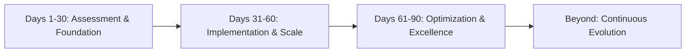
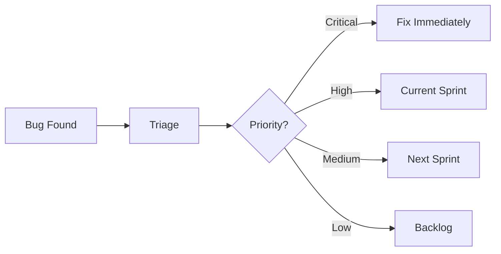

# 🚀 90-Day Quality Implementation Roadmap

> "From Zero to Quality Hero: Building Excellence from Scratch"

## 🎯 Overview: The Transformation Journey



## 📅 Week 0: Pre-Start Preparation

### Before Day 1
- [ ] Research company tech stack
- [ ] Understand product/domain
- [ ] Prepare assessment questions
- [ ] Set up personal tools
- [ ] Plan stakeholder meetings

## 🔍 MONTH 1: Assessment & Foundation (Days 1-30)

### 🗓️ Week 1: Discovery & Assessment

#### Day 1-2: Orientation & Observation
**Morning:**
- Meet team members
- Understand team structure
- Get system access
- Set up development environment

**Afternoon:**
- Shadow team processes
- Attend existing meetings
- Review documentation
- Explore the application

**Key Questions to Ask:**
```markdown
1. What keeps you up at night about quality?
2. What's the current release process?
3. How do we know if something is ready?
4. What are the main pain points?
5. How do customers report issues?
```

#### Day 3-4: Technical Assessment
**Evaluate Current State:**
```markdown
## Assessment Checklist
### Code & Architecture
- [ ] Code repository structure
- [ ] Architecture documentation
- [ ] Technical debt inventory
- [ ] Code review process

### Testing
- [ ] Existing test coverage
- [ ] Test environments
- [ ] Test data management
- [ ] Automation (if any)

### Process
- [ ] CI/CD pipeline
- [ ] Deployment frequency
- [ ] Incident management
- [ ] Bug tracking system
```

**Create Assessment Report:**
```markdown
# Quality Assessment Report

## Current State
- **Testing Coverage:** [X]%
- **Automation Level:** [None/Basic/Moderate/Advanced]
- **Release Frequency:** [Daily/Weekly/Monthly]
- **Average Bug Count:** [X per release]
- **MTTR:** [X hours]

## Key Findings
1. 🔴 Critical Gaps
2. 🟡 Improvement Areas
3. 🟢 Existing Strengths

## Immediate Risks
- Risk 1: [Description]
- Risk 2: [Description]
```

#### Day 5: Strategic Planning
**Create 90-Day Vision:**
```markdown
# 90-Day Quality Vision

## Goals
1. Reduce production bugs by 50%
2. Implement basic automation (30% coverage)
3. Establish quality metrics dashboard
4. Create testing standards

## Success Metrics
- Defect escape rate < 5%
- Test automation > 30%
- CI/CD pipeline with quality gates
- Team quality score > 7/10
```

### 🗓️ Week 2: Quick Wins & Trust Building

#### Days 6-8: Implement First Quick Wins
**High-Impact, Low-Effort Actions:**
```markdown
## Quick Win Options (Choose 3-5)
- [ ] Create bug report template
- [ ] Set up basic smoke tests
- [ ] Document critical test cases
- [ ] Implement pre-commit hooks
- [ ] Create test environment inventory
- [ ] Start daily quality standup
- [ ] Set up error monitoring tool
- [ ] Create known issues list
```

**Example Smoke Test Suite:**
```javascript
// smoke-tests.js - 5-minute validation
describe('Smoke Tests', () => {
  test('Application loads', async () => {
    const response = await fetch(APP_URL);
    expect(response.status).toBe(200);
  });

  test('Login works', async () => {
    const result = await login('test@user.com', 'password');
    expect(result.token).toBeDefined();
  });

  test('Database connects', async () => {
    const connection = await db.ping();
    expect(connection).toBe(true);
  });
});
```

#### Days 9-10: Stakeholder Buy-In
**Present Initial Findings:**
```markdown
# Quality Improvement Proposal

## Current Challenges
- Manual testing taking 3 days
- No regression confidence
- Production issues weekly

## Proposed Solutions
1. **Week 2-3:** Basic automation
2. **Week 4:** CI/CD integration
3. **Month 2:** Full test coverage

## Expected ROI
- 50% reduction in testing time
- 75% fewer production issues
- 2x faster releases
```

### 🗓️ Week 3: Process Foundation

#### Days 11-13: Establish Basic Processes
**Testing Process Documentation:**
```markdown
# Testing Process v1.0

## Definition of Ready
- [ ] Acceptance criteria defined
- [ ] Test scenarios reviewed
- [ ] Test data identified

## Definition of Done
- [ ] Unit tests written
- [ ] Code reviewed
- [ ] Integration tests pass
- [ ] Documentation updated
```

**Bug Workflow:**


#### Days 14-15: Test Infrastructure Setup
```yaml
# Basic CI/CD Pipeline
stages:
  - build:
      script: npm install && npm build

  - test:
      script: npm test

  - quality-check:
      script:
        - npm run lint
        - npm run test:coverage
        - npm audit

  - deploy:
      script: ./deploy.sh
      only: main
```

### 🗓️ Week 4: Team Enablement

#### Days 16-18: Knowledge Sharing
**Testing Workshop Agenda:**
```markdown
# Testing Excellence Workshop (2 hours)

## Part 1: Why Testing Matters (30 min)
- Cost of bugs over time
- Testing pyramid concept
- ROI of automation

## Part 2: Hands-On Session (60 min)
- Writing first unit test together
- Creating integration test
- Debugging failed tests

## Part 3: Tools & Resources (30 min)
- Testing tools overview
- Documentation walkthrough
- Q&A session
```

#### Days 19-20: Pairing Sessions
- Pair with developers on test writing
- Show debugging techniques
- Share testing best practices

### 🗓️ Week 5 (Bonus): First Month Wrap-Up

#### Days 21-30: Foundation Completion
**Deliverables Checklist:**
```markdown
## Month 1 Deliverables
- [x] Quality assessment complete
- [x] Basic smoke tests running
- [x] Bug tracking process defined
- [x] Team workshop delivered
- [x] CI/CD pipeline with tests
- [x] First automation framework setup
- [x] Quality metrics baseline
- [ ] Month 1 report prepared
```

## 🚀 MONTH 2: Implementation & Scale (Days 31-60)

### 🗓️ Week 5-6: Automation Framework

#### Days 31-35: Framework Development
```javascript
// test-framework/base.config.js
module.exports = {
  baseURL: process.env.BASE_URL,
  timeout: 30000,
  retries: 2,
  parallel: true,
  reporters: ['html', 'junit'],

  projects: [
    { name: 'Chrome', use: { ...devices['Desktop Chrome'] } },
    { name: 'Firefox', use: { ...devices['Desktop Firefox'] } },
  ],
};
```

**Page Object Pattern:**
```javascript
// pages/LoginPage.js
class LoginPage {
  constructor(page) {
    this.page = page;
    this.emailInput = page.locator('#email');
    this.passwordInput = page.locator('#password');
    this.submitButton = page.locator('button[type="submit"]');
  }

  async login(email, password) {
    await this.emailInput.fill(email);
    await this.passwordInput.fill(password);
    await this.submitButton.click();
  }
}
```

#### Days 36-40: Critical Path Automation
**Priority Test Scenarios:**
```markdown
## P1 - Critical User Journeys
1. User Registration & Login
2. Core Business Transaction
3. Payment Processing
4. Data Export/Import
5. Admin Functions
```

### 🗓️ Week 7-8: API & Database Testing

#### Days 41-45: API Test Suite
```javascript
// api-tests/user.test.js
describe('User API', () => {
  test('Create user', async () => {
    const response = await api.post('/users', {
      name: 'Test User',
      email: 'test@example.com'
    });

    expect(response.status).toBe(201);
    expect(response.data.id).toBeDefined();
  });

  test('Get user', async () => {
    const response = await api.get('/users/123');

    expect(response.status).toBe(200);
    expect(response.data).toMatchSchema(userSchema);
  });
});
```

#### Days 46-50: Database Validation
```sql
-- Data integrity tests
CREATE PROCEDURE sp_TestDataIntegrity
AS
BEGIN
    -- Orphaned records check
    SELECT COUNT(*) as OrphanedOrders
    FROM Orders o
    LEFT JOIN Customers c ON o.CustomerId = c.Id
    WHERE c.Id IS NULL;

    -- Duplicate check
    SELECT Email, COUNT(*) as DuplicateCount
    FROM Users
    GROUP BY Email
    HAVING COUNT(*) > 1;
END
```

### 🗓️ Week 8: Performance & Security

#### Days 51-55: Performance Baseline
```javascript
// performance/lighthouse.js
const lighthouse = require('lighthouse');

async function auditPerformance(url) {
  const result = await lighthouse(url, {
    onlyCategories: ['performance'],
  });

  const metrics = {
    FCP: result.lhr.audits['first-contentful-paint'].numericValue,
    LCP: result.lhr.audits['largest-contentful-paint'].numericValue,
    TTI: result.lhr.audits['interactive'].numericValue,
  };

  // Assert performance budgets
  expect(metrics.FCP).toBeLessThan(2000);
  expect(metrics.LCP).toBeLessThan(3000);
}
```

#### Days 56-60: Security Scanning
```yaml
# Security pipeline integration
security-scan:
  stage: test
  script:
    - npm audit --audit-level=moderate
    - dependency-check --scan .
    - owasp-zap-scan --target $APP_URL
```

## 🏆 MONTH 3: Optimization & Excellence (Days 61-90)

### 🗓️ Week 9-10: Advanced Automation

#### Days 61-70: Visual & E2E Testing
```javascript
// Visual regression testing
test('Homepage visual consistency', async () => {
  await page.goto('/');
  await expect(page).toHaveScreenshot('homepage.png', {
    maxDiffPixels: 100,
    threshold: 0.2,
  });
});

// E2E user journey
test('Complete purchase flow', async () => {
  await user.login();
  await product.search('laptop');
  await cart.add(product);
  await checkout.complete();
  await order.verify();
});
```

### 🗓️ Week 11-12: Continuous Improvement

#### Days 71-80: Metrics & Optimization
**Quality Dashboard Implementation:**
```markdown
## Quality Metrics Dashboard

### Real-Time Metrics
- Current Build Status: ✅
- Test Coverage: 73%
- Open Bugs: 12
- Automation Rate: 65%

### Trends (Last 30 Days)
- Defect Escape Rate: ↓ 15%
- MTTR: ↓ 2.5 hours
- Test Execution Time: ↓ 45%
- Code Coverage: ↑ 25%
```

#### Days 81-90: Knowledge Transfer & Documentation
**Create Comprehensive Documentation:**
```markdown
## Testing Playbook

### 1. Test Strategy
- Approach and methodology
- Tools and frameworks
- Team responsibilities

### 2. How-To Guides
- Writing unit tests
- Creating E2E tests
- Debugging failures

### 3. Best Practices
- Code standards
- Review checklist
- Maintenance guide

### 4. Troubleshooting
- Common issues
- Solutions database
- Contact points
```

## 📊 Success Metrics & KPIs

### Month 1 Targets
- ✅ Smoke tests implemented
- ✅ Basic CI/CD pipeline
- ✅ Bug tracking process
- ✅ Team awareness increased

### Month 2 Targets
- ✅ 30% automation coverage
- ✅ API testing framework
- ✅ Performance baselines
- ✅ Security scanning

### Month 3 Targets
- ✅ 60% automation coverage
- ✅ Visual testing
- ✅ Quality dashboard
- ✅ Team self-sufficient

## 🎯 Daily Execution Guide

### Daily Routine
```markdown
## QA Daily Schedule

### Morning (9:00-10:00)
- [ ] Check overnight test results
- [ ] Review new bugs
- [ ] Update quality dashboard
- [ ] Plan day's priorities

### Mid-Morning (10:00-12:00)
- [ ] Test execution/automation
- [ ] Code reviews
- [ ] Pairing sessions

### Afternoon (14:00-17:00)
- [ ] Feature testing
- [ ] Framework development
- [ ] Documentation

### End of Day (17:00-18:00)
- [ ] Update test results
- [ ] Prepare next day
- [ ] Team sync if needed
```

## 🚨 Risk Mitigation

### Common Challenges & Solutions

| Challenge | Solution |
|-----------|----------|
| Resistance to change | Show value through quick wins |
| Lack of time | Automate repetitive tasks first |
| Technical debt | Incremental improvement approach |
| No test data | Implement test data factory |
| Flaky tests | Add retry logic and stabilization |

## 🎓 Continuous Learning Plan

### Month 1: Foundation
- Testing fundamentals
- Tool basics
- Domain knowledge

### Month 2: Advanced
- Framework design
- Performance testing
- Security testing

### Month 3: Excellence
- AI/ML testing
- Chaos engineering
- Advanced metrics

## 📈 Beyond 90 Days

### Next Steps
1. **Scale automation to 80%**
2. **Implement AI-driven testing**
3. **Chaos engineering**
4. **Predictive quality analytics**
5. **Center of Excellence creation**

### Long-term Vision
```markdown
Year 1: Quality Foundation
Year 2: Quality Excellence
Year 3: Quality Innovation
```

## 🏁 Final Checklist

### Before Starting
- [ ] Understand company culture
- [ ] Know the product
- [ ] Have tools ready
- [ ] Set clear goals

### Week 1
- [ ] Complete assessment
- [ ] Build relationships
- [ ] Identify quick wins
- [ ] Create initial plan

### Month 1
- [ ] Establish processes
- [ ] Implement basics
- [ ] Gain trust
- [ ] Show value

### Month 2
- [ ] Build framework
- [ ] Scale automation
- [ ] Enable team
- [ ] Measure progress

### Month 3
- [ ] Optimize processes
- [ ] Transfer knowledge
- [ ] Establish excellence
- [ ] Plan future

---

**Remember:** *"Quality is a journey, not a destination. These 90 days are just the beginning of continuous excellence."*

**Your Success Mantra:** *"Assess, Implement, Optimize, Repeat"*