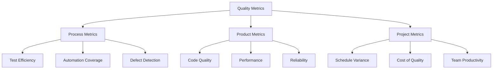

# 📊 Quality Metrics & KPIs Framework

> "What gets measured gets managed, what gets managed gets improved"

## 🎯 Metrics Strategy Overview

### The Three Pillars of Quality Metrics



## 📈 Core Quality KPIs

### Tier 1: Executive Dashboard (C-Level View)

| KPI | Formula | Target | Frequency |
|-----|---------|--------|-----------|
| **Quality Score** | Weighted average of all metrics | >85% | Daily |
| **Customer Satisfaction** | NPS + Support Tickets | >70 NPS | Weekly |
| **Release Confidence** | Successful Releases / Total | >95% | Per Release |
| **Cost of Quality** | Prevention + Appraisal + Failure costs | <20% of Dev Cost | Monthly |
| **Time to Market** | Feature Request → Production | <30 days | Monthly |

### Tier 2: Management Metrics (Team Lead View)

| Metric | Formula | Good | Warning | Critical |
|--------|---------|------|---------|----------|
| **Defect Escape Rate** | Prod Bugs / Total Bugs × 100 | <5% | 5-10% | >10% |
| **MTTR** | Σ(Recovery Time) / Incidents | <2h | 2-4h | >4h |
| **Test Coverage** | Covered Lines / Total Lines × 100 | >80% | 60-80% | <60% |
| **Automation Rate** | Automated Tests / Total Tests × 100 | >70% | 50-70% | <50% |
| **Sprint Quality** | Stories without Bugs / Total × 100 | >90% | 75-90% | <75% |

### Tier 3: Team Metrics (Daily Operations)

```markdown
## Daily Quality Metrics

### Test Execution
- Tests Executed: 245/300 (82%)
- Pass Rate: 232/245 (95%)
- Failures: 13 (5%)
- Average Execution Time: 12 minutes

### Defect Metrics
- New Bugs Today: 5
- Bugs Fixed: 8
- Open Critical: 2
- Open Total: 34

### Automation Health
- Flaky Tests: 3 (1.2%)
- Broken Tests: 2
- New Tests Added: 12
- Tests Refactored: 5
```

## 🔢 Detailed Metrics Definitions

### 1. Defect Metrics

#### Defect Density
```
Formula: Number of Defects / Size (KLOC or Story Points)
Target: <5 defects per KLOC
Use: Measure code quality trends
```

#### Defect Detection Percentage (DDP)
```
Formula: (Defects found before release / Total Defects) × 100
Target: >95%
Use: Effectiveness of testing process
```

#### Defect Leakage
```
Formula: (Defects in Production / Total Defects) × 100
Target: <5%
Use: Quality gate effectiveness
```

#### Defect Age
```
Formula: Current Date - Defect Creation Date
Target: Critical <1 day, High <3 days, Medium <7 days
Use: Response time efficiency
```

### 2. Test Metrics

#### Test Effectiveness
```
Formula: (Defects found by tests / Total defects) × 100
Target: >85%
Use: Value of test suite
```

#### Test Efficiency
```
Formula: Number of defects found / Number of test cases executed
Target: >0.05 (1 defect per 20 tests)
Use: Test quality measurement
```

#### Requirements Coverage
```
Formula: (Requirements with tests / Total requirements) × 100
Target: 100%
Use: Completeness of testing
```

#### Test Execution Rate
```
Formula: (Executed tests / Planned tests) × 100
Target: >95%
Use: Testing progress tracking
```

### 3. Automation Metrics

#### Automation ROI
```
Formula: (Time Saved - Automation Development Time) / Automation Development Time
Target: >200% within 6 months
Calculation Example:
- Manual Test Time: 8 hours × 20 runs = 160 hours
- Automation Dev Time: 40 hours
- Automated Test Time: 0.5 hours × 20 = 10 hours
- ROI: (150 - 40) / 40 = 275%
```

#### Test Automation Pyramid
```
Ideal Distribution:
- Unit Tests: 60-70%
- Integration Tests: 20-30%
- E2E Tests: 5-10%
```

#### Automation Stability
```
Formula: (Stable Tests / Total Automated Tests) × 100
Target: >95%
Use: Test reliability measurement
```

### 4. Performance Metrics

#### Response Time Percentiles
```
P50 (Median): <200ms
P95: <1000ms
P99: <3000ms
```

#### Error Rate
```
Formula: (Failed Requests / Total Requests) × 100
Target: <0.1%
```

#### Throughput
```
Measurement: Requests per second
Target: Based on SLA requirements
```

### 5. Process Metrics

#### Cycle Time
```
Formula: Time from work started to deployment
Target: <3 days for bugs, <5 days for features
```

#### Lead Time
```
Formula: Time from request to deployment
Target: <7 days for bugs, <14 days for features
```

#### Deployment Frequency
```
Target: Daily for web, Weekly for mobile
Measure: Deployments per time period
```

## 📊 Quality Dashboard Implementation

### Executive Dashboard
```markdown
# Quality Executive Dashboard - Q4 2024

## Overall Health: 🟢 Good (87%)

### Key Metrics
| Metric | Current | Target | Trend |
|--------|---------|--------|-------|
| Customer Satisfaction | 72 NPS | >70 | ↑ |
| Release Success Rate | 96% | >95% | → |
| Production Incidents | 3/month | <5 | ↓ |
| Cost of Quality | 18% | <20% | ↓ |

### Quality Score Breakdown
- Code Quality: 85%
- Test Coverage: 82%
- Performance: 90%
- Security: 88%
- Accessibility: 75%

### Action Items
1. Improve accessibility testing coverage
2. Reduce critical bug backlog
3. Increase automation for regression tests
```

### Team Dashboard
```markdown
# Team Quality Dashboard - Sprint 23

## Sprint Quality Score: 82%

### Test Execution
Progress: ████████░░ 82%
- Planned: 150 tests
- Executed: 123 tests
- Passed: 117 (95%)
- Failed: 6 (5%)

### Defect Status
- 🔴 Critical: 1 (↓ from 3)
- 🟠 High: 5 (→)
- 🟡 Medium: 12 (↑ from 10)
- 🟢 Low: 18 (→)

### Automation Progress
Coverage: ████████░░ 78%
- New tests added: 15
- Tests automated: 8
- Flaky tests fixed: 3

### Performance
- Build Time: 8m 23s (↓ from 9m 45s)
- Test Suite Time: 12m 14s (↓ from 14m 30s)
- Deploy Time: 3m 45s (→)
```

## 📈 Metrics Visualization Examples

### Defect Trend Analysis
```
Defects by Week
Week 1: ████████████████ 32
Week 2: ████████████ 24
Week 3: ██████████ 20
Week 4: ████████ 16
Trend: ↓ Improving
```

### Test Coverage Heatmap
```
Module Coverage:
Auth:     ████████████████████ 95%
Payment:  ████████████████░░░░ 85%
Search:   ██████████████░░░░░░ 75%
Reports:  ████████░░░░░░░░░░░░ 45%
Admin:    ████████████░░░░░░░░ 65%
```

### Release Quality Metrics
```
Release v2.1.0 Quality Report
├─ Features: 12
├─ Bug Fixes: 23
├─ Tests Added: 45
├─ Coverage Change: +3.2%
├─ Performance: ✓ All benchmarks met
├─ Security: ✓ No critical issues
└─ Risk Level: Low
```

## 🎯 Metric-Driven Actions

### If-Then Action Rules

```markdown
## Automated Quality Actions

IF Defect Escape Rate > 10%
THEN:
- Increase test coverage by 10%
- Add exploratory testing session
- Review test effectiveness

IF Test Execution Time > 30 minutes
THEN:
- Parallelize test execution
- Identify slow tests for optimization
- Consider test selection strategy

IF Flaky Test Rate > 5%
THEN:
- Quarantine flaky tests
- Assign stabilization sprint
- Review test design patterns

IF Code Coverage Drops > 5%
THEN:
- Block merge to main
- Require additional tests
- Review with team lead
```

## 📊 Custom Metrics Formulas

### Quality Index Formula
```javascript
function calculateQualityIndex() {
  const weights = {
    testCoverage: 0.25,
    defectRate: 0.30,
    automation: 0.20,
    performance: 0.15,
    security: 0.10
  };

  const scores = {
    testCoverage: getTestCoverage() / 100,
    defectRate: 1 - (getDefectRate() / 100),
    automation: getAutomationRate() / 100,
    performance: getPerformanceScore() / 100,
    security: getSecurityScore() / 100
  };

  return Object.keys(weights).reduce((total, key) => {
    return total + (weights[key] * scores[key] * 100);
  }, 0);
}
```

### Test ROI Calculator
```javascript
function calculateTestROI(bug) {
  const costs = {
    findInDev: 100,      // $100 to fix in development
    findInTest: 500,     // $500 to fix in testing
    findInProd: 5000,    // $5000 to fix in production
    customerImpact: 10000 // Potential customer loss
  };

  const preventedCost = costs.findInProd + (costs.customerImpact * 0.1);
  const testingCost = costs.findInTest;

  return {
    saved: preventedCost - testingCost,
    roi: ((preventedCost - testingCost) / testingCost) * 100
  };
}
```

## 📉 Anti-Patterns to Avoid

### Vanity Metrics (Don't Focus On These)
```markdown
❌ Total number of test cases
❌ Total bugs found (without context)
❌ Lines of test code
❌ Number of testers
❌ Test cases per requirement
```

### Why They're Misleading
- **Many test cases ≠ Good coverage**
- **Many bugs found ≠ Good testing** (might mean poor development)
- **More testers ≠ Better quality**

## 🔄 Continuous Improvement Cycle

### Monthly Quality Review Template
```markdown
# Monthly Quality Review - [Month Year]

## Metrics Analysis
### What Improved
- Metric 1: from X to Y (+Z%)
- Metric 2: from X to Y (+Z%)

### What Declined
- Metric 1: from X to Y (-Z%)
- Metric 2: from X to Y (-Z%)

## Root Cause Analysis
### Top 3 Quality Issues
1. Issue: [Description]
   - Root Cause: [Analysis]
   - Action: [Improvement plan]

## Action Items for Next Month
- [ ] Action 1 (Owner) (Due Date)
- [ ] Action 2 (Owner) (Due Date)
- [ ] Action 3 (Owner) (Due Date)

## Success Stories
- Achievement 1
- Achievement 2
```

## 🎲 Predictive Quality Metrics

### Defect Prediction Model
```python
# Factors that predict defects
risk_score = (
    complexity_score * 0.3 +
    change_frequency * 0.2 +
    developer_experience * 0.1 +
    code_age * 0.1 +
    test_coverage * 0.3
)

if risk_score > 0.7:
    priority = "HIGH"
    action = "Additional testing required"
```

### Release Readiness Score
```markdown
## Release Readiness Calculation

Criteria (Weight):
- Test Pass Rate > 95% (25%)
- No Critical Bugs (30%)
- Performance Benchmarks Met (15%)
- Security Scan Passed (15%)
- Documentation Complete (10%)
- Rollback Plan Ready (5%)

Score: 87/100 ✅ Ready to Release
```

## 📱 Real-Time Monitoring

### Production Quality Metrics
```markdown
## Live Production Metrics

### Application Health
- Uptime: 99.97% (Last 30 days)
- Error Rate: 0.02%
- Response Time (P95): 234ms
- Active Users: 12,453

### Quality Indicators
- Customer Complaints: 3 (↓ from 8)
- Rollback Events: 0 (Last 30 days)
- Hotfixes Deployed: 1
- Feature Adoption: 67%
```

## 🏁 Implementation Checklist

### Setting Up Metrics Program
```markdown
## Week 1: Foundation
- [ ] Define key metrics
- [ ] Set up tracking tools
- [ ] Create dashboards
- [ ] Establish baselines

## Week 2: Integration
- [ ] Integrate with CI/CD
- [ ] Automate data collection
- [ ] Set up alerts
- [ ] Train team

## Week 3: Optimization
- [ ] Review initial data
- [ ] Adjust thresholds
- [ ] Add custom metrics
- [ ] Create reports

## Week 4: Operationalization
- [ ] Regular review meetings
- [ ] Action plan process
- [ ] Continuous improvement
- [ ] Success celebration
```

---

**Remember:** *"The goal is not to track everything, but to track what drives improvement."*

**Key Success Factor:** *Start with 3-5 core metrics, master them, then expand.*