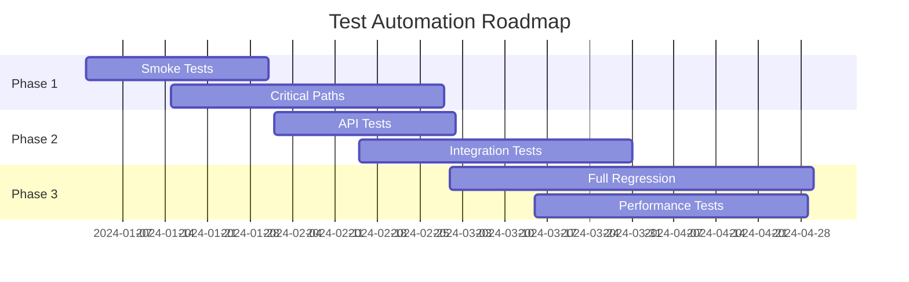
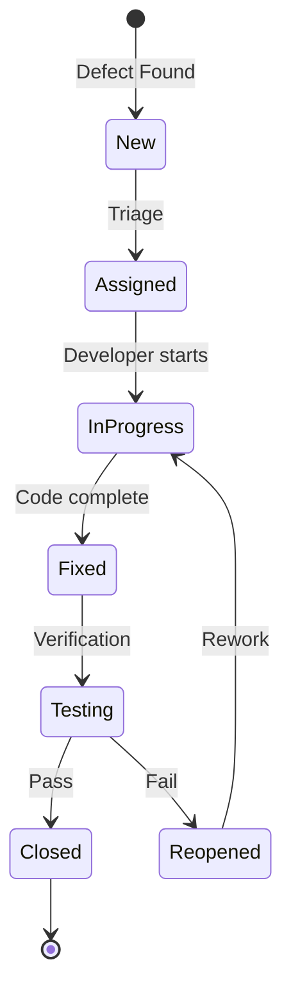

# 📋 Test Strategy Template

> A comprehensive template for creating effective test strategies

## 📄 Document Information

| Field | Details |
|-------|---------|
| **Document Title:** | [Project Name] Test Strategy |
| **Version:** | 1.0 |
| **Author:** | [Your Name] |
| **Date Created:** | [Date] |
| **Last Updated:** | [Date] |
| **Approved By:** | [Stakeholder Names] |
| **Distribution:** | Development Team, Product Owner, Stakeholders |

## 📑 Table of Contents

1. [Executive Summary](#executive-summary)
2. [Scope and Objectives](#scope-and-objectives)
3. [Test Approach](#test-approach)
4. [Test Levels and Types](#test-levels-and-types)
5. [Entry and Exit Criteria](#entry-and-exit-criteria)
6. [Test Environment](#test-environment)
7. [Test Data Strategy](#test-data-strategy)
8. [Risk Analysis](#risk-analysis)
9. [Test Automation Strategy](#test-automation-strategy)
10. [Defect Management](#defect-management)
11. [Metrics and Reporting](#metrics-and-reporting)
12. [Tools and Technologies](#tools-and-technologies)
13. [Roles and Responsibilities](#roles-and-responsibilities)
14. [Timeline and Milestones](#timeline-and-milestones)
15. [Appendices](#appendices)

---

## 1. Executive Summary

### Purpose
```markdown
This test strategy document defines the overall approach for testing [Project Name].
It serves as a guide for all testing activities and ensures alignment between
stakeholders on quality objectives and methods.
```

### Key Objectives
- [ ] Ensure product meets business requirements
- [ ] Minimize production defects to <5%
- [ ] Achieve 80% automated test coverage
- [ ] Reduce time-to-market by 30%
- [ ] Maintain quality score above 85%

### Success Criteria
```markdown
The testing effort will be considered successful when:
1. All critical business scenarios pass
2. No critical or high-severity defects in production
3. Test coverage meets defined targets
4. Performance benchmarks achieved
5. Security requirements validated
```

## 2. Scope and Objectives

### In Scope
```markdown
## Testing Scope

### Functional Areas
- User Management (Registration, Login, Profile)
- Core Business Logic
- Payment Processing
- Reporting Module
- API Endpoints
- Admin Dashboard

### Non-Functional Areas
- Performance (Load, Stress, Volume)
- Security (Authentication, Authorization, Data Protection)
- Usability (UI/UX, Accessibility)
- Compatibility (Browsers, Devices, OS)
- Reliability (Failover, Recovery)
```

### Out of Scope
```markdown
The following are explicitly out of scope:
- Third-party service internal testing
- Legacy system components (unless integration points)
- Marketing website
- Internal admin tools (separate project)
```

### Testing Objectives
| Objective | Description | Measure of Success |
|-----------|-------------|-------------------|
| **Functional Correctness** | Verify all features work as specified | 100% requirement coverage |
| **Performance** | Ensure system meets SLAs | <200ms response time (P95) |
| **Security** | Validate security controls | Pass security audit |
| **Usability** | Confirm user-friendly interface | >80% task completion rate |
| **Reliability** | System stability and recovery | 99.9% uptime |

## 3. Test Approach

### Testing Methodology
```markdown
## Agile Testing Approach

We will follow Agile testing principles with:
- Continuous testing throughout sprints
- Test-Driven Development (TDD) for critical components
- Behavior-Driven Development (BDD) for user stories
- Shift-left testing with early involvement
- Risk-based testing prioritization
```

### Testing Pyramid Strategy
```
         ┌─────────────┐
         │    E2E      │ 10%
         │   Tests     │
         ├─────────────┤
         │ Integration │ 30%
         │   Tests     │
         ├─────────────┤
         │    Unit     │ 60%
         │   Tests     │
         └─────────────┘
```

### Test Design Techniques
- **Equivalence Partitioning:** Input domain testing
- **Boundary Value Analysis:** Edge case validation
- **Decision Tables:** Complex business rules
- **State Transitions:** Workflow testing
- **Error Guessing:** Experience-based testing
- **Exploratory Testing:** Unscripted discovery

## 4. Test Levels and Types

### Test Levels

#### Unit Testing
```markdown
**Objective:** Validate individual components
**Responsibility:** Developers
**Coverage Target:** 80%
**Tools:** Jest, NUnit, JUnit
**Approach:** TDD where applicable
```

#### Integration Testing
```markdown
**Objective:** Verify component interactions
**Responsibility:** Developers + QA
**Coverage Target:** 70%
**Focus Areas:**
- API contracts
- Database operations
- Service communication
- Third-party integrations
```

#### System Testing
```markdown
**Objective:** Validate complete system
**Responsibility:** QA Team
**Coverage Target:** 100% critical paths
**Types:**
- Functional testing
- End-to-end testing
- Data integrity testing
```

#### Acceptance Testing
```markdown
**Objective:** Business validation
**Responsibility:** Product Owner + Stakeholders
**Approach:** User story validation
**Method:** Manual + Automated scenarios
```

### Test Types Matrix

| Test Type | Priority | Automated | Manual | Frequency |
|-----------|----------|-----------|--------|-----------|
| **Smoke** | P1 | ✅ | ❌ | Every build |
| **Functional** | P1 | ✅ | ✅ | Every sprint |
| **Regression** | P1 | ✅ | ❌ | Every release |
| **Performance** | P2 | ✅ | ❌ | Weekly |
| **Security** | P1 | ✅ | ✅ | Every release |
| **Usability** | P2 | ❌ | ✅ | Every sprint |
| **Exploratory** | P2 | ❌ | ✅ | Weekly |
| **Accessibility** | P2 | ✅ | ✅ | Every release |

## 5. Entry and Exit Criteria

### Entry Criteria

#### Sprint Testing Entry
```markdown
✅ Required for Testing to Begin:
- [ ] Code complete and committed
- [ ] Unit tests passing (>80% coverage)
- [ ] Code review completed
- [ ] Build successful in CI
- [ ] Test environment available
- [ ] Test data prepared
- [ ] Requirements documented
```

#### Release Testing Entry
```markdown
✅ Required for Release Testing:
- [ ] All sprint testing completed
- [ ] Feature freeze implemented
- [ ] Release notes drafted
- [ ] Regression suite updated
- [ ] Performance baseline established
```

### Exit Criteria

#### Sprint Testing Exit
```markdown
✅ Required to Complete Sprint:
- [ ] All test cases executed
- [ ] >95% test cases passing
- [ ] No critical defects open
- [ ] High priority defects <3
- [ ] Test report submitted
```

#### Release Testing Exit
```markdown
✅ Required for Production:
- [ ] 100% critical scenarios passing
- [ ] No critical/high defects
- [ ] Performance SLAs met
- [ ] Security scan passed
- [ ] UAT sign-off received
- [ ] Rollback plan tested
```

## 6. Test Environment

### Environment Strategy

```markdown
## Environment Tiers

### Development (DEV)
- **Purpose:** Developer testing
- **Data:** Synthetic
- **Access:** Development team
- **Refresh:** Daily

### Testing (QA)
- **Purpose:** Functional testing
- **Data:** Subset of production
- **Access:** QA team
- **Refresh:** Per sprint

### Staging (STG)
- **Purpose:** Pre-production validation
- **Data:** Production-like
- **Access:** QA + Stakeholders
- **Refresh:** Per release

### Production (PROD)
- **Purpose:** Live system
- **Data:** Real data
- **Access:** Controlled
- **Testing:** Smoke only
```

### Environment Requirements

| Component | DEV | QA | STG | PROD |
|-----------|-----|-----|-----|------|
| **Web Server** | 2 cores, 4GB | 4 cores, 8GB | 8 cores, 16GB | 16 cores, 32GB |
| **Database** | Shared | Dedicated | Cluster | Cluster + Replica |
| **Cache** | Local | Redis | Redis Cluster | Redis Cluster |
| **CDN** | No | No | Yes | Yes |
| **SSL** | Self-signed | Self-signed | Valid | Valid |

## 7. Test Data Strategy

### Test Data Categories

```markdown
## Data Types

### Synthetic Data
- Generated programmatically
- Used for: Volume testing, edge cases
- Tools: Faker.js, Bogus

### Anonymized Production Data
- Real data with PII removed
- Used for: Realistic scenarios
- Process: ETL with masking

### Golden Data Sets
- Curated test scenarios
- Used for: Regression testing
- Maintenance: Version controlled
```

### Test Data Management

```yaml
test_data:
  users:
    admin:
      email: "admin@test.com"
      password: "Admin123!"
      role: "administrator"

    standard:
      email: "user@test.com"
      password: "User123!"
      role: "user"

  scenarios:
    happy_path:
      - create_user
      - verify_email
      - complete_profile

    edge_cases:
      - maximum_length_inputs
      - special_characters
      - concurrent_updates
```

## 8. Risk Analysis

### Risk Matrix

| Risk | Probability | Impact | Mitigation | Contingency |
|------|------------|---------|------------|-------------|
| **Late delivery of features** | High | High | Daily standups, Sprint planning | Reduce scope |
| **Environment instability** | Medium | High | Environment monitoring | Backup environment |
| **Test data corruption** | Low | Medium | Data backups | Data restoration scripts |
| **Resource unavailability** | Medium | Medium | Cross-training | External consultants |
| **Third-party service failure** | Low | High | Service mocking | Graceful degradation |

### Risk-Based Testing Priority

```markdown
## Priority Matrix

        Impact
        High    Medium   Low
    ┌─────────────────────────┐
High│   P1      P1      P2    │
    │                         │ Probability
Med │   P1      P2      P3    │
    │                         │
Low │   P2      P3      P4    │
    └─────────────────────────┘

P1: Extensive testing required
P2: Standard testing
P3: Basic testing
P4: Minimal testing
```

## 9. Test Automation Strategy

### Automation Approach

```markdown
## Automation Principles

1. **Automate Repetitive Tasks First**
   - Smoke tests
   - Regression suite
   - Data setup/teardown

2. **ROI-Driven Selection**
   - High-frequency execution
   - High-risk areas
   - Stable features

3. **Maintainability Focus**
   - Page Object Model
   - Reusable components
   - Clear naming conventions
```

### Automation Framework

```javascript
// Framework Structure
automation/
├── config/
│   ├── environments.json
│   └── test.config.js
├── tests/
│   ├── ui/
│   ├── api/
│   └── integration/
├── pages/
│   └── *.page.js
├── utils/
│   ├── database.js
│   └── helpers.js
└── reports/
```

### Automation Roadmap



## 10. Defect Management

### Defect Lifecycle



### Defect Categorization

| Severity | Description | Response Time | Example |
|----------|-------------|---------------|---------|
| **Critical** | System down, data loss | 2 hours | Payment failure |
| **High** | Major feature broken | 24 hours | Login not working |
| **Medium** | Feature partially working | 3 days | Filter issues |
| **Low** | Minor issue | Next sprint | Typo in text |

### Defect Report Template

```markdown
## Defect Report

**ID:** BUG-123
**Title:** [Clear, concise description]
**Severity:** [Critical/High/Medium/Low]
**Priority:** [P1/P2/P3/P4]
**Environment:** [Where found]

### Steps to Reproduce
1. Step one
2. Step two
3. Step three

### Expected Result
[What should happen]

### Actual Result
[What actually happens]

### Evidence
- Screenshot: [Link]
- Logs: [Link]
- Video: [Link]

### Additional Information
- Browser/Device:
- User Role:
- Test Data:
```

## 11. Metrics and Reporting

### Key Metrics

```markdown
## Quality Metrics Dashboard

### Process Metrics
- Test Execution Rate: Target >95%
- Automation Coverage: Target >70%
- Defect Detection Rate: Target >90%
- Test Efficiency: Defects/Test Case >0.05

### Product Metrics
- Defect Density: <5 per KLOC
- Code Coverage: >80%
- Performance: <200ms P95
- Availability: >99.9%

### Project Metrics
- Schedule Variance: <10%
- Effort Variance: <15%
- Defect Escape Rate: <5%
- Customer Satisfaction: >4.5/5
```

### Reporting Structure

```markdown
## Report Hierarchy

### Daily
- Test execution status
- Blocker issues
- Environment health

### Weekly
- Sprint progress
- Defect trends
- Risk updates
- Automation progress

### Sprint/Release
- Quality metrics summary
- Test coverage report
- Performance benchmarks
- Recommendations
```

## 12. Tools and Technologies

### Testing Stack

| Category | Tool | Purpose | License |
|----------|------|---------|---------|
| **UI Automation** | Playwright | Web testing | Open Source |
| **API Testing** | REST Assured | API validation | Open Source |
| **Performance** | K6 | Load testing | Open Source |
| **Security** | OWASP ZAP | Security scanning | Open Source |
| **Test Management** | TestRail | Test case management | Commercial |
| **Bug Tracking** | JIRA | Defect management | Commercial |
| **CI/CD** | Jenkins | Automation pipeline | Open Source |
| **Monitoring** | Datadog | Application monitoring | Commercial |

### Tool Integration

```yaml
# CI/CD Pipeline Integration
pipeline:
  stages:
    - build:
        tools: [npm, maven]
    - test:
        tools: [jest, playwright, rest-assured]
    - analyze:
        tools: [sonarqube, zap]
    - report:
        tools: [allure, testrail]
    - deploy:
        tools: [ansible, kubernetes]
```

## 13. Roles and Responsibilities

### RACI Matrix

| Activity | QA Lead | QA Engineer | Developer | Product Owner | DevOps |
|----------|---------|-------------|-----------|---------------|--------|
| Test Strategy | R | C | C | A | I |
| Test Planning | R | R | C | I | I |
| Test Design | A | R | C | I | - |
| Test Execution | I | R | C | I | - |
| Defect Management | A | R | R | I | - |
| Automation | C | R | R | I | C |
| Reporting | R | C | I | A | I |
| Environment | C | I | I | - | R |

**Legend:** R=Responsible, A=Accountable, C=Consulted, I=Informed

### Team Structure

```markdown
## QA Team Organization

### QA Lead (1)
- Strategy and planning
- Stakeholder communication
- Process improvement
- Team mentoring

### Senior QA Engineers (2)
- Framework development
- Complex testing
- Automation architecture
- Technical leadership

### QA Engineers (3)
- Test execution
- Automation implementation
- Defect management
- Documentation

### Contract/Support (As needed)
- Performance testing
- Security testing
- Accessibility testing
```

## 14. Timeline and Milestones

### Project Timeline

```markdown
## Testing Milestones

### Month 1
- Week 1-2: Environment setup
- Week 3-4: Framework development

### Month 2
- Week 1-2: Core feature testing
- Week 3-4: Integration testing

### Month 3
- Week 1-2: System testing
- Week 3-4: UAT preparation

### Month 4
- Week 1-2: UAT execution
- Week 3-4: Production preparation
```

### Sprint Testing Schedule

```markdown
## 2-Week Sprint Cycle

### Week 1
- Day 1-2: Sprint planning, test design
- Day 3-5: Development + Unit testing

### Week 2
- Day 1-3: Integration testing
- Day 4: Regression testing
- Day 5: Sprint demo, retrospective
```

## 15. Appendices

### Appendix A: Templates
- Test Case Template
- Bug Report Template
- Test Report Template
- Risk Assessment Template

### Appendix B: Checklists
- Environment Setup Checklist
- Release Testing Checklist
- Security Testing Checklist
- Performance Testing Checklist

### Appendix C: References
- Company Standards
- Industry Best Practices
- Tool Documentation
- Training Materials

---

## Sign-off

| Role | Name | Signature | Date |
|------|------|-----------|------|
| QA Lead | | | |
| Development Lead | | | |
| Product Owner | | | |
| Project Manager | | | |

---

**Document Version History:**

| Version | Date | Author | Changes |
|---------|------|--------|---------|
| 1.0 | | | Initial version |
| | | | |

---

*This test strategy is a living document and will be updated as the project evolves.*