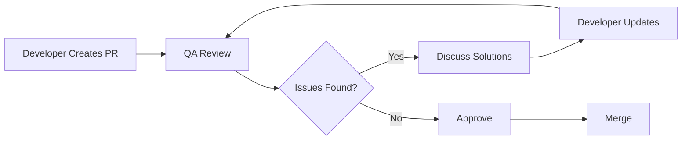

# 🔍 Code Review Excellence for QA Professionals

> Elevating code quality through strategic QA participation in code reviews

## 📋 Overview

### Purpose and Scope
This guide empowers QA professionals to participate effectively in code reviews, contributing unique testing perspectives that improve code quality, testability, and overall product reliability. It bridges the gap between development and testing through collaborative code examination.

### Target Audience
- QA Engineers and Test Automation Engineers
- QA Team Leads and Managers
- Developers seeking QA perspective
- DevOps Engineers involved in quality gates
- Technical Product Managers

### Key Benefits
- **Enhanced Code Quality:** QA perspective catches different issues than developers
- **Improved Testability:** Code designed with testing in mind from the start
- **Knowledge Sharing:** QA learns codebase, developers learn testing concerns
- **Early Defect Detection:** Issues caught before testing phase
- **Stronger Team Collaboration:** Shared ownership of quality

## 🏛️ Fundamental Principles

### Core Concepts
1. **Testing Perspective:** Unique viewpoint on potential failure modes
2. **Testability Focus:** Code that's easy to test is often better designed
3. **User Advocacy:** Representing end-user concerns in technical decisions
4. **Risk Assessment:** Identifying high-risk areas that need extra attention
5. **Collaborative Excellence:** Working together, not as gatekeepers

### QA Value in Code Reviews
```markdown
## What QA Brings to Code Reviews

### Unique Perspectives
- User journey understanding
- Edge case identification
- Error scenario thinking
- Integration point awareness
- Performance considerations

### Testing Expertise
- Testability assessment
- Test data requirements
- Automation opportunities
- Coverage gap identification
- Risk-based prioritization
```

### Anti-Patterns to Avoid
❌ **Being a bottleneck** - Don't slow down development
❌ **Nitpicking syntax** - Focus on functionality and testability
❌ **Testing everything in review** - Complement, don't replace testing
❌ **Being too abstract** - Provide specific, actionable feedback
❌ **Ignoring business context** - Consider user impact and business value

## 🔍 What QA Should Look For

### 1. Testability Assessment

#### Code Structure & Design
```javascript
// ❌ Hard to Test
class UserService {
  async createUser(userData) {
    // Direct database call, hard to mock
    const result = await database.users.insert(userData);

    // Email sending mixed with business logic
    await emailService.sendWelcomeEmail(userData.email);

    // No error handling visibility
    return result;
  }
}

// ✅ Easy to Test
class UserService {
  constructor(userRepository, emailService, logger) {
    this.userRepository = userRepository;
    this.emailService = emailService;
    this.logger = logger;
  }

  async createUser(userData) {
    try {
      // Separate concerns, injected dependencies
      const user = await this.userRepository.create(userData);

      // Async operation that can be mocked/tested separately
      this.emailService.sendWelcomeEmail(user.email)
        .catch(err => this.logger.error('Email failed', err));

      return { success: true, user };
    } catch (error) {
      this.logger.error('User creation failed', error);
      return { success: false, error: error.message };
    }
  }
}
```

#### QA Review Comments:
```markdown
## Testability Feedback

✅ **Good:**
- Dependencies are injected, easy to mock
- Error handling is explicit and testable
- Single responsibility principle followed
- Return values are consistent

🔧 **Suggestions:**
- Consider adding input validation
- Email failure shouldn't fail user creation (good async handling)
- Add logging for better debugging in tests
```

### 2. Error Handling & Edge Cases

#### Comprehensive Error Scenarios
```python
# QA Review Focus: Error Handling
def process_payment(amount, payment_method, user_id):
    # ✅ QA Checks: Input validation
    if amount <= 0:
        raise ValueError("Amount must be positive")

    if not payment_method or not payment_method.strip():
        raise ValueError("Payment method is required")

    # ✅ QA Checks: External service error handling
    try:
        user = user_service.get_user(user_id)
        if not user.is_active:
            return PaymentResult(success=False, error="User account inactive")

        # ✅ QA Checks: Third-party integration error handling
        payment_response = payment_gateway.charge(
            amount=amount,
            method=payment_method,
            user_id=user_id
        )

        if payment_response.status == "failed":
            # ✅ QA Checks: Specific error handling
            return PaymentResult(
                success=False,
                error=payment_response.error_message,
                retry_possible=payment_response.retryable
            )

        return PaymentResult(success=True, transaction_id=payment_response.id)

    except NetworkError as e:
        # ✅ QA Checks: Network failure handling
        logger.error(f"Payment gateway unreachable: {e}")
        return PaymentResult(
            success=False,
            error="Payment service temporarily unavailable",
            retry_possible=True
        )
    except Exception as e:
        # ✅ QA Checks: Unexpected error handling
        logger.error(f"Unexpected payment error: {e}")
        return PaymentResult(
            success=False,
            error="Payment processing failed",
            retry_possible=False
        )
```

#### QA Review Checklist:
```markdown
## Error Handling Review

### Input Validation
- [ ] Null/empty values handled
- [ ] Invalid data types rejected
- [ ] Boundary values validated
- [ ] Malicious input sanitized

### External Dependencies
- [ ] Network failures handled
- [ ] Service unavailability managed
- [ ] Timeout scenarios covered
- [ ] Authentication failures handled

### User Experience
- [ ] Error messages are user-friendly
- [ ] Retry mechanisms where appropriate
- [ ] Fallback options available
- [ ] Graceful degradation implemented
```

### 3. Security Considerations

#### Security Review Focus Areas
```java
// QA Security Review Focus
@RestController
public class UserController {

    @PostMapping("/users/{userId}/update")
    // ✅ QA Check: Authorization
    @PreAuthorize("hasRole('USER') and #userId == authentication.principal.id")
    public ResponseEntity<UserDTO> updateUser(
            @PathVariable Long userId,
            @Valid @RequestBody UpdateUserRequest request,
            Authentication authentication) {

        // ✅ QA Check: Input validation
        if (request.getEmail() != null) {
            if (!EmailValidator.isValid(request.getEmail())) {
                return ResponseEntity.badRequest()
                    .body(new ErrorResponse("Invalid email format"));
            }
        }

        // ✅ QA Check: Sensitive data handling
        User user = userService.findById(userId);
        if (user == null) {
            // Don't reveal if user exists
            return ResponseEntity.notFound().build();
        }

        // ✅ QA Check: Data sanitization
        UpdateUserDTO sanitizedRequest = sanitizationService.sanitize(request);

        User updatedUser = userService.updateUser(userId, sanitizedRequest);

        // ✅ QA Check: Sensitive data exposure
        UserDTO responseDTO = userMapper.toDTO(updatedUser);
        // Don't expose password, internal IDs, etc.

        return ResponseEntity.ok(responseDTO);
    }
}
```

#### Security Review Checklist:
```markdown
## Security Review Checklist

### Authentication & Authorization
- [ ] Proper authentication required
- [ ] Authorization checks for all endpoints
- [ ] Role-based access control implemented
- [ ] Session management secure

### Input Security
- [ ] SQL injection prevention
- [ ] XSS protection
- [ ] Command injection prevention
- [ ] Path traversal protection

### Data Protection
- [ ] Sensitive data encrypted
- [ ] PII handling compliant
- [ ] Secrets not hardcoded
- [ ] Secure communication (HTTPS)

### Output Security
- [ ] Sensitive data not exposed in responses
- [ ] Error messages don't leak information
- [ ] Logging doesn't include secrets
- [ ] CORS properly configured
```

### 4. Performance & Scalability

#### Performance Review Areas
```sql
-- QA Performance Review: Database Queries
-- ❌ Performance Issue
SELECT u.*, p.*, o.*, oi.*
FROM users u
LEFT JOIN profiles p ON u.id = p.user_id
LEFT JOIN orders o ON u.id = o.user_id
LEFT JOIN order_items oi ON o.id = oi.order_id
WHERE u.email = 'user@example.com';

-- ✅ Optimized Approach
-- Get user first
SELECT id, email, name FROM users WHERE email = 'user@example.com';

-- Get profile separately if needed
SELECT bio, avatar_url FROM profiles WHERE user_id = ?;

-- Get orders with pagination
SELECT id, total, created_at FROM orders
WHERE user_id = ?
ORDER BY created_at DESC
LIMIT 10 OFFSET 0;
```

#### Performance Review Checklist:
```markdown
## Performance Review

### Database Operations
- [ ] Queries are optimized
- [ ] Proper indexing used
- [ ] N+1 query problems avoided
- [ ] Pagination implemented for large datasets

### Memory Management
- [ ] Objects properly disposed
- [ ] Large collections handled efficiently
- [ ] Memory leaks prevented
- [ ] Caching strategies appropriate

### Algorithmic Efficiency
- [ ] Time complexity reasonable
- [ ] Space complexity acceptable
- [ ] Unnecessary loops avoided
- [ ] Early termination conditions used

### External Calls
- [ ] API calls are batched where possible
- [ ] Timeouts configured
- [ ] Retry logic implemented
- [ ] Circuit breakers for critical services
```

### 5. Logging & Observability

#### Logging Best Practices Review
```javascript
// ✅ Good Logging for Testing/Debugging
class OrderService {
  async processOrder(orderData) {
    const correlationId = generateCorrelationId();

    logger.info('Processing order started', {
      correlationId,
      orderId: orderData.id,
      userId: orderData.userId,
      itemCount: orderData.items.length
    });

    try {
      // Validate order
      const validation = this.validateOrder(orderData);
      if (!validation.isValid) {
        logger.warn('Order validation failed', {
          correlationId,
          orderId: orderData.id,
          errors: validation.errors
        });
        return { success: false, errors: validation.errors };
      }

      // Process payment
      logger.info('Processing payment', { correlationId, amount: orderData.total });
      const paymentResult = await this.paymentService.charge(orderData.payment);

      if (!paymentResult.success) {
        logger.error('Payment failed', {
          correlationId,
          orderId: orderData.id,
          paymentError: paymentResult.error,
          // Don't log sensitive payment data
        });
        return { success: false, error: 'Payment processing failed' };
      }

      logger.info('Order processed successfully', {
        correlationId,
        orderId: orderData.id,
        transactionId: paymentResult.transactionId,
        processingTimeMs: Date.now() - startTime
      });

      return { success: true, orderId: orderData.id };

    } catch (error) {
      logger.error('Order processing error', {
        correlationId,
        orderId: orderData.id,
        error: error.message,
        stack: error.stack
      });
      throw error;
    }
  }
}
```

#### Observability Review Checklist:
```markdown
## Logging & Observability Review

### Logging Quality
- [ ] Appropriate log levels used
- [ ] Correlation IDs for tracing
- [ ] Structured logging format
- [ ] No sensitive data in logs

### Error Handling
- [ ] Errors properly logged with context
- [ ] Stack traces included for debugging
- [ ] Error correlation across services
- [ ] Actionable error messages

### Performance Metrics
- [ ] Key operation timing logged
- [ ] Business metrics tracked
- [ ] Health check endpoints available
- [ ] Custom metrics for critical paths

### Debugging Support
- [ ] Sufficient detail for troubleshooting
- [ ] Request/response correlation
- [ ] State changes logged
- [ ] Configuration changes tracked
```

## 🛠️ Review Tools and Techniques

### Code Review Tools
```markdown
## Recommended Review Tools

### Integrated Tools
- **GitHub:** Pull request reviews with inline comments
- **GitLab:** Merge request reviews with approval rules
- **Azure DevOps:** Pull request policies and branch protection
- **Bitbucket:** Code review workflows

### Static Analysis Integration
- **SonarQube:** Code quality and security analysis
- **CodeClimate:** Maintainability and test coverage
- **ESLint/TSLint:** JavaScript/TypeScript code quality
- **SpotBugs:** Java static analysis
```

### Review Automation
```yaml
# GitHub Actions: QA Review Automation
name: QA Review Checks
on:
  pull_request:
    types: [opened, synchronize]

jobs:
  qa-review:
    runs-on: ubuntu-latest
    steps:
      - uses: actions/checkout@v2

      - name: Security Scan
        run: |
          # OWASP dependency check
          dependency-check --project "MyApp" --scan .

      - name: Code Quality Analysis
        run: |
          # SonarQube analysis
          sonar-scanner -Dsonar.projectKey=myapp

      - name: Testability Check
        run: |
          # Custom testability metrics
          npm run testability-analysis

      - name: Performance Analysis
        run: |
          # Bundle size analysis
          npm run bundle-analyzer
```

### Review Templates
```markdown
## QA Code Review Template

### 🔍 QA Review Checklist

#### Testability
- [ ] Code is easily testable
- [ ] Dependencies can be mocked
- [ ] Clear input/output contracts
- [ ] Error scenarios testable

#### Quality Assurance
- [ ] Error handling comprehensive
- [ ] Edge cases considered
- [ ] Input validation appropriate
- [ ] Security concerns addressed

#### Risk Assessment
- [ ] High-risk areas identified
- [ ] Performance implications considered
- [ ] Integration points reviewed
- [ ] Backward compatibility maintained

#### Test Impact
- [ ] Existing tests still valid
- [ ] New test cases needed
- [ ] Test data requirements identified
- [ ] Automation opportunities noted

### 💬 QA Feedback
[Detailed feedback with specific suggestions]

### 🎯 Testing Strategy
[How this change affects testing approach]

### ⚠️ Risks Identified
[Any concerns or recommendations]
```

## 🤝 Collaboration Best Practices

### Effective Communication

#### Constructive Feedback Examples
```markdown
## Good QA Review Comments

### ✅ Specific and Actionable
"Consider adding input validation for the email parameter on line 45.
Invalid emails could cause runtime errors in the downstream email service."

### ✅ Context-Aware
"This change affects the payment flow. We should add integration tests
to verify the payment gateway timeout handling works correctly."

### ✅ Solution-Oriented
"The error handling here could be improved. Consider using a Result<T>
pattern to make success/failure states explicit and testable."

### ✅ Learning-Focused
"I learned about this new validation library. Could you add a comment
explaining why this approach was chosen over the existing validator?"
```

#### Collaborative Review Process


### Building Developer Relationships

#### Do's and Don'ts
```markdown
## QA-Developer Collaboration

### ✅ DO
- Focus on improvement, not criticism
- Ask questions to understand context
- Suggest specific solutions
- Acknowledge good practices
- Share testing knowledge
- Be timely with reviews

### ❌ DON'T
- Block PRs unnecessarily
- Nitpick code style issues
- Assume malicious intent
- Only point out problems
- Use reviews to show superiority
- Delay feedback for days
```

### Knowledge Sharing

#### Learning Opportunities
```markdown
## Mutual Learning in Reviews

### QA Learns From Developers
- Code architecture patterns
- Performance optimization techniques
- Security implementation details
- Framework-specific best practices
- Business logic complexity

### Developers Learn From QA
- User journey perspectives
- Edge case identification
- Testing strategies
- Risk assessment approaches
- Quality metric insights
```

## 📊 Metrics and Measurement

### Review Effectiveness Metrics
```markdown
## Code Review Quality Metrics

### Participation Metrics
- QA review participation rate: 85%
- Average review time: 2 hours
- Comments per review: 3.5
- Review cycles per PR: 1.2

### Quality Impact Metrics
- Defects caught in review vs testing: 40% / 60%
- Post-review defect rate: 15% reduction
- Testability score improvement: +20%
- Security issues prevented: 8 per month

### Collaboration Metrics
- Developer-QA discussion threads: 25 per week
- Knowledge sharing instances: 12 per sprint
- Cross-team learning events: 1 per month
```

### Success Indicators
```markdown
## Review Program Success

### Short-term (1-3 months)
- Increased QA participation in reviews
- Reduced testing phase defects
- Improved code testability scores
- Better error handling practices

### Medium-term (3-6 months)
- Faster bug resolution times
- Reduced production incidents
- Enhanced team collaboration
- Knowledge transfer acceleration

### Long-term (6+ months)
- Higher overall code quality
- Reduced technical debt
- Improved system reliability
- Stronger quality culture
```

## 🚀 Advanced Techniques

### Automated Review Assistance
```python
# Custom QA Review Bot
class QAReviewBot:
    def analyze_pr(self, pull_request):
        analysis = {
            'testability_score': self.calculate_testability(pull_request),
            'security_risks': self.identify_security_risks(pull_request),
            'performance_concerns': self.check_performance(pull_request),
            'testing_suggestions': self.suggest_tests(pull_request)
        }

        return self.generate_review_comment(analysis)

    def calculate_testability(self, pr):
        # Analyze code for testability patterns
        score = 0
        if self.has_dependency_injection(pr): score += 20
        if self.has_error_handling(pr): score += 20
        if self.has_clear_interfaces(pr): score += 20
        if self.has_logging(pr): score += 20
        if self.avoids_global_state(pr): score += 20
        return score
```

### AI-Assisted Reviews
```markdown
## AI-Enhanced QA Reviews

### Pattern Recognition
- Identify common anti-patterns
- Suggest testing approaches
- Flag security vulnerabilities
- Recommend performance optimizations

### Learning from History
- Learn from past defects
- Identify risky code patterns
- Suggest based on similar changes
- Predict potential issues
```

## 📋 Quick Reference

### Pre-Review Checklist
```markdown
## Before Starting Review

### Preparation
- [ ] Understand the feature/bug being addressed
- [ ] Review related requirements or tickets
- [ ] Check if tests are included
- [ ] Understand the business context

### Tools Setup
- [ ] Review tools configured
- [ ] Static analysis results available
- [ ] Test coverage reports ready
- [ ] Performance baselines known
```

### Review Process Checklist
```markdown
## During Review

### First Pass - Understanding
- [ ] Read PR description and comments
- [ ] Understand the change scope
- [ ] Identify affected components
- [ ] Note testing implications

### Second Pass - Detailed Analysis
- [ ] Check testability factors
- [ ] Review error handling
- [ ] Assess security implications
- [ ] Evaluate performance impact

### Third Pass - Documentation
- [ ] Provide specific feedback
- [ ] Suggest improvements
- [ ] Identify testing needs
- [ ] Note any risks
```

### Post-Review Actions
```markdown
## After Review

### Follow-up
- [ ] Monitor discussion threads
- [ ] Re-review after changes
- [ ] Verify final approval
- [ ] Update testing plans

### Learning
- [ ] Note new patterns learned
- [ ] Share insights with team
- [ ] Update review templates
- [ ] Document best practices
```

---

## 🎯 Key Takeaways

1. **QA Brings Unique Value** - Testing perspective complements development view
2. **Focus on Testability** - Code that's easy to test is often better designed
3. **Be Collaborative, Not Gatekeeping** - Work together to improve quality
4. **Specific Feedback Wins** - Actionable suggestions are more valuable than generic comments
5. **Learn and Teach** - Reviews are opportunities for mutual knowledge sharing
6. **Automate What You Can** - Use tools to catch common issues, focus on complex analysis
7. **Measure Impact** - Track how reviews improve overall quality

---

*"The best code reviews combine the rigor of testing with the craftsmanship of development, creating software that is both robust and maintainable."*

**Remember:** Code review is not about finding fault—it's about building better software together.