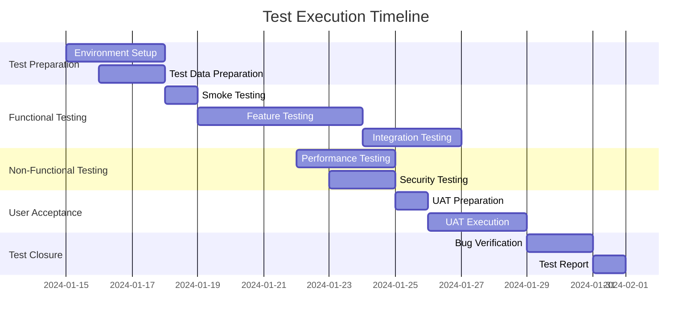

# Documentation Standards

## Overview

Documentation is the cornerstone of effective quality assurance, serving as the bridge between testing activities and stakeholder understanding. This guide establishes comprehensive documentation standards that ensure clarity, consistency, and actionable insights across all QA deliverables.

### Purpose and Scope
- Define documentation standards for QA professionals
- Establish templates and frameworks for consistent documentation
- Create living documentation strategies that evolve with projects
- Provide stakeholder communication best practices

### Target Audience
- QA Engineers creating test documentation
- Test managers overseeing documentation processes
- Product teams consuming QA documentation
- Stakeholders requiring testing insights

### Key Benefits
- Improved communication and transparency
- Reduced knowledge silos and dependencies
- Enhanced project continuity and handoffs
- Accelerated onboarding and knowledge transfer
- Better decision-making through clear insights

## Fundamental Principles

### Core Documentation Concepts

#### 1. Documentation Hierarchy
```
Strategic Documentation (Executive Level)
├── Test Strategy Documents
├── Quality Metrics Dashboards
├── Risk Assessment Reports
└── ROI and Business Impact Analysis

Tactical Documentation (Management Level)
├── Test Plans and Schedules
├── Resource Allocation Plans
├── Process Documentation
└── Progress and Status Reports

Operational Documentation (Execution Level)
├── Test Cases and Scenarios
├── Bug Reports and Defect Logs
├── Test Execution Reports
└── Environment and Setup Guides
```

#### 2. Documentation Types Matrix

| Document Type | Audience | Update Frequency | Automation Level | Review Process |
|---------------|----------|------------------|------------------|----------------|
| **Test Strategy** | Leadership | Quarterly | Manual | Formal review |
| **Test Plans** | Team/Stakeholders | Sprint/Release | Semi-automated | Peer review |
| **Test Cases** | QA Team | As needed | Highly automated | Continuous |
| **Bug Reports** | Development | Real-time | Automated | Workflow-based |
| **Test Reports** | All stakeholders | Daily/Weekly | Fully automated | Auto-generated |
| **Knowledge Base** | Organization | Continuous | Content-managed | Community-driven |

#### 3. Documentation Quality Standards

**Clarity Standards:**
- Use active voice and clear, concise language
- Define technical terms and abbreviations
- Include visual aids (diagrams, screenshots, flowcharts)
- Structure content with logical hierarchy

**Completeness Standards:**
- Cover all necessary information without redundancy
- Include prerequisites, dependencies, and assumptions
- Provide troubleshooting and FAQ sections
- Reference related documents and resources

**Consistency Standards:**
- Follow established templates and formats
- Use standardized terminology and conventions
- Maintain uniform styling and branding
- Apply consistent naming conventions

#### 4. Documentation Anti-Patterns to Avoid

❌ **Documentation Debt**
- Create living documentation that evolves with code
- Implement automated documentation generation

❌ **Over-Documentation**
- Focus on value-adding documentation only
- Eliminate redundant or outdated information

❌ **Siloed Documentation**
- Create centralized, searchable documentation
- Ensure cross-team accessibility

❌ **Static Documentation**
- Implement version control and change tracking
- Build feedback loops for continuous improvement

## Step-by-Step Implementation

### Phase 1: Test Case Documentation Standards

#### 1.1 Test Case Template Framework
```markdown
# Test Case Template

## Test Case Information
**Test Case ID:** TC-[Module]-[Function]-[Number]
**Test Case Title:** [Clear, descriptive title]
**Priority:** [Critical/High/Medium/Low]
**Severity:** [Blocker/Critical/Major/Minor/Trivial]
**Test Type:** [Functional/Integration/Performance/Security/Usability]
**Automation Status:** [Automated/Manual/Candidate for Automation]

## Test Details
**Module/Feature:** [Specific module or feature being tested]
**User Story/Requirement ID:** [Link to requirement or user story]
**Test Objective:** [What this test aims to verify]

## Prerequisites
**Test Environment:** [Environment requirements]
**Test Data:** [Required test data or data setup]
**User Permissions:** [Required user roles or permissions]
**System State:** [Required system configuration or state]

## Test Steps
| Step # | Action | Expected Result | Notes |
|--------|--------|-----------------|-------|
| 1 | [Detailed action description] | [Specific expected outcome] | [Additional context] |
| 2 | [Next action] | [Expected result] | [Notes if needed] |
| ... | ... | ... | ... |

## Test Data
**Input Data:**
- Field 1: [Value or description]
- Field 2: [Value or description]
- File uploads: [File specifications]

**Expected Output:**
- Response format: [JSON/XML/UI display]
- Success criteria: [Specific validation points]
- Error conditions: [Expected error messages]

## Validation Criteria
**Functional Validation:**
- [ ] Core functionality works as expected
- [ ] Business rules are enforced
- [ ] Data integrity is maintained

**Non-Functional Validation:**
- [ ] Performance meets requirements
- [ ] Security controls are effective
- [ ] Usability standards are met

## Post-Conditions
**System State:** [Expected system state after test]
**Data Cleanup:** [Required cleanup steps]
**Environment Reset:** [Steps to reset test environment]

## Traceability
**Requirements Coverage:** [Link to requirements]
**Related Test Cases:** [Links to dependent test cases]
**Defects Found:** [Links to associated bug reports]

## Maintenance Information
**Created By:** [Author name]
**Created Date:** [Creation date]
**Last Modified:** [Last update date]
**Review Status:** [Reviewed/Pending Review]
**Automation Notes:** [Automation considerations]
```

#### 1.2 Test Case Writing Best Practices
```python
#!/usr/bin/env python3
"""
Test Case Quality Analyzer
Analyzes test case quality and provides improvement suggestions
"""

import re
import json
from typing import Dict, List
from dataclasses import dataclass

@dataclass
class TestCaseQualityMetrics:
    clarity_score: float
    completeness_score: float
    specificity_score: float
    traceability_score: float
    maintainability_score: float
    overall_score: float

class TestCaseAnalyzer:
    def __init__(self):
        self.quality_rules = self._load_quality_rules()

    def _load_quality_rules(self) -> Dict:
        """Load test case quality rules and scoring criteria"""
        return {
            'clarity_rules': {
                'active_voice': {
                    'pattern': r'\\b(click|enter|select|verify|validate)\\b',
                    'weight': 0.3,
                    'description': 'Use active voice for test steps'
                },
                'specific_elements': {
                    'pattern': r'\\b(button|field|link|dropdown|checkbox)\\b',
                    'weight': 0.2,
                    'description': 'Reference specific UI elements'
                },
                'clear_actions': {
                    'pattern': r'\\b(navigate to|fill in|click on|select from)\\b',
                    'weight': 0.3,
                    'description': 'Use clear action verbs'
                },
                'avoid_ambiguity': {
                    'negative_patterns': [r'\\bstuff\\b', r'\\bthing\\b', r'\\betc\\.\\b'],
                    'weight': 0.2,
                    'description': 'Avoid ambiguous terms'
                }
            },
            'completeness_rules': {
                'required_sections': [
                    'test_case_id', 'title', 'objective', 'prerequisites',
                    'test_steps', 'expected_results', 'post_conditions'
                ],
                'recommended_sections': [
                    'test_data', 'environment', 'traceability', 'automation_notes'
                ]
            },
            'specificity_rules': {
                'measurable_criteria': {
                    'pattern': r'\\b(\\d+\\s*(seconds?|minutes?|%|MB|KB))\\b',
                    'weight': 0.4,
                    'description': 'Include measurable success criteria'
                },
                'exact_values': {
                    'pattern': r'\\b(equals?|exactly|precisely|must be)\\b',
                    'weight': 0.3,
                    'description': 'Use exact validation criteria'
                },
                'specific_locations': {
                    'pattern': r'\\b(in the .+ section|on the .+ page|under .+ menu)\\b',
                    'weight': 0.3,
                    'description': 'Specify exact locations'
                }
            }
        }

    def analyze_test_case(self, test_case_content: str) -> TestCaseQualityMetrics:
        """Analyze test case quality across multiple dimensions"""

        clarity_score = self._analyze_clarity(test_case_content)
        completeness_score = self._analyze_completeness(test_case_content)
        specificity_score = self._analyze_specificity(test_case_content)
        traceability_score = self._analyze_traceability(test_case_content)
        maintainability_score = self._analyze_maintainability(test_case_content)

        overall_score = (
            clarity_score * 0.25 +
            completeness_score * 0.25 +
            specificity_score * 0.20 +
            traceability_score * 0.15 +
            maintainability_score * 0.15
        )

        return TestCaseQualityMetrics(
            clarity_score=clarity_score,
            completeness_score=completeness_score,
            specificity_score=specificity_score,
            traceability_score=traceability_score,
            maintainability_score=maintainability_score,
            overall_score=overall_score
        )

    def _analyze_clarity(self, content: str) -> float:
        """Analyze clarity of test case writing"""
        clarity_rules = self.quality_rules['clarity_rules']
        total_score = 0
        total_weight = 0

        # Check for active voice usage
        active_voice_matches = len(re.findall(clarity_rules['active_voice']['pattern'], content, re.IGNORECASE))
        active_voice_score = min(active_voice_matches / 10, 1.0)  # Normalize to 1.0
        total_score += active_voice_score * clarity_rules['active_voice']['weight']
        total_weight += clarity_rules['active_voice']['weight']

        # Check for specific element references
        element_matches = len(re.findall(clarity_rules['specific_elements']['pattern'], content, re.IGNORECASE))
        element_score = min(element_matches / 5, 1.0)
        total_score += element_score * clarity_rules['specific_elements']['weight']
        total_weight += clarity_rules['specific_elements']['weight']

        # Check for clear actions
        action_matches = len(re.findall(clarity_rules['clear_actions']['pattern'], content, re.IGNORECASE))
        action_score = min(action_matches / 8, 1.0)
        total_score += action_score * clarity_rules['clear_actions']['weight']
        total_weight += clarity_rules['clear_actions']['weight']

        # Check for ambiguous terms (negative scoring)
        ambiguous_penalty = 0
        for pattern in clarity_rules['avoid_ambiguity']['negative_patterns']:
            ambiguous_matches = len(re.findall(pattern, content, re.IGNORECASE))
            ambiguous_penalty += ambiguous_matches * 0.1

        ambiguity_score = max(1.0 - ambiguous_penalty, 0)
        total_score += ambiguity_score * clarity_rules['avoid_ambiguity']['weight']
        total_weight += clarity_rules['avoid_ambiguity']['weight']

        return total_score / total_weight if total_weight > 0 else 0

    def _analyze_completeness(self, content: str) -> float:
        """Analyze completeness of test case documentation"""
        completeness_rules = self.quality_rules['completeness_rules']

        # Check required sections
        required_sections = completeness_rules['required_sections']
        required_found = 0

        for section in required_sections:
            section_pattern = section.replace('_', '\\s+').replace(' ', '\\s+')
            if re.search(section_pattern, content, re.IGNORECASE):
                required_found += 1

        required_score = required_found / len(required_sections)

        # Check recommended sections
        recommended_sections = completeness_rules['recommended_sections']
        recommended_found = 0

        for section in recommended_sections:
            section_pattern = section.replace('_', '\\s+').replace(' ', '\\s+')
            if re.search(section_pattern, content, re.IGNORECASE):
                recommended_found += 1

        recommended_score = recommended_found / len(recommended_sections)

        # Weight required sections more heavily
        return required_score * 0.7 + recommended_score * 0.3

    def _analyze_specificity(self, content: str) -> float:
        """Analyze specificity of test case steps and validations"""
        specificity_rules = self.quality_rules['specificity_rules']
        total_score = 0
        total_weight = 0

        for rule_name, rule_config in specificity_rules.items():
            pattern = rule_config['pattern']
            weight = rule_config['weight']

            matches = len(re.findall(pattern, content, re.IGNORECASE))
            score = min(matches / 3, 1.0)  # Normalize based on expected frequency

            total_score += score * weight
            total_weight += weight

        return total_score / total_weight if total_weight > 0 else 0

    def _analyze_traceability(self, content: str) -> float:
        """Analyze traceability links and references"""
        traceability_patterns = [
            r'\\b(REQ-\\d+|US-\\d+|STORY-\\d+)\\b',  # Requirement IDs
            r'\\b(TC-\\w+-\\d+)\\b',                  # Test case IDs
            r'\\b(BUG-\\d+|DEFECT-\\d+)\\b',         # Bug IDs
            r'\\bhttps?://[\\w.-]+/[\\w.-/]+\\b'      # URLs to requirements
        ]

        traceability_score = 0
        for pattern in traceability_patterns:
            matches = len(re.findall(pattern, content, re.IGNORECASE))
            if matches > 0:
                traceability_score += 0.25

        return min(traceability_score, 1.0)

    def _analyze_maintainability(self, content: str) -> float:
        """Analyze maintainability aspects of test case"""
        maintainability_score = 0

        # Check for version/date information
        if re.search(r'\\b(created|modified|updated)\\b.*\\b\\d{4}-\\d{2}-\\d{2}\\b', content, re.IGNORECASE):
            maintainability_score += 0.3

        # Check for author information
        if re.search(r'\\b(author|created by|written by)\\b', content, re.IGNORECASE):
            maintainability_score += 0.2

        # Check for automation notes
        if re.search(r'\\b(automation|automated|manual)\\b', content, re.IGNORECASE):
            maintainability_score += 0.3

        # Check for review status
        if re.search(r'\\b(review|reviewed|approved)\\b', content, re.IGNORECASE):
            maintainability_score += 0.2

        return maintainability_score

    def generate_improvement_suggestions(self, content: str, metrics: TestCaseQualityMetrics) -> List[str]:
        """Generate specific improvement suggestions based on analysis"""
        suggestions = []

        if metrics.clarity_score < 0.7:
            suggestions.append("Improve clarity by using more active voice and specific UI element references")
            suggestions.append("Replace ambiguous terms like 'stuff', 'thing', 'etc.' with specific descriptions")

        if metrics.completeness_score < 0.8:
            suggestions.append("Add missing required sections: prerequisites, test data, or post-conditions")
            suggestions.append("Consider adding traceability links and automation notes")

        if metrics.specificity_score < 0.6:
            suggestions.append("Include measurable success criteria with specific values, timeouts, or percentages")
            suggestions.append("Specify exact UI locations and element names")

        if metrics.traceability_score < 0.5:
            suggestions.append("Add links to requirements, user stories, or related test cases")
            suggestions.append("Include requirement IDs or ticket numbers for better traceability")

        if metrics.maintainability_score < 0.6:
            suggestions.append("Add creation/modification dates and author information")
            suggestions.append("Include automation status and review information")

        return suggestions

    def generate_quality_report(self, test_cases: List[Dict]) -> Dict:
        """Generate quality report for multiple test cases"""
        all_metrics = []
        total_score = 0

        for test_case in test_cases:
            content = test_case.get('content', '')
            metrics = self.analyze_test_case(content)
            suggestions = self.generate_improvement_suggestions(content, metrics)

            all_metrics.append({
                'test_case_id': test_case.get('id', 'Unknown'),
                'metrics': metrics,
                'suggestions': suggestions
            })

            total_score += metrics.overall_score

        average_score = total_score / len(test_cases) if test_cases else 0

        return {
            'summary': {
                'total_test_cases': len(test_cases),
                'average_quality_score': average_score,
                'grade': self._calculate_grade(average_score)
            },
            'detailed_analysis': all_metrics,
            'recommendations': self._generate_overall_recommendations(all_metrics)
        }

    def _calculate_grade(self, score: float) -> str:
        """Calculate letter grade based on quality score"""
        if score >= 0.9:
            return 'A'
        elif score >= 0.8:
            return 'B'
        elif score >= 0.7:
            return 'C'
        elif score >= 0.6:
            return 'D'
        else:
            return 'F'

    def _generate_overall_recommendations(self, metrics_list: List[Dict]) -> List[str]:
        """Generate overall recommendations for test case improvement"""
        low_clarity_count = sum(1 for m in metrics_list if m['metrics'].clarity_score < 0.7)
        low_completeness_count = sum(1 for m in metrics_list if m['metrics'].completeness_score < 0.8)

        recommendations = []

        if low_clarity_count > len(metrics_list) * 0.3:
            recommendations.append("Focus on team training for clear test case writing")

        if low_completeness_count > len(metrics_list) * 0.2:
            recommendations.append("Implement mandatory test case review process")

        recommendations.append("Consider implementing automated test case quality checks")
        recommendations.append("Create test case writing guidelines and templates")

        return recommendations

# Usage example
if __name__ == "__main__":
    analyzer = TestCaseAnalyzer()

    # Sample test case content
    sample_test_case = """
    Test Case ID: TC-LOGIN-001
    Title: Verify successful user login with valid credentials

    Objective: Verify that a user can successfully log in with valid username and password

    Prerequisites:
    - User account exists in the system
    - Login page is accessible

    Test Steps:
    1. Navigate to the login page
    2. Enter valid username in the username field
    3. Enter valid password in the password field
    4. Click the Login button

    Expected Results:
    1. Login page loads within 3 seconds
    2. Username field accepts input
    3. Password field masks input characters
    4. User is redirected to dashboard page within 2 seconds

    Post-conditions:
    - User session is established
    - Dashboard displays user-specific information

    Traceability: REQ-AUTH-001, US-LOGIN-001
    Created by: QA Engineer
    Created date: 2024-01-15
    """

    metrics = analyzer.analyze_test_case(sample_test_case)
    suggestions = analyzer.generate_improvement_suggestions(sample_test_case, metrics)

    print(f"Quality Score: {metrics.overall_score:.2f}")
    print(f"Clarity: {metrics.clarity_score:.2f}")
    print(f"Completeness: {metrics.completeness_score:.2f}")
    print(f"Specificity: {metrics.specificity_score:.2f}")
    print(f"Traceability: {metrics.traceability_score:.2f}")
    print(f"Maintainability: {metrics.maintainability_score:.2f}")

    print("\\nImprovement Suggestions:")
    for suggestion in suggestions:
        print(f"- {suggestion}")
```

### Phase 2: Bug Report Documentation Standards

#### 2.1 Bug Report Template Framework
```markdown
# Bug Report Template

## Bug Information
**Bug ID:** BUG-[YYYY-MM-DD]-[Sequential Number]
**Summary:** [One-line description of the issue]
**Reporter:** [Name of person reporting the bug]
**Date Reported:** [YYYY-MM-DD HH:MM]
**Product/Module:** [Affected product or module]
**Version:** [Software version where bug was found]

## Classification
**Severity:** [Critical/High/Medium/Low]
- Critical: System crash, data loss, security vulnerability
- High: Major feature broken, significant impact on users
- Medium: Minor feature issues, workarounds available
- Low: Cosmetic issues, minor inconveniences

**Priority:** [P1/P2/P3/P4]
- P1: Fix immediately, blocks critical functionality
- P2: Fix in current sprint/release
- P3: Fix in next release
- P4: Fix when time permits

**Bug Type:** [Functional/UI/Performance/Security/Integration/Data]
**Component:** [Specific component or feature affected]

## Environment Details
**Operating System:** [Windows 10, macOS 12.0, Ubuntu 20.04, etc.]
**Browser:** [Chrome 96.0, Firefox 95.0, Safari 15.0, etc.]
**Device:** [Desktop, Mobile, Tablet - specific model if relevant]
**Screen Resolution:** [1920x1080, 1366x768, etc.]
**Network:** [WiFi, 4G, Ethernet, etc.]
**Additional Software:** [Antivirus, VPN, extensions, etc.]

## Reproduction Information
**Reproducibility:** [Always/Sometimes/Rarely/Unable to Reproduce]
**Steps to Reproduce:**
1. [Detailed step-by-step instructions]
2. [Include specific data used]
3. [Mention user roles or permissions required]
4. [Include timing if relevant]

**Test Data Used:**
- Username: [test username or pattern]
- Test files: [specific files used]
- Input values: [exact values entered]

## Bug Details
**Actual Result:**
[Detailed description of what actually happened]
[Include error messages, unexpected behavior, or incorrect output]

**Expected Result:**
[Clear description of what should have happened]
[Reference to requirements or specifications if available]

**Impact Assessment:**
- User Impact: [How this affects end users]
- Business Impact: [How this affects business operations]
- Workaround Available: [Yes/No - describe if yes]

## Evidence
**Screenshots/Videos:**
- [Attach screenshots showing the issue]
- [Include screen recordings for complex issues]
- [Highlight relevant areas in screenshots]

**Log Files:**
- [Attach relevant log entries]
- [Include timestamps and error codes]
- [Sanitize sensitive information]

**Network Traces:**
- [Include network requests/responses if relevant]
- [API call details and responses]

## Technical Analysis
**Root Cause Hypothesis:**
[Initial analysis of potential cause]

**Related Issues:**
- Similar bugs: [Links to related bug reports]
- Duplicate check: [Confirmation this isn't a duplicate]

**Regression Information:**
- Previously working: [Yes/No/Unknown]
- Last known working version: [Version number]
- Introduced in version: [Version where bug was introduced]

## Developer Information
**Assigned To:** [Developer name]
**Status:** [New/Assigned/In Progress/Resolved/Closed/Reopened]
**Resolution:** [Fixed/Won't Fix/Duplicate/Cannot Reproduce/By Design]
**Fix Version:** [Version where fix will be included]

## Verification
**Verification Steps:**
[Steps to verify the fix]

**Acceptance Criteria:**
[Specific criteria for considering the bug fixed]

**Test Cases Updated:**
[List of test cases that need to be updated based on this bug]

## Communication
**Stakeholder Notification:**
[List of people who need to be notified about this bug]

**Customer Communication:**
[If customer-facing, note communication requirements]
```

#### 2.2 Bug Classification Framework
```python
#!/usr/bin/env python3
"""
Bug Classification and Severity Assessment Framework
Provides automated and consistent bug classification
"""

from enum import Enum
from dataclasses import dataclass
from typing import List, Dict, Optional
import json

class BugSeverity(Enum):
    CRITICAL = "Critical"
    HIGH = "High"
    MEDIUM = "Medium"
    LOW = "Low"

class BugPriority(Enum):
    P1 = "P1"
    P2 = "P2"
    P3 = "P3"
    P4 = "P4"

class BugType(Enum):
    FUNCTIONAL = "Functional"
    UI_UX = "UI/UX"
    PERFORMANCE = "Performance"
    SECURITY = "Security"
    INTEGRATION = "Integration"
    DATA = "Data"
    COMPATIBILITY = "Compatibility"

@dataclass
class BugImpactMetrics:
    user_impact_score: int  # 1-10
    business_impact_score: int  # 1-10
    frequency_score: int  # 1-10
    workaround_available: bool
    regression_risk: int  # 1-10

@dataclass
class BugClassification:
    severity: BugSeverity
    priority: BugPriority
    bug_type: BugType
    impact_metrics: BugImpactMetrics
    confidence_score: float
    reasoning: str

class BugClassifier:
    def __init__(self):
        self.severity_rules = self._load_severity_rules()
        self.priority_matrix = self._load_priority_matrix()
        self.type_keywords = self._load_type_keywords()

    def _load_severity_rules(self) -> Dict:
        """Load severity classification rules"""
        return {
            'critical_indicators': [
                'crash', 'system down', 'data loss', 'security breach',
                'cannot access', 'complete failure', 'production down',
                'payment failed', 'data corruption', 'sql injection'
            ],
            'high_indicators': [
                'major feature', 'significant impact', 'core functionality',
                'many users affected', 'business process', 'revenue impact',
                'customer complaint', 'integration failure'
            ],
            'medium_indicators': [
                'minor feature', 'workaround available', 'some users affected',
                'cosmetic issue', 'edge case', 'performance degradation'
            ],
            'low_indicators': [
                'typo', 'alignment', 'color', 'minor text', 'suggestion',
                'enhancement', 'nice to have', 'documentation'
            ]
        }

    def _load_priority_matrix(self) -> Dict:
        """Load priority classification matrix"""
        return {
            # (severity, business_impact, user_frequency) -> priority
            ('Critical', 'High', 'High'): BugPriority.P1,
            ('Critical', 'High', 'Medium'): BugPriority.P1,
            ('Critical', 'Medium', 'High'): BugPriority.P1,
            ('High', 'High', 'High'): BugPriority.P1,
            ('Critical', 'Low', 'Low'): BugPriority.P2,
            ('High', 'High', 'Medium'): BugPriority.P2,
            ('High', 'Medium', 'High'): BugPriority.P2,
            ('Medium', 'High', 'High'): BugPriority.P2,
            ('High', 'Medium', 'Medium'): BugPriority.P3,
            ('Medium', 'Medium', 'Medium'): BugPriority.P3,
            ('Medium', 'Low', 'High'): BugPriority.P3,
            ('Low', 'High', 'Medium'): BugPriority.P3,
            ('Low', 'Low', 'Low'): BugPriority.P4,
            ('Medium', 'Low', 'Low'): BugPriority.P4
        }

    def _load_type_keywords(self) -> Dict:
        """Load bug type classification keywords"""
        return {
            BugType.FUNCTIONAL: [
                'function', 'feature', 'calculation', 'logic', 'workflow',
                'business rule', 'validation', 'process', 'algorithm'
            ],
            BugType.UI_UX: [
                'display', 'layout', 'alignment', 'color', 'font', 'button',
                'menu', 'navigation', 'responsive', 'mobile', 'design'
            ],
            BugType.PERFORMANCE: [
                'slow', 'timeout', 'load time', 'response time', 'memory',
                'cpu', 'performance', 'lag', 'delay', 'optimization'
            ],
            BugType.SECURITY: [
                'security', 'authentication', 'authorization', 'permission',
                'encryption', 'vulnerability', 'xss', 'sql injection', 'csrf'
            ],
            BugType.INTEGRATION: [
                'api', 'integration', 'external', 'third party', 'service',
                'endpoint', 'connection', 'sync', 'import', 'export'
            ],
            BugType.DATA: [
                'data', 'database', 'corruption', 'migration', 'backup',
                'report', 'export', 'import', 'calculation', 'accuracy'
            ],
            BugType.COMPATIBILITY: [
                'browser', 'version', 'platform', 'compatibility', 'ie',
                'chrome', 'firefox', 'safari', 'mobile', 'tablet'
            ]
        }

    def classify_bug(self, bug_description: str, environment_info: Dict,
                    reproduction_info: Dict) -> BugClassification:
        """Classify bug based on description and context"""

        # Analyze impact metrics
        impact_metrics = self._calculate_impact_metrics(
            bug_description, environment_info, reproduction_info
        )

        # Determine severity
        severity = self._determine_severity(bug_description, impact_metrics)

        # Determine bug type
        bug_type = self._determine_bug_type(bug_description)

        # Calculate priority based on severity and impact
        priority = self._determine_priority(severity, impact_metrics)

        # Calculate confidence score
        confidence_score = self._calculate_confidence(
            bug_description, severity, bug_type, impact_metrics
        )

        # Generate reasoning
        reasoning = self._generate_reasoning(
            severity, priority, bug_type, impact_metrics
        )

        return BugClassification(
            severity=severity,
            priority=priority,
            bug_type=bug_type,
            impact_metrics=impact_metrics,
            confidence_score=confidence_score,
            reasoning=reasoning
        )

    def _calculate_impact_metrics(self, description: str, environment: Dict,
                                 reproduction: Dict) -> BugImpactMetrics:
        """Calculate impact metrics based on bug information"""

        # User impact scoring
        user_impact_score = 5  # Default medium impact
        if any(word in description.lower() for word in ['all users', 'every user', 'cannot use']):
            user_impact_score = 10
        elif any(word in description.lower() for word in ['some users', 'specific users']):
            user_impact_score = 6
        elif any(word in description.lower() for word in ['few users', 'edge case']):
            user_impact_score = 3

        # Business impact scoring
        business_impact_score = 5  # Default medium impact
        if any(word in description.lower() for word in ['revenue', 'payment', 'critical business']):
            business_impact_score = 10
        elif any(word in description.lower() for word in ['customer service', 'support']):
            business_impact_score = 7
        elif any(word in description.lower() for word in ['internal', 'admin only']):
            business_impact_score = 3

        # Frequency scoring based on reproduction information
        reproducibility = reproduction.get('reproducibility', 'sometimes').lower()
        frequency_map = {
            'always': 10,
            'often': 8,
            'sometimes': 5,
            'rarely': 2,
            'unable to reproduce': 1
        }
        frequency_score = frequency_map.get(reproducibility, 5)

        # Workaround availability
        workaround_available = 'workaround' in description.lower()

        # Regression risk
        regression_risk = 5  # Default medium risk
        if 'new feature' in description.lower():
            regression_risk = 3
        elif 'core functionality' in description.lower():
            regression_risk = 9

        return BugImpactMetrics(
            user_impact_score=user_impact_score,
            business_impact_score=business_impact_score,
            frequency_score=frequency_score,
            workaround_available=workaround_available,
            regression_risk=regression_risk
        )

    def _determine_severity(self, description: str, impact: BugImpactMetrics) -> BugSeverity:
        """Determine bug severity based on description and impact"""
        description_lower = description.lower()

        # Check for critical severity indicators
        if any(indicator in description_lower for indicator in self.severity_rules['critical_indicators']):
            return BugSeverity.CRITICAL

        # Check for high severity indicators
        if any(indicator in description_lower for indicator in self.severity_rules['high_indicators']):
            return BugSeverity.HIGH

        # Use impact metrics for borderline cases
        if impact.user_impact_score >= 8 and impact.business_impact_score >= 8:
            return BugSeverity.CRITICAL
        elif impact.user_impact_score >= 7 or impact.business_impact_score >= 7:
            return BugSeverity.HIGH

        # Check for medium severity indicators
        if any(indicator in description_lower for indicator in self.severity_rules['medium_indicators']):
            return BugSeverity.MEDIUM

        # Check for low severity indicators
        if any(indicator in description_lower for indicator in self.severity_rules['low_indicators']):
            return BugSeverity.LOW

        # Default to medium if no clear indicators
        return BugSeverity.MEDIUM

    def _determine_bug_type(self, description: str) -> BugType:
        """Determine bug type based on description keywords"""
        description_lower = description.lower()
        type_scores = {}

        for bug_type, keywords in self.type_keywords.items():
            score = sum(1 for keyword in keywords if keyword in description_lower)
            type_scores[bug_type] = score

        # Return the type with the highest score
        if type_scores:
            return max(type_scores, key=type_scores.get)

        return BugType.FUNCTIONAL  # Default fallback

    def _determine_priority(self, severity: BugSeverity, impact: BugImpactMetrics) -> BugPriority:
        """Determine priority based on severity and impact metrics"""

        # Convert impact scores to categories
        business_category = 'High' if impact.business_impact_score >= 7 else 'Medium' if impact.business_impact_score >= 4 else 'Low'
        frequency_category = 'High' if impact.frequency_score >= 7 else 'Medium' if impact.frequency_score >= 4 else 'Low'

        # Look up priority in matrix
        matrix_key = (severity.value, business_category, frequency_category)

        if matrix_key in self.priority_matrix:
            return self.priority_matrix[matrix_key]

        # Fallback logic for cases not in matrix
        if severity == BugSeverity.CRITICAL:
            return BugPriority.P1
        elif severity == BugSeverity.HIGH:
            return BugPriority.P2
        elif severity == BugSeverity.MEDIUM:
            return BugPriority.P3
        else:
            return BugPriority.P4

    def _calculate_confidence(self, description: str, severity: BugSeverity,
                            bug_type: BugType, impact: BugImpactMetrics) -> float:
        """Calculate confidence score for the classification"""
        confidence_factors = []

        # Length and detail of description
        if len(description) > 100:
            confidence_factors.append(0.8)
        else:
            confidence_factors.append(0.5)

        # Presence of specific keywords
        if any(keyword in description.lower() for keywords in self.type_keywords[bug_type] for keyword in keywords):
            confidence_factors.append(0.9)
        else:
            confidence_factors.append(0.6)

        # Impact metrics consistency
        if impact.user_impact_score >= 7 and severity in [BugSeverity.HIGH, BugSeverity.CRITICAL]:
            confidence_factors.append(0.9)
        elif impact.user_impact_score <= 3 and severity == BugSeverity.LOW:
            confidence_factors.append(0.9)
        else:
            confidence_factors.append(0.7)

        return sum(confidence_factors) / len(confidence_factors)

    def _generate_reasoning(self, severity: BugSeverity, priority: BugPriority,
                          bug_type: BugType, impact: BugImpactMetrics) -> str:
        """Generate human-readable reasoning for classification"""
        reasoning_parts = []

        # Severity reasoning
        reasoning_parts.append(f"Classified as {severity.value} severity based on:")
        if impact.user_impact_score >= 8:
            reasoning_parts.append("- High user impact")
        if impact.business_impact_score >= 8:
            reasoning_parts.append("- High business impact")
        if impact.frequency_score >= 8:
            reasoning_parts.append("- High reproduction frequency")

        # Priority reasoning
        reasoning_parts.append(f"Assigned {priority.value} priority considering:")
        reasoning_parts.append(f"- Severity level ({severity.value})")
        reasoning_parts.append(f"- Business impact score: {impact.business_impact_score}/10")
        reasoning_parts.append(f"- User frequency score: {impact.frequency_score}/10")

        if impact.workaround_available:
            reasoning_parts.append("- Workaround is available (reduces priority)")

        return "\\n".join(reasoning_parts)

    def generate_classification_report(self, classifications: List[BugClassification]) -> Dict:
        """Generate summary report of bug classifications"""
        if not classifications:
            return {"error": "No classifications to analyze"}

        # Count by severity
        severity_counts = {}
        for classification in classifications:
            severity = classification.severity.value
            severity_counts[severity] = severity_counts.get(severity, 0) + 1

        # Count by priority
        priority_counts = {}
        for classification in classifications:
            priority = classification.priority.value
            priority_counts[priority] = priority_counts.get(priority, 0) + 1

        # Count by type
        type_counts = {}
        for classification in classifications:
            bug_type = classification.bug_type.value
            type_counts[bug_type] = type_counts.get(bug_type, 0) + 1

        # Calculate average confidence
        avg_confidence = sum(c.confidence_score for c in classifications) / len(classifications)

        return {
            'summary': {
                'total_bugs': len(classifications),
                'average_confidence': avg_confidence,
                'high_priority_bugs': sum(1 for c in classifications if c.priority in [BugPriority.P1, BugPriority.P2])
            },
            'distribution': {
                'by_severity': severity_counts,
                'by_priority': priority_counts,
                'by_type': type_counts
            },
            'recommendations': self._generate_classification_recommendations(classifications)
        }

    def _generate_classification_recommendations(self, classifications: List[BugClassification]) -> List[str]:
        """Generate recommendations based on classification patterns"""
        recommendations = []

        critical_count = sum(1 for c in classifications if c.severity == BugSeverity.CRITICAL)
        total_count = len(classifications)

        if critical_count > total_count * 0.1:  # More than 10% critical
            recommendations.append("High number of critical bugs indicates potential quality issues")

        p1_count = sum(1 for c in classifications if c.priority == BugPriority.P1)
        if p1_count > total_count * 0.2:  # More than 20% P1
            recommendations.append("Consider additional testing for high-priority areas")

        low_confidence_count = sum(1 for c in classifications if c.confidence_score < 0.7)
        if low_confidence_count > total_count * 0.3:
            recommendations.append("Improve bug report detail to increase classification confidence")

        return recommendations

# Usage example
if __name__ == "__main__":
    classifier = BugClassifier()

    # Sample bug report
    bug_description = """
    User login fails completely when entering valid credentials.
    All users are affected and cannot access the system.
    This is blocking core business functionality and affecting revenue.
    Error message shows 'Authentication service unavailable'.
    """

    environment_info = {
        'browser': 'Chrome 96.0',
        'os': 'Windows 10',
        'environment': 'production'
    }

    reproduction_info = {
        'reproducibility': 'always',
        'steps': ['Navigate to login', 'Enter credentials', 'Click login'],
        'frequency': 'every attempt'
    }

    classification = classifier.classify_bug(bug_description, environment_info, reproduction_info)

    print(f"Severity: {classification.severity.value}")
    print(f"Priority: {classification.priority.value}")
    print(f"Type: {classification.bug_type.value}")
    print(f"Confidence: {classification.confidence_score:.2f}")
    print(f"Reasoning:\\n{classification.reasoning}")
```

### Phase 3: Test Plan Documentation Standards

#### 3.1 Test Plan Template Framework
```markdown
# Test Plan Template

## Document Information
**Document Title:** [Product/Feature] Test Plan
**Version:** [Version number]
**Date:** [Creation date]
**Author(s):** [Test plan author(s)]
**Reviewers:** [Review participants]
**Approval:** [Approval authority]

## Table of Contents
1. [Introduction](#introduction)
2. [Test Objectives](#test-objectives)
3. [Scope](#scope)
4. [Test Strategy](#test-strategy)
5. [Test Environment](#test-environment)
6. [Test Schedule](#test-schedule)
7. [Resource Requirements](#resource-requirements)
8. [Risk Assessment](#risk-assessment)
9. [Test Deliverables](#test-deliverables)
10. [Exit Criteria](#exit-criteria)
11. [Approvals](#approvals)

## 1. Introduction

### 1.1 Purpose
[Brief description of the purpose of this test plan]

### 1.2 Project Overview
**Project Name:** [Project or product name]
**Project Description:** [Brief project description]
**Stakeholders:**
- Product Owner: [Name]
- Development Lead: [Name]
- QA Lead: [Name]
- Business Analyst: [Name]

### 1.3 Document Scope
[What this test plan covers and what it doesn't cover]

### 1.4 References
- Requirements Document: [Link/Reference]
- Design Specifications: [Link/Reference]
- User Stories: [Link/Reference]
- Previous Test Plans: [Link/Reference]

## 2. Test Objectives

### 2.1 Primary Objectives
- [ ] Verify functional requirements are met
- [ ] Validate business rules and workflows
- [ ] Ensure system performance meets requirements
- [ ] Confirm security controls are effective
- [ ] Validate user experience and usability

### 2.2 Secondary Objectives
- [ ] Identify potential performance bottlenecks
- [ ] Verify system reliability and stability
- [ ] Validate accessibility compliance
- [ ] Confirm integration points work correctly

### 2.3 Success Criteria
**Functional Success:**
- All critical user journeys work as expected
- No P1 or P2 defects remain open
- All acceptance criteria are met

**Quality Success:**
- System response time < 3 seconds for 95% of requests
- System availability > 99.5% during testing
- Zero critical security vulnerabilities

## 3. Scope

### 3.1 Features to be Tested
**In Scope:**
| Feature | Priority | Test Types | Coverage Level |
|---------|----------|------------|----------------|
| User Authentication | High | Functional, Security | 100% |
| Payment Processing | High | Functional, Integration | 100% |
| Product Catalog | Medium | Functional, Performance | 90% |
| Reporting | Medium | Functional, Data | 80% |

**Out of Scope:**
- Third-party integrations (tested separately)
- Legacy system compatibility
- Performance testing beyond normal load

### 3.2 Test Types

#### 3.2.1 Functional Testing
- Unit Testing: [Coverage expectations]
- Integration Testing: [API and system integration]
- System Testing: [End-to-end scenarios]
- User Acceptance Testing: [Business validation]

#### 3.2.2 Non-Functional Testing
- Performance Testing: [Load, stress, volume testing]
- Security Testing: [Vulnerability assessment, penetration testing]
- Usability Testing: [User experience validation]
- Compatibility Testing: [Browser, device, OS testing]

### 3.3 Test Levels
| Test Level | Responsibility | Environment | Schedule |
|------------|---------------|-------------|----------|
| Unit | Development Team | Dev | Continuous |
| Integration | QA Team | Test | Sprint cycle |
| System | QA Team | Staging | Release cycle |
| Acceptance | Business Users | UAT | Pre-production |

## 4. Test Strategy

### 4.1 Testing Approach
**Test Pyramid Strategy:**
```
Manual Exploratory Testing (10%)
├── Edge cases and usability
└── Business workflow validation

Automated UI Testing (20%)
├── Critical user journeys
└── Regression testing

Automated Integration Testing (30%)
├── API testing
└── Service integration

Automated Unit Testing (40%)
├── Business logic
└── Component testing
```

### 4.2 Test Automation Strategy
**Automation Priorities:**
1. Smoke tests (must be automated)
2. Regression tests (highly automated)
3. Data-driven tests (automated)
4. Performance tests (automated)

**Automation Tools:**
- Unit Testing: [Tool name and version]
- API Testing: [Tool name and version]
- UI Testing: [Tool name and version]
- Performance Testing: [Tool name and version]

### 4.3 Test Data Strategy
**Test Data Requirements:**
- User accounts with different roles
- Sample products and transactions
- Edge case data sets
- Performance test data volumes

**Test Data Management:**
- Data refresh strategy: [Frequency and process]
- Data privacy compliance: [GDPR, CCPA considerations]
- Data backup and restoration: [Process and schedule]

### 4.4 Defect Management Strategy
**Defect Lifecycle:**
New → Assigned → In Progress → Resolved → Verified → Closed

**Severity Guidelines:**
- Critical: System unavailable, data loss, security breach
- High: Major feature broken, significant user impact
- Medium: Minor feature issues, workarounds available
- Low: Cosmetic issues, enhancements

**Escalation Process:**
- P1 defects: Immediate escalation to dev lead
- Multiple P2 defects: Daily standup discussion
- Trend analysis: Weekly defect review meeting

## 5. Test Environment

### 5.1 Environment Configuration
| Environment | Purpose | Configuration | Access |
|-------------|---------|---------------|--------|
| Development | Developer testing | Latest code | Dev team |
| Test | QA testing | Stable builds | QA team |
| Staging | Pre-production | Production-like | QA + Business |
| UAT | User acceptance | Business validation | Business users |

### 5.2 Hardware Requirements
**Minimum Specifications:**
- CPU: [Specifications]
- Memory: [Requirements]
- Storage: [Requirements]
- Network: [Bandwidth requirements]

### 5.3 Software Requirements
**Operating Systems:**
- Windows 10/11
- macOS 12+
- Ubuntu 20.04+

**Browsers:**
- Chrome (latest 2 versions)
- Firefox (latest 2 versions)
- Safari (latest version)
- Edge (latest version)

### 5.4 Test Tools
| Tool Category | Tool Name | Version | Purpose |
|---------------|-----------|---------|---------|
| Test Management | [Tool] | [Version] | Test case management |
| Automation | [Tool] | [Version] | Test automation |
| Performance | [Tool] | [Version] | Load testing |
| Bug Tracking | [Tool] | [Version] | Defect management |

## 6. Test Schedule

### 6.1 Test Phases Timeline


### 6.2 Milestones
| Milestone | Date | Criteria |
|-----------|------|----------|
| Test Environment Ready | [Date] | All environments configured and accessible |
| Smoke Test Complete | [Date] | Basic functionality verified |
| Functional Testing Complete | [Date] | All test cases executed, P1/P2 bugs resolved |
| Performance Testing Complete | [Date] | Performance criteria met |
| UAT Sign-off | [Date] | Business acceptance obtained |

### 6.3 Dependencies
**Testing Dependencies:**
- Code deployment to test environment
- Test data availability
- Third-party service availability
- SME availability for business validation

**Critical Path Items:**
- Environment setup completion
- Test automation framework readiness
- Business user availability for UAT

## 7. Resource Requirements

### 7.1 Human Resources
| Role | Responsibility | Allocation | Duration |
|------|---------------|------------|----------|
| QA Lead | Test planning and coordination | 100% | Full project |
| Senior QA Engineer | Test design and execution | 100% | Full project |
| QA Engineer | Test execution | 100% | Execution phase |
| Automation Engineer | Test automation | 50% | Setup + Maintenance |
| Performance Tester | Performance testing | 25% | Performance phase |

### 7.2 Infrastructure Resources
**Test Environment Costs:**
- Development environment: $[Amount]/month
- Test environment: $[Amount]/month
- Staging environment: $[Amount]/month
- UAT environment: $[Amount]/month

**Tool Licenses:**
- Test management tool: $[Amount]
- Automation tools: $[Amount]
- Performance testing tools: $[Amount]

### 7.3 Training Requirements
- New tool training for QA team
- Domain knowledge transfer sessions
- Process updates and best practices

## 8. Risk Assessment

### 8.1 Project Risks
| Risk | Impact | Probability | Mitigation Strategy |
|------|--------|-------------|-------------------|
| Environment instability | High | Medium | Backup environment, early setup |
| Resource unavailability | High | Low | Cross-training, resource buffer |
| Scope creep | Medium | High | Change control process |
| Third-party dependencies | Medium | Medium | Early integration, fallback plans |

### 8.2 Quality Risks
| Risk | Impact | Mitigation |
|------|--------|------------|
| Inadequate test coverage | High | Requirements traceability matrix |
| Test data issues | Medium | Data validation and backup procedures |
| Automation failures | Medium | Manual backup procedures |
| Performance bottlenecks | High | Early performance testing |

### 8.3 Contingency Plans
**Environment Issues:**
- Fallback to previous stable environment
- Cloud-based environment as backup

**Resource Issues:**
- Contractor engagement plan
- Cross-training for critical skills

**Schedule Issues:**
- Parallel testing where possible
- Risk-based testing prioritization

## 9. Test Deliverables

### 9.1 Test Documents
- [ ] Test Plan (this document)
- [ ] Test Cases and Test Scripts
- [ ] Test Data Specifications
- [ ] Test Environment Setup Guide
- [ ] Test Execution Reports
- [ ] Defect Reports
- [ ] Test Summary Report

### 9.2 Test Artifacts
- [ ] Automated Test Scripts
- [ ] Performance Test Scripts
- [ ] Test Data Sets
- [ ] Environment Configuration Scripts

### 9.3 Reports and Metrics
**Daily Reports:**
- Test execution status
- Defect summary
- Environment status

**Weekly Reports:**
- Test progress against plan
- Quality metrics trends
- Risk and issue status

**Final Report:**
- Test completion summary
- Quality assessment
- Recommendations

## 10. Exit Criteria

### 10.1 Functional Exit Criteria
- [ ] 100% of planned test cases executed
- [ ] All P1 and P2 defects resolved and verified
- [ ] No open critical or high-severity defects
- [ ] All acceptance criteria met
- [ ] Regression testing completed successfully

### 10.2 Non-Functional Exit Criteria
- [ ] Performance benchmarks met
- [ ] Security scan completed with no critical findings
- [ ] Accessibility compliance verified
- [ ] Browser compatibility confirmed

### 10.3 Process Exit Criteria
- [ ] Test summary report approved
- [ ] Lessons learned documented
- [ ] Test artifacts archived
- [ ] Production readiness checklist completed

## 11. Approvals

### 11.1 Review and Approval Matrix
| Role | Review | Approval | Date | Signature |
|------|--------|----------|------|-----------|
| QA Lead | ✓ | ✓ | [Date] | [Signature] |
| Dev Lead | ✓ |  | [Date] | [Signature] |
| Product Owner | ✓ | ✓ | [Date] | [Signature] |
| Project Manager | ✓ | ✓ | [Date] | [Signature] |

### 11.2 Change Control
**Change Request Process:**
1. Change request submitted with justification
2. Impact assessment by QA Lead
3. Approval by Product Owner and Project Manager
4. Test plan updated and redistributed
5. Changes communicated to all stakeholders

### 11.3 Document Version Control
| Version | Date | Author | Changes |
|---------|------|--------|---------|
| 1.0 | [Date] | [Author] | Initial version |
| 1.1 | [Date] | [Author] | Updated scope and timeline |
| 2.0 | [Date] | [Author] | Major revision after review |

---

**Document Status:** [Draft/Under Review/Approved]
**Next Review Date:** [Date]
**Distribution List:** [List of recipients]
```

### Phase 4: Living Documentation Framework

#### 4.1 Living Documentation Implementation
```python
#!/usr/bin/env python3
"""
Living Documentation Framework
Automatically generates and maintains documentation from code and tests
"""

import ast
import json
import yaml
import re
from pathlib import Path
from typing import Dict, List, Any
from dataclasses import dataclass
import subprocess

@dataclass
class DocumentationElement:
    element_type: str  # function, class, test, api_endpoint
    name: str
    description: str
    parameters: List[Dict]
    examples: List[str]
    source_file: str
    line_number: int
    last_updated: str

class LivingDocumentationGenerator:
    def __init__(self, project_root: str):
        self.project_root = Path(project_root)
        self.documentation_elements = []
        self.config = self._load_config()

    def _load_config(self) -> Dict:
        """Load documentation configuration"""
        config_file = self.project_root / 'docs' / 'config.yaml'
        if config_file.exists():
            with open(config_file, 'r') as f:
                return yaml.safe_load(f)

        return {
            'source_directories': ['src', 'lib', 'app'],
            'test_directories': ['tests', 'test', 'spec'],
            'documentation_output': 'docs/generated',
            'formats': ['markdown', 'html', 'json'],
            'auto_update_frequency': 'on_commit',
            'include_private_methods': False,
            'generate_api_docs': True,
            'generate_test_docs': True
        }

    def extract_code_documentation(self) -> List[DocumentationElement]:
        """Extract documentation from source code"""
        elements = []

        for source_dir in self.config['source_directories']:
            source_path = self.project_root / source_dir
            if source_path.exists():
                elements.extend(self._process_python_files(source_path))
                elements.extend(self._process_javascript_files(source_path))
                elements.extend(self._process_api_files(source_path))

        return elements

    def _process_python_files(self, directory: Path) -> List[DocumentationElement]:
        """Process Python files to extract documentation"""
        elements = []

        for py_file in directory.rglob('*.py'):
            try:
                with open(py_file, 'r', encoding='utf-8') as f:
                    source = f.read()

                tree = ast.parse(source)

                for node in ast.walk(tree):
                    if isinstance(node, ast.FunctionDef):
                        element = self._extract_function_docs(node, py_file, source)
                        if element:
                            elements.append(element)

                    elif isinstance(node, ast.ClassDef):
                        element = self._extract_class_docs(node, py_file, source)
                        if element:
                            elements.append(element)

            except Exception as e:
                print(f"Error processing {py_file}: {e}")

        return elements

    def _extract_function_docs(self, node: ast.FunctionDef, file_path: Path, source: str) -> DocumentationElement:
        """Extract documentation from Python function"""

        # Skip private methods if configured
        if node.name.startswith('_') and not self.config['include_private_methods']:
            return None

        # Extract docstring
        docstring = ast.get_docstring(node) or ""

        # Extract parameters
        parameters = []
        for arg in node.args.args:
            param_info = {
                'name': arg.arg,
                'type': self._get_type_annotation(arg),
                'description': self._extract_param_description(docstring, arg.arg)
            }
            parameters.append(param_info)

        # Extract examples from docstring
        examples = self._extract_examples_from_docstring(docstring)

        # Get last modification time
        last_updated = self._get_file_last_modified(file_path)

        return DocumentationElement(
            element_type='function',
            name=node.name,
            description=self._clean_docstring(docstring),
            parameters=parameters,
            examples=examples,
            source_file=str(file_path.relative_to(self.project_root)),
            line_number=node.lineno,
            last_updated=last_updated
        )

    def _extract_class_docs(self, node: ast.ClassDef, file_path: Path, source: str) -> DocumentationElement:
        """Extract documentation from Python class"""

        docstring = ast.get_docstring(node) or ""

        # Extract methods
        methods = []
        for item in node.body:
            if isinstance(item, ast.FunctionDef):
                method_info = {
                    'name': item.name,
                    'description': ast.get_docstring(item) or "",
                    'parameters': [arg.arg for arg in item.args.args if arg.arg != 'self']
                }
                methods.append(method_info)

        examples = self._extract_examples_from_docstring(docstring)
        last_updated = self._get_file_last_modified(file_path)

        return DocumentationElement(
            element_type='class',
            name=node.name,
            description=self._clean_docstring(docstring),
            parameters=methods,  # Store methods in parameters field
            examples=examples,
            source_file=str(file_path.relative_to(self.project_root)),
            line_number=node.lineno,
            last_updated=last_updated
        )

    def _process_javascript_files(self, directory: Path) -> List[DocumentationElement]:
        """Process JavaScript files to extract JSDoc documentation"""
        elements = []

        for js_file in directory.rglob('*.js'):
            try:
                with open(js_file, 'r', encoding='utf-8') as f:
                    content = f.read()

                # Extract JSDoc comments
                jsdoc_pattern = r'/\\*\\*(.*?)\\*/'
                function_pattern = r'function\\s+(\\w+)\\s*\\(([^)]*)\\)'

                jsdocs = re.findall(jsdoc_pattern, content, re.DOTALL)
                functions = re.findall(function_pattern, content)

                for i, (func_name, params) in enumerate(functions):
                    if i < len(jsdocs):
                        description = self._parse_jsdoc(jsdocs[i])

                        element = DocumentationElement(
                            element_type='function',
                            name=func_name,
                            description=description,
                            parameters=self._parse_js_parameters(params),
                            examples=[],
                            source_file=str(js_file.relative_to(self.project_root)),
                            line_number=0,  # Would need more sophisticated parsing
                            last_updated=self._get_file_last_modified(js_file)
                        )
                        elements.append(element)

            except Exception as e:
                print(f"Error processing {js_file}: {e}")

        return elements

    def _process_api_files(self, directory: Path) -> List[DocumentationElement]:
        """Process API documentation from OpenAPI/Swagger files"""
        elements = []

        # Look for OpenAPI/Swagger files
        api_files = list(directory.rglob('*.yaml')) + list(directory.rglob('*.yml')) + list(directory.rglob('*.json'))

        for api_file in api_files:
            if 'openapi' in api_file.name.lower() or 'swagger' in api_file.name.lower():
                try:
                    if api_file.suffix.lower() in ['.yaml', '.yml']:
                        with open(api_file, 'r') as f:
                            api_spec = yaml.safe_load(f)
                    else:
                        with open(api_file, 'r') as f:
                            api_spec = json.load(f)

                    elements.extend(self._extract_api_endpoints(api_spec, api_file))

                except Exception as e:
                    print(f"Error processing API file {api_file}: {e}")

        return elements

    def _extract_api_endpoints(self, api_spec: Dict, file_path: Path) -> List[DocumentationElement]:
        """Extract API endpoints from OpenAPI specification"""
        elements = []

        paths = api_spec.get('paths', {})

        for path, methods in paths.items():
            for method, spec in methods.items():
                if method.upper() in ['GET', 'POST', 'PUT', 'DELETE', 'PATCH']:

                    # Extract parameters
                    parameters = []
                    for param in spec.get('parameters', []):
                        param_info = {
                            'name': param.get('name', ''),
                            'type': param.get('type', 'string'),
                            'description': param.get('description', ''),
                            'required': param.get('required', False),
                            'location': param.get('in', 'query')
                        }
                        parameters.append(param_info)

                    # Extract examples
                    examples = []
                    if 'examples' in spec:
                        examples = list(spec['examples'].values())

                    element = DocumentationElement(
                        element_type='api_endpoint',
                        name=f"{method.upper()} {path}",
                        description=spec.get('summary', '') + '\\n' + spec.get('description', ''),
                        parameters=parameters,
                        examples=examples,
                        source_file=str(file_path.relative_to(self.project_root)),
                        line_number=0,
                        last_updated=self._get_file_last_modified(file_path)
                    )
                    elements.append(element)

        return elements

    def extract_test_documentation(self) -> List[DocumentationElement]:
        """Extract documentation from test files"""
        elements = []

        for test_dir in self.config['test_directories']:
            test_path = self.project_root / test_dir
            if test_path.exists():
                elements.extend(self._process_test_files(test_path))

        return elements

    def _process_test_files(self, directory: Path) -> List[DocumentationElement]:
        """Process test files to extract test documentation"""
        elements = []

        for test_file in directory.rglob('test_*.py'):
            try:
                with open(test_file, 'r', encoding='utf-8') as f:
                    source = f.read()

                tree = ast.parse(source)

                for node in ast.walk(tree):
                    if isinstance(node, ast.FunctionDef) and node.name.startswith('test_'):
                        element = self._extract_test_docs(node, test_file, source)
                        if element:
                            elements.append(element)

            except Exception as e:
                print(f"Error processing test file {test_file}: {e}")

        return elements

    def _extract_test_docs(self, node: ast.FunctionDef, file_path: Path, source: str) -> DocumentationElement:
        """Extract documentation from test function"""

        docstring = ast.get_docstring(node) or ""

        # Extract test scenarios from docstring or comments
        test_scenarios = self._extract_test_scenarios(docstring, source, node.lineno)

        # Extract what is being tested
        test_subject = self._extract_test_subject(node.name, docstring)

        return DocumentationElement(
            element_type='test',
            name=node.name,
            description=f"Tests: {test_subject}\\n{self._clean_docstring(docstring)}",
            parameters=test_scenarios,
            examples=[],
            source_file=str(file_path.relative_to(self.project_root)),
            line_number=node.lineno,
            last_updated=self._get_file_last_modified(file_path)
        )

    def generate_documentation(self, output_format: str = 'markdown') -> str:
        """Generate documentation in specified format"""

        # Extract all documentation elements
        code_elements = self.extract_code_documentation()
        test_elements = self.extract_test_documentation()

        all_elements = code_elements + test_elements

        if output_format == 'markdown':
            return self._generate_markdown_docs(all_elements)
        elif output_format == 'html':
            return self._generate_html_docs(all_elements)
        elif output_format == 'json':
            return self._generate_json_docs(all_elements)
        else:
            raise ValueError(f"Unsupported output format: {output_format}")

    def _generate_markdown_docs(self, elements: List[DocumentationElement]) -> str:
        """Generate Markdown documentation"""

        markdown = "# Living Documentation\\n\\n"
        markdown += f"*Last updated: {self._get_current_timestamp()}*\\n\\n"

        # Group elements by type
        grouped = {}
        for element in elements:
            element_type = element.element_type
            if element_type not in grouped:
                grouped[element_type] = []
            grouped[element_type].append(element)

        # Generate sections for each type
        for element_type, type_elements in grouped.items():
            markdown += f"## {element_type.title()}s\\n\\n"

            for element in sorted(type_elements, key=lambda x: x.name):
                markdown += f"### {element.name}\\n\\n"
                markdown += f"**Source:** `{element.source_file}:{element.line_number}`\\n\\n"
                markdown += f"{element.description}\\n\\n"

                if element.parameters:
                    markdown += "**Parameters:**\\n\\n"
                    for param in element.parameters:
                        if isinstance(param, dict):
                            param_name = param.get('name', 'Unknown')
                            param_type = param.get('type', 'Unknown')
                            param_desc = param.get('description', 'No description')
                            markdown += f"- `{param_name}` ({param_type}): {param_desc}\\n"
                    markdown += "\\n"

                if element.examples:
                    markdown += "**Examples:**\\n\\n"
                    for example in element.examples:
                        markdown += f"```\\n{example}\\n```\\n\\n"

                markdown += f"*Last updated: {element.last_updated}*\\n\\n"
                markdown += "---\\n\\n"

        return markdown

    def _generate_html_docs(self, elements: List[DocumentationElement]) -> str:
        """Generate HTML documentation"""

        html = """
        <!DOCTYPE html>
        <html>
        <head>
            <title>Living Documentation</title>
            <style>
                body { font-family: Arial, sans-serif; margin: 20px; }
                .element { border: 1px solid #ddd; margin: 10px 0; padding: 15px; }
                .element-type { background-color: #f0f0f0; padding: 5px; font-weight: bold; }
                .parameters { background-color: #f9f9f9; padding: 10px; margin: 10px 0; }
                code { background-color: #f5f5f5; padding: 2px 4px; }
                pre { background-color: #f5f5f5; padding: 10px; overflow-x: auto; }
            </style>
        </head>
        <body>
            <h1>Living Documentation</h1>
        """

        # Group and generate HTML for each element
        grouped = {}
        for element in elements:
            element_type = element.element_type
            if element_type not in grouped:
                grouped[element_type] = []
            grouped[element_type].append(element)

        for element_type, type_elements in grouped.items():
            html += f"<h2>{element_type.title()}s</h2>"

            for element in sorted(type_elements, key=lambda x: x.name):
                html += f"""
                <div class="element">
                    <div class="element-type">{element.element_type}</div>
                    <h3>{element.name}</h3>
                    <p><strong>Source:</strong> <code>{element.source_file}:{element.line_number}</code></p>
                    <p>{element.description.replace('\\n', '<br>')}</p>
                """

                if element.parameters:
                    html += '<div class="parameters"><strong>Parameters:</strong><ul>'
                    for param in element.parameters:
                        if isinstance(param, dict):
                            param_name = param.get('name', 'Unknown')
                            param_type = param.get('type', 'Unknown')
                            param_desc = param.get('description', 'No description')
                            html += f'<li><code>{param_name}</code> ({param_type}): {param_desc}</li>'
                    html += '</ul></div>'

                if element.examples:
                    html += '<strong>Examples:</strong>'
                    for example in element.examples:
                        html += f'<pre><code>{example}</code></pre>'

                html += f'<p><em>Last updated: {element.last_updated}</em></p></div>'

        html += "</body></html>"
        return html

    def _generate_json_docs(self, elements: List[DocumentationElement]) -> str:
        """Generate JSON documentation"""

        json_data = {
            'metadata': {
                'generated_at': self._get_current_timestamp(),
                'total_elements': len(elements),
                'project_root': str(self.project_root)
            },
            'elements': []
        }

        for element in elements:
            element_data = {
                'type': element.element_type,
                'name': element.name,
                'description': element.description,
                'parameters': element.parameters,
                'examples': element.examples,
                'source_file': element.source_file,
                'line_number': element.line_number,
                'last_updated': element.last_updated
            }
            json_data['elements'].append(element_data)

        return json.dumps(json_data, indent=2)

    def setup_auto_update(self) -> None:
        """Setup automatic documentation updates"""

        # Create git hook for automatic updates
        hook_content = """#!/bin/bash
# Auto-generate documentation on commit
echo "Updating living documentation..."
python scripts/generate_docs.py
git add docs/generated/
"""

        hook_path = self.project_root / '.git' / 'hooks' / 'pre-commit'
        with open(hook_path, 'w') as f:
            f.write(hook_content)

        # Make hook executable
        import stat
        hook_path.chmod(stat.S_IRWXU | stat.S_IRGRP | stat.S_IROTH)

        print("Auto-update git hook installed")

    # Helper methods
    def _get_type_annotation(self, arg) -> str:
        """Extract type annotation from function argument"""
        if hasattr(arg, 'annotation') and arg.annotation:
            return ast.unparse(arg.annotation)
        return 'Any'

    def _extract_param_description(self, docstring: str, param_name: str) -> str:
        """Extract parameter description from docstring"""
        if not docstring:
            return ""

        # Look for various docstring formats
        patterns = [
            rf'{param_name}\\s*\\([^)]+\\)\\s*:\\s*(.+?)(?=\\n|$)',
            rf':{param_name}:\\s*(.+?)(?=\\n|$)',
            rf'{param_name}\\s*-\\s*(.+?)(?=\\n|$)'
        ]

        for pattern in patterns:
            match = re.search(pattern, docstring, re.IGNORECASE)
            if match:
                return match.group(1).strip()

        return ""

    def _extract_examples_from_docstring(self, docstring: str) -> List[str]:
        """Extract code examples from docstring"""
        if not docstring:
            return []

        # Look for code blocks in docstring
        code_pattern = r'```[^\\n]*\\n(.*?)```'
        examples = re.findall(code_pattern, docstring, re.DOTALL)

        # Also look for >>> examples (doctests)
        doctest_pattern = r'>>> (.+?)(?=\\n\\n|\\n>>>|$)'
        doctests = re.findall(doctest_pattern, docstring, re.DOTALL)

        return examples + doctests

    def _clean_docstring(self, docstring: str) -> str:
        """Clean and format docstring"""
        if not docstring:
            return ""

        # Remove leading/trailing whitespace
        cleaned = docstring.strip()

        # Remove common leading whitespace
        lines = cleaned.split('\\n')
        if len(lines) > 1:
            # Find common leading whitespace
            common_indent = min(len(line) - len(line.lstrip())
                              for line in lines[1:] if line.strip())
            if common_indent > 0:
                lines = [lines[0]] + [line[common_indent:] for line in lines[1:]]
            cleaned = '\\n'.join(lines)

        return cleaned

    def _parse_jsdoc(self, jsdoc_content: str) -> str:
        """Parse JSDoc comment content"""
        # Remove comment markers and clean up
        cleaned = re.sub(r'\\s*\\*\\s*', ' ', jsdoc_content).strip()
        return cleaned

    def _parse_js_parameters(self, params_string: str) -> List[Dict]:
        """Parse JavaScript function parameters"""
        if not params_string.strip():
            return []

        params = []
        for param in params_string.split(','):
            param_name = param.strip()
            if param_name:
                params.append({
                    'name': param_name,
                    'type': 'any',
                    'description': ''
                })

        return params

    def _extract_test_scenarios(self, docstring: str, source: str, line_number: int) -> List[Dict]:
        """Extract test scenarios from test function"""
        scenarios = []

        if docstring:
            # Look for Given/When/Then patterns
            gherkin_pattern = r'Given\\s+(.+?)\\s+When\\s+(.+?)\\s+Then\\s+(.+?)(?=\\n|$)'
            matches = re.findall(gherkin_pattern, docstring, re.IGNORECASE | re.DOTALL)

            for given, when, then in matches:
                scenarios.append({
                    'type': 'scenario',
                    'given': given.strip(),
                    'when': when.strip(),
                    'then': then.strip()
                })

        return scenarios

    def _extract_test_subject(self, test_name: str, docstring: str) -> str:
        """Extract what is being tested from test name and docstring"""
        # Remove test_ prefix and convert to readable format
        subject = test_name.replace('test_', '').replace('_', ' ')

        if docstring:
            # Look for "Tests that..." or "Verify that..." patterns
            test_pattern = r'(?:Tests?|Verify|Validates?)\\s+(?:that\\s+)?(.+?)(?=\\.|\\n|$)'
            match = re.search(test_pattern, docstring, re.IGNORECASE)
            if match:
                return match.group(1).strip()

        return subject

    def _get_file_last_modified(self, file_path: Path) -> str:
        """Get file last modification time"""
        try:
            mtime = file_path.stat().st_mtime
            return self._format_timestamp(mtime)
        except:
            return "Unknown"

    def _get_current_timestamp(self) -> str:
        """Get current timestamp"""
        import time
        return self._format_timestamp(time.time())

    def _format_timestamp(self, timestamp: float) -> str:
        """Format timestamp to readable string"""
        import datetime
        dt = datetime.datetime.fromtimestamp(timestamp)
        return dt.strftime('%Y-%m-%d %H:%M:%S')

# Usage example
if __name__ == "__main__":
    generator = LivingDocumentationGenerator("/path/to/project")

    # Generate documentation in multiple formats
    markdown_docs = generator.generate_documentation('markdown')
    html_docs = generator.generate_documentation('html')
    json_docs = generator.generate_documentation('json')

    # Save to files
    docs_dir = Path("docs/generated")
    docs_dir.mkdir(parents=True, exist_ok=True)

    with open(docs_dir / 'README.md', 'w') as f:
        f.write(markdown_docs)

    with open(docs_dir / 'documentation.html', 'w') as f:
        f.write(html_docs)

    with open(docs_dir / 'documentation.json', 'w') as f:
        f.write(json_docs)

    # Setup auto-update
    generator.setup_auto_update()

    print("Living documentation generated successfully!")
```

## Tools and Technologies

### Documentation Tools Ecosystem

#### Documentation Platforms
| Platform | Features | Best For | Pricing |
|----------|----------|----------|---------|
| **Confluence** | Wiki-style, collaboration | Enterprise teams | $5.75+/user/month |
| **Notion** | All-in-one workspace | Small to medium teams | $8+/user/month |
| **GitBook** | Git integration, beautiful UI | Developer teams | $6.70+/user/month |
| **Docusaurus** | React-based, open source | Technical documentation | Free |
| **MkDocs** | Markdown-based, static | Simple documentation | Free |

#### Test Management Tools
| Tool | Strengths | Integration | Cost |
|------|-----------|-------------|------|
| **TestRail** | Comprehensive test management | Strong integrations | $37+/user/month |
| **Zephyr** | Jira integration | Atlassian ecosystem | $10+/user/month |
| **PractiTest** | End-to-end QA management | API-first approach | $39+/user/month |
| **qTest** | Enterprise-grade | DevOps integration | Enterprise pricing |
| **TestLink** | Open source | Basic features | Free |

## Common Challenges

### Documentation Maintenance Challenges

#### 1. Documentation Debt Management
**Challenge**: Keeping documentation current with rapid development cycles

**Solution Framework:**
```python
#!/usr/bin/env python3
"""
Documentation Debt Tracker
Identifies and tracks documentation that needs updates
"""

import os
import git
import time
from pathlib import Path
from typing import Dict, List
import json

class DocumentationDebtTracker:
    def __init__(self, repo_path: str):
        self.repo = git.Repo(repo_path)
        self.repo_path = Path(repo_path)
        self.debt_items = []

    def analyze_documentation_debt(self) -> Dict:
        """Analyze repository for documentation debt"""

        debt_analysis = {
            'outdated_docs': self._find_outdated_documentation(),
            'missing_docs': self._find_missing_documentation(),
            'inconsistent_docs': self._find_inconsistent_documentation(),
            'unused_docs': self._find_unused_documentation()
        }

        self._calculate_debt_score(debt_analysis)
        return debt_analysis

    def _find_outdated_documentation(self) -> List[Dict]:
        """Find documentation that's older than related code"""
        outdated_docs = []

        # Find all documentation files
        doc_files = []
        for pattern in ['*.md', '*.rst', '*.txt']:
            doc_files.extend(self.repo_path.rglob(pattern))

        for doc_file in doc_files:
            if self._is_documentation_file(doc_file):
                # Get last modification time of doc file
                doc_mtime = self._get_git_last_modified(doc_file)

                # Find related code files
                related_code = self._find_related_code_files(doc_file)

                for code_file in related_code:
                    code_mtime = self._get_git_last_modified(code_file)

                    # If code is newer than docs by more than a week
                    if code_mtime - doc_mtime > 7 * 24 * 3600:  # 7 days
                        outdated_docs.append({
                            'doc_file': str(doc_file),
                            'related_code': str(code_file),
                            'doc_age_days': (time.time() - doc_mtime) / (24 * 3600),
                            'code_age_days': (time.time() - code_mtime) / (24 * 3600),
                            'staleness_score': (code_mtime - doc_mtime) / (24 * 3600)
                        })

        return outdated_docs

    def _find_missing_documentation(self) -> List[Dict]:
        """Find code that lacks documentation"""
        missing_docs = []

        # Find all source files
        source_files = []
        for pattern in ['*.py', '*.js', '*.java', '*.cs', '*.rb']:
            source_files.extend(self.repo_path.rglob(pattern))

        for source_file in source_files:
            if self._should_have_documentation(source_file):
                expected_doc_files = self._get_expected_doc_files(source_file)

                existing_docs = [doc for doc in expected_doc_files if doc.exists()]

                if not existing_docs:
                    missing_docs.append({
                        'source_file': str(source_file),
                        'expected_docs': [str(doc) for doc in expected_doc_files],
                        'file_complexity': self._calculate_file_complexity(source_file),
                        'priority': self._calculate_doc_priority(source_file)
                    })

        return missing_docs

    def _find_inconsistent_documentation(self) -> List[Dict]:
        """Find documentation with inconsistent formats or standards"""
        inconsistent_docs = []

        doc_files = list(self.repo_path.rglob('*.md'))

        for doc_file in doc_files:
            issues = []

            with open(doc_file, 'r', encoding='utf-8') as f:
                content = f.read()

            # Check for consistent heading styles
            if not self._has_consistent_headings(content):
                issues.append('Inconsistent heading styles')

            # Check for proper front matter
            if not self._has_proper_frontmatter(content):
                issues.append('Missing or improper front matter')

            # Check for consistent code block formatting
            if not self._has_consistent_code_blocks(content):
                issues.append('Inconsistent code block formatting')

            # Check for proper linking
            if not self._has_proper_links(content):
                issues.append('Broken or improper links')

            if issues:
                inconsistent_docs.append({
                    'file': str(doc_file),
                    'issues': issues,
                    'severity': len(issues)
                })

        return inconsistent_docs

    def _find_unused_documentation(self) -> List[Dict]:
        """Find documentation that's no longer referenced"""
        unused_docs = []

        doc_files = list(self.repo_path.rglob('*.md'))

        for doc_file in doc_files:
            # Skip main README files
            if doc_file.name.lower() in ['readme.md', 'index.md']:
                continue

            references = self._find_doc_references(doc_file)

            if not references:
                # Check if it's linked from other docs
                is_linked = self._is_doc_linked(doc_file)

                if not is_linked:
                    unused_docs.append({
                        'file': str(doc_file),
                        'last_modified': self._get_git_last_modified(doc_file),
                        'size': doc_file.stat().st_size,
                        'orphan_score': self._calculate_orphan_score(doc_file)
                    })

        return unused_docs

    def _is_documentation_file(self, file_path: Path) -> bool:
        """Determine if a file is documentation"""
        doc_indicators = ['readme', 'doc', 'guide', 'manual', 'wiki']
        file_name_lower = file_path.name.lower()

        return any(indicator in file_name_lower for indicator in doc_indicators)

    def _find_related_code_files(self, doc_file: Path) -> List[Path]:
        """Find code files related to a documentation file"""
        related_files = []

        # Look in the same directory and subdirectories
        search_dir = doc_file.parent

        # Extract module/component name from doc file
        doc_name = doc_file.stem.lower()

        for pattern in ['*.py', '*.js', '*.java']:
            for code_file in search_dir.rglob(pattern):
                if doc_name in code_file.stem.lower():
                    related_files.append(code_file)

        return related_files

    def _get_git_last_modified(self, file_path: Path) -> float:
        """Get last modification time from git history"""
        try:
            commits = list(self.repo.iter_commits(paths=str(file_path), max_count=1))
            if commits:
                return commits[0].committed_date
        except:
            pass

        # Fallback to file system mtime
        return file_path.stat().st_mtime

    def _should_have_documentation(self, source_file: Path) -> bool:
        """Determine if a source file should have documentation"""

        # Skip test files and small files
        if 'test' in source_file.name.lower():
            return False

        # Skip files smaller than 100 lines
        try:
            with open(source_file, 'r', encoding='utf-8') as f:
                lines = len(f.readlines())
            if lines < 100:
                return False
        except:
            return False

        # Check if it's a main module or public API
        complexity = self._calculate_file_complexity(source_file)
        return complexity > 5  # Arbitrary threshold

    def _calculate_file_complexity(self, source_file: Path) -> int:
        """Calculate complexity score for a source file"""
        try:
            with open(source_file, 'r', encoding='utf-8') as f:
                content = f.read()

            # Simple complexity metrics
            complexity = 0
            complexity += content.count('class ') * 3
            complexity += content.count('def ') * 2
            complexity += content.count('function ') * 2
            complexity += content.count('if ') * 1
            complexity += content.count('for ') * 1
            complexity += content.count('while ') * 1

            return complexity
        except:
            return 0

    def _get_expected_doc_files(self, source_file: Path) -> List[Path]:
        """Get expected documentation files for a source file"""
        expected_docs = []

        # Same directory with .md extension
        md_file = source_file.with_suffix('.md')
        expected_docs.append(md_file)

        # docs/ directory
        docs_dir = source_file.parent / 'docs'
        if docs_dir.exists():
            expected_docs.append(docs_dir / f"{source_file.stem}.md")

        return expected_docs

    def _calculate_doc_priority(self, source_file: Path) -> str:
        """Calculate documentation priority for a source file"""
        complexity = self._calculate_file_complexity(source_file)

        if complexity > 20:
            return 'High'
        elif complexity > 10:
            return 'Medium'
        else:
            return 'Low'

    def _has_consistent_headings(self, content: str) -> bool:
        """Check if document has consistent heading styles"""
        # Check for mix of # and ## styles vs === and --- styles
        hash_headings = content.count('#')
        underline_headings = content.count('===') + content.count('---')

        # If both styles are used significantly, it's inconsistent
        return not (hash_headings > 0 and underline_headings > 0)

    def _has_proper_frontmatter(self, content: str) -> bool:
        """Check if document has proper YAML front matter"""
        return content.startswith('---\\n') and '\\n---\\n' in content

    def _has_consistent_code_blocks(self, content: str) -> bool:
        """Check for consistent code block formatting"""
        # Look for both ``` and ~~~ code blocks
        triple_backtick = content.count('```')
        triple_tilde = content.count('~~~')

        # Prefer consistency (use one style predominantly)
        return not (triple_backtick > 0 and triple_tilde > 0)

    def _has_proper_links(self, content: str) -> bool:
        """Check for proper link formatting"""
        import re

        # Find markdown links
        markdown_links = re.findall(r'\\[([^\\]]+)\\]\\(([^)]+)\\)', content)

        for link_text, link_url in markdown_links:
            # Check for broken internal links
            if link_url.startswith('./') or link_url.startswith('../'):
                link_path = Path(link_url)
                if not link_path.exists():
                    return False

        return True

    def _find_doc_references(self, doc_file: Path) -> List[str]:
        """Find references to a documentation file"""
        references = []

        # Search in source code for references
        for pattern in ['*.py', '*.js', '*.java', '*.md']:
            for source_file in self.repo_path.rglob(pattern):
                if source_file == doc_file:
                    continue

                try:
                    with open(source_file, 'r', encoding='utf-8') as f:
                        content = f.read()

                    if doc_file.name in content or str(doc_file) in content:
                        references.append(str(source_file))
                except:
                    continue

        return references

    def _is_doc_linked(self, doc_file: Path) -> bool:
        """Check if documentation file is linked from other docs"""
        for other_doc in self.repo_path.rglob('*.md'):
            if other_doc == doc_file:
                continue

            try:
                with open(other_doc, 'r', encoding='utf-8') as f:
                    content = f.read()

                if doc_file.name in content:
                    return True
            except:
                continue

        return False

    def _calculate_orphan_score(self, doc_file: Path) -> float:
        """Calculate how orphaned a documentation file is"""
        score = 0

        # Higher score = more orphaned

        # Age factor
        mtime = self._get_git_last_modified(doc_file)
        age_days = (time.time() - mtime) / (24 * 3600)
        score += min(age_days / 30, 5)  # Max 5 points for age

        # Size factor (very small or very large files are suspicious)
        size = doc_file.stat().st_size
        if size < 100 or size > 50000:
            score += 2

        # Location factor (files in deep subdirectories)
        depth = len(doc_file.parts) - len(self.repo_path.parts)
        if depth > 4:
            score += 1

        return score

    def _calculate_debt_score(self, debt_analysis: Dict) -> None:
        """Calculate overall documentation debt score"""

        total_files = sum(len(self.repo_path.rglob(pattern)) for pattern in ['*.py', '*.js', '*.java', '*.md'])

        if total_files == 0:
            debt_analysis['debt_score'] = 0
            return

        # Weight different types of debt
        outdated_weight = 3
        missing_weight = 2
        inconsistent_weight = 1
        unused_weight = 1

        debt_score = (
            len(debt_analysis['outdated_docs']) * outdated_weight +
            len(debt_analysis['missing_docs']) * missing_weight +
            len(debt_analysis['inconsistent_docs']) * inconsistent_weight +
            len(debt_analysis['unused_docs']) * unused_weight
        ) / total_files * 100

        debt_analysis['debt_score'] = min(debt_score, 100)  # Cap at 100
        debt_analysis['debt_grade'] = self._get_debt_grade(debt_analysis['debt_score'])

    def _get_debt_grade(self, score: float) -> str:
        """Convert debt score to letter grade"""
        if score < 10:
            return 'A'
        elif score < 25:
            return 'B'
        elif score < 50:
            return 'C'
        elif score < 75:
            return 'D'
        else:
            return 'F'

    def generate_debt_report(self) -> str:
        """Generate documentation debt report"""
        debt_analysis = self.analyze_documentation_debt()

        report = f"""
# Documentation Debt Report

**Overall Debt Score:** {debt_analysis['debt_score']:.1f}/100 (Grade: {debt_analysis['debt_grade']})

## Summary
- Outdated Documentation: {len(debt_analysis['outdated_docs'])} files
- Missing Documentation: {len(debt_analysis['missing_docs'])} files
- Inconsistent Documentation: {len(debt_analysis['inconsistent_docs'])} files
- Unused Documentation: {len(debt_analysis['unused_docs'])} files

## Top Priority Actions

### Outdated Documentation
"""

        # Sort by staleness score and show top 5
        outdated_sorted = sorted(debt_analysis['outdated_docs'],
                                key=lambda x: x['staleness_score'], reverse=True)[:5]

        for item in outdated_sorted:
            report += f"- `{item['doc_file']}` (stale for {item['staleness_score']:.1f} days)\\n"

        report += "\\n### Missing Documentation\\n"

        # Sort by priority and complexity
        missing_sorted = sorted(debt_analysis['missing_docs'],
                               key=lambda x: (x['priority'], x['file_complexity']), reverse=True)[:5]

        for item in missing_sorted:
            report += f"- `{item['source_file']}` (Priority: {item['priority']}, Complexity: {item['file_complexity']})\\n"

        report += """

## Recommendations
1. Set up automated documentation freshness checks
2. Implement documentation review in pull request process
3. Create documentation templates and standards
4. Set up documentation generation from code comments
5. Regular documentation maintenance sprints
"""

        return report

# Usage example
if __name__ == "__main__":
    tracker = DocumentationDebtTracker("/path/to/repository")

    # Generate debt analysis
    debt_analysis = tracker.analyze_documentation_debt()

    # Generate report
    report = tracker.generate_debt_report()

    # Save report
    with open("documentation_debt_report.md", "w") as f:
        f.write(report)

    print(f"Documentation debt score: {debt_analysis['debt_score']:.1f}")
    print(f"Debt grade: {debt_analysis['debt_grade']}")
```

## Metrics and Measurement

### Documentation Quality Metrics

```json
{
  "documentation_metrics": {
    "coverage_metrics": {
      "documentation_coverage": {
        "current": "75%",
        "target": "> 80%",
        "trend": "improving",
        "measurement": "Files with documentation vs total files"
      },
      "api_documentation_coverage": {
        "current": "90%",
        "target": "> 95%",
        "trend": "stable",
        "measurement": "Documented API endpoints vs total endpoints"
      },
      "test_documentation_coverage": {
        "current": "60%",
        "target": "> 70%",
        "trend": "improving",
        "measurement": "Test scenarios with descriptions"
      }
    },
    "quality_metrics": {
      "documentation_freshness": {
        "current": "85%",
        "target": "> 80%",
        "trend": "stable",
        "measurement": "Docs updated within 30 days of code changes"
      },
      "documentation_accuracy": {
        "current": "92%",
        "target": "> 90%",
        "trend": "improving",
        "measurement": "Documentation feedback and validation"
      },
      "stakeholder_satisfaction": {
        "current": "4.2/5",
        "target": "> 4.0/5",
        "trend": "improving",
        "measurement": "Documentation usability surveys"
      }
    },
    "efficiency_metrics": {
      "documentation_creation_time": {
        "current": "30 minutes",
        "target": "< 45 minutes",
        "trend": "improving",
        "measurement": "Average time to create test case"
      },
      "documentation_maintenance_effort": {
        "current": "15%",
        "target": "< 20%",
        "trend": "stable",
        "measurement": "Time spent on doc updates vs total QA time"
      }
    }
  }
}
```

## Advanced Topics

### Documentation Automation Integration

#### 1. Automated Test Case Generation
```python
#!/usr/bin/env python3
"""
Automated Test Case Generation from Requirements
Uses NLP to generate test cases from requirements documents
"""

import spacy
import re
from typing import List, Dict
from dataclasses import dataclass

@dataclass
class TestScenario:
    scenario_id: str
    title: str
    preconditions: List[str]
    steps: List[str]
    expected_results: List[str]
    priority: str
    test_type: str

class RequirementsToTestCaseGenerator:
    def __init__(self):
        # Load spaCy model for NLP processing
        try:
            self.nlp = spacy.load("en_core_web_sm")
        except IOError:
            print("Please install spaCy English model: python -m spacy download en_core_web_sm")
            self.nlp = None

    def generate_test_cases(self, requirements_text: str) -> List[TestScenario]:
        """Generate test cases from requirements text"""
        if not self.nlp:
            return []

        # Parse requirements into structured format
        requirements = self._parse_requirements(requirements_text)

        test_scenarios = []
        for req in requirements:
            scenarios = self._generate_scenarios_for_requirement(req)
            test_scenarios.extend(scenarios)

        return test_scenarios

    def _parse_requirements(self, text: str) -> List[Dict]:
        """Parse requirements text into structured requirements"""
        requirements = []

        # Split by requirement markers (e.g., REQ-001, User Story)
        req_pattern = r'(REQ-\d+|US-\d+|Story \d+|Requirement \d+):\s*(.+?)(?=(?:REQ-\d+|US-\d+|Story \d+|Requirement \d+|$))'
        matches = re.findall(req_pattern, text, re.DOTALL | re.IGNORECASE)

        for req_id, req_text in matches:
            requirement = {
                'id': req_id.strip(),
                'text': req_text.strip(),
                'entities': self._extract_entities(req_text),
                'actions': self._extract_actions(req_text),
                'conditions': self._extract_conditions(req_text),
                'acceptance_criteria': self._extract_acceptance_criteria(req_text)
            }
            requirements.append(requirement)

        return requirements

    def _extract_entities(self, text: str) -> List[str]:
        """Extract entities (nouns) from requirement text"""
        if not self.nlp:
            return []

        doc = self.nlp(text)
        entities = []

        for token in doc:
            if token.pos_ in ['NOUN', 'PROPN'] and not token.is_stop:
                entities.append(token.lemma_.lower())

        # Also extract named entities
        for ent in doc.ents:
            if ent.label_ in ['PERSON', 'ORG', 'PRODUCT']:
                entities.append(ent.text.lower())

        return list(set(entities))

    def _extract_actions(self, text: str) -> List[str]:
        """Extract actions (verbs) from requirement text"""
        if not self.nlp:
            return []

        doc = self.nlp(text)
        actions = []

        for token in doc:
            if token.pos_ == 'VERB' and not token.is_stop:
                actions.append(token.lemma_.lower())

        return list(set(actions))

    def _extract_conditions(self, text: str) -> List[str]:
        """Extract conditions and constraints from text"""
        conditions = []

        # Look for conditional phrases
        condition_patterns = [
            r'if\s+(.+?)(?=then|,|\.|$)',
            r'when\s+(.+?)(?=then|,|\.|$)',
            r'provided\s+that\s+(.+?)(?=,|\.|$)',
            r'given\s+(.+?)(?=,|\.|$)'
        ]

        for pattern in condition_patterns:
            matches = re.findall(pattern, text, re.IGNORECASE)
            conditions.extend([m.strip() for m in matches])

        return conditions

    def _extract_acceptance_criteria(self, text: str) -> List[str]:
        """Extract acceptance criteria from requirement text"""
        criteria = []

        # Look for acceptance criteria sections
        ac_pattern = r'acceptance\s+criteria[:\s]+(.*?)(?=\n\n|\Z)'
        matches = re.findall(ac_pattern, text, re.IGNORECASE | re.DOTALL)

        for match in matches:
            # Split by bullet points or numbers
            items = re.split(r'[•\-\*]\s*|\d+\.\s*', match)
            criteria.extend([item.strip() for item in items if item.strip()])

        return criteria

    def _generate_scenarios_for_requirement(self, requirement: Dict) -> List[TestScenario]:
        """Generate test scenarios for a specific requirement"""
        scenarios = []

        # Generate positive test scenarios
        positive_scenario = self._generate_positive_scenario(requirement)
        if positive_scenario:
            scenarios.append(positive_scenario)

        # Generate negative test scenarios
        negative_scenarios = self._generate_negative_scenarios(requirement)
        scenarios.extend(negative_scenarios)

        # Generate edge case scenarios
        edge_scenarios = self._generate_edge_case_scenarios(requirement)
        scenarios.extend(edge_scenarios)

        return scenarios

    def _generate_positive_scenario(self, requirement: Dict) -> TestScenario:
        """Generate positive (happy path) test scenario"""
        req_id = requirement['id']
        entities = requirement['entities']
        actions = requirement['actions']

        # Create scenario title
        title = f"Verify {' '.join(actions[:2])} with valid {' '.join(entities[:2])}"

        # Generate preconditions
        preconditions = [
            "User is logged in to the system",
            "Required data is available",
            "System is in operational state"
        ]

        # Add specific preconditions based on entities
        if 'user' in entities:
            preconditions.append("User has appropriate permissions")
        if 'data' in entities or 'database' in entities:
            preconditions.append("Database is accessible and contains test data")

        # Generate test steps
        steps = []
        for i, action in enumerate(actions[:3], 1):
            if action in ['login', 'authenticate']:
                steps.append(f"Step {i}: Log in with valid credentials")
            elif action in ['create', 'add']:
                steps.append(f"Step {i}: Create new {entities[0] if entities else 'item'} with valid data")
            elif action in ['update', 'modify']:
                steps.append(f"Step {i}: Update existing {entities[0] if entities else 'item'} with valid data")
            elif action in ['delete', 'remove']:
                steps.append(f"Step {i}: Delete selected {entities[0] if entities else 'item'}")
            elif action in ['view', 'display', 'show']:
                steps.append(f"Step {i}: Navigate to {entities[0] if entities else 'page'} view")
            else:
                steps.append(f"Step {i}: {action.title()} {entities[0] if entities else 'item'}")

        # Generate expected results
        expected_results = []
        if 'create' in actions:
            expected_results.append("New item is created successfully")
            expected_results.append("Success message is displayed")
        elif 'update' in actions:
            expected_results.append("Item is updated with new values")
            expected_results.append("Changes are saved to database")
        elif 'delete' in actions:
            expected_results.append("Item is removed from system")
            expected_results.append("Confirmation message is shown")
        else:
            expected_results.append("Operation completes successfully")
            expected_results.append("Appropriate feedback is provided to user")

        return TestScenario(
            scenario_id=f"{req_id}-TC001",
            title=title,
            preconditions=preconditions,
            steps=steps,
            expected_results=expected_results,
            priority="High",
            test_type="Functional"
        )

    def _generate_negative_scenarios(self, requirement: Dict) -> List[TestScenario]:
        """Generate negative test scenarios"""
        scenarios = []
        req_id = requirement['id']
        entities = requirement['entities']
        actions = requirement['actions']

        # Invalid data scenario
        if any(action in ['create', 'update', 'add'] for action in actions):
            scenarios.append(TestScenario(
                scenario_id=f"{req_id}-TC002",
                title=f"Verify validation with invalid {entities[0] if entities else 'data'}",
                preconditions=["User is logged in to the system"],
                steps=[
                    "Step 1: Navigate to data entry form",
                    "Step 2: Enter invalid data in required fields",
                    "Step 3: Attempt to submit form"
                ],
                expected_results=[
                    "Validation errors are displayed",
                    "Form submission is prevented",
                    "User receives clear error messages"
                ],
                priority="Medium",
                test_type="Negative"
            ))

        # Permission/Authorization scenario
        if 'user' in entities:
            scenarios.append(TestScenario(
                scenario_id=f"{req_id}-TC003",
                title="Verify unauthorized access prevention",
                preconditions=["User without required permissions is logged in"],
                steps=[
                    "Step 1: Attempt to access restricted functionality",
                    "Step 2: Verify access is denied"
                ],
                expected_results=[
                    "Access is denied",
                    "Appropriate error message is displayed",
                    "User is redirected or blocked"
                ],
                priority="High",
                test_type="Security"
            ))

        return scenarios

    def _generate_edge_case_scenarios(self, requirement: Dict) -> List[TestScenario]:
        """Generate edge case test scenarios"""
        scenarios = []
        req_id = requirement['id']

        # Boundary value testing
        scenarios.append(TestScenario(
            scenario_id=f"{req_id}-TC004",
            title="Verify system behavior with boundary values",
            preconditions=["System is operational"],
            steps=[
                "Step 1: Input minimum allowed values",
                "Step 2: Input maximum allowed values",
                "Step 3: Input values just outside boundaries"
            ],
            expected_results=[
                "Valid boundary values are accepted",
                "Invalid boundary values are rejected",
                "Appropriate validation messages are shown"
            ],
            priority="Medium",
            test_type="Boundary"
        ))

        # Performance/Load scenario
        scenarios.append(TestScenario(
            scenario_id=f"{req_id}-TC005",
            title="Verify system performance under load",
            preconditions=["System is under normal load conditions"],
            steps=[
                "Step 1: Execute operation with high volume of data",
                "Step 2: Monitor system response time",
                "Step 3: Verify system stability"
            ],
            expected_results=[
                "Operation completes within acceptable time",
                "System remains stable",
                "No performance degradation occurs"
            ],
            priority="Low",
            test_type="Performance"
        ))

        return scenarios

    def export_test_cases(self, scenarios: List[TestScenario], format: str = 'markdown') -> str:
        """Export test scenarios to specified format"""
        if format == 'markdown':
            return self._export_to_markdown(scenarios)
        elif format == 'csv':
            return self._export_to_csv(scenarios)
        elif format == 'json':
            return self._export_to_json(scenarios)
        else:
            raise ValueError(f"Unsupported format: {format}")

    def _export_to_markdown(self, scenarios: List[TestScenario]) -> str:
        """Export test scenarios to Markdown format"""
        markdown = "# Generated Test Cases\\n\\n"

        for scenario in scenarios:
            markdown += f"## {scenario.scenario_id}: {scenario.title}\\n\\n"
            markdown += f"**Priority:** {scenario.priority}\\n"
            markdown += f"**Test Type:** {scenario.test_type}\\n\\n"

            markdown += "### Preconditions\\n"
            for condition in scenario.preconditions:
                markdown += f"- {condition}\\n"
            markdown += "\\n"

            markdown += "### Test Steps\\n"
            for step in scenario.steps:
                markdown += f"- {step}\\n"
            markdown += "\\n"

            markdown += "### Expected Results\\n"
            for result in scenario.expected_results:
                markdown += f"- {result}\\n"
            markdown += "\\n---\\n\\n"

        return markdown

    def _export_to_csv(self, scenarios: List[TestScenario]) -> str:
        """Export test scenarios to CSV format"""
        csv_content = "Scenario ID,Title,Priority,Test Type,Preconditions,Steps,Expected Results\\n"

        for scenario in scenarios:
            preconditions = "; ".join(scenario.preconditions)
            steps = "; ".join(scenario.steps)
            expected_results = "; ".join(scenario.expected_results)

            csv_content += f'"{scenario.scenario_id}","{scenario.title}","{scenario.priority}","{scenario.test_type}","{preconditions}","{steps}","{expected_results}"\\n'

        return csv_content

    def _export_to_json(self, scenarios: List[TestScenario]) -> str:
        """Export test scenarios to JSON format"""
        scenarios_dict = []
        for scenario in scenarios:
            scenarios_dict.append({
                'scenario_id': scenario.scenario_id,
                'title': scenario.title,
                'priority': scenario.priority,
                'test_type': scenario.test_type,
                'preconditions': scenario.preconditions,
                'steps': scenario.steps,
                'expected_results': scenario.expected_results
            })

        import json
        return json.dumps({'test_scenarios': scenarios_dict}, indent=2)

# Usage example
if __name__ == "__main__":
    generator = RequirementsToTestCaseGenerator()

    # Sample requirements text
    requirements_text = """
    REQ-001: User Authentication
    The system shall allow users to login using email and password.
    When a user enters valid credentials, they should be authenticated and redirected to the dashboard.
    If invalid credentials are provided, an error message should be displayed.

    Acceptance Criteria:
    - User can login with valid email and password
    - Invalid credentials show appropriate error message
    - User is redirected to dashboard after successful login
    - Password field masks input characters

    REQ-002: Product Management
    Authorized users shall be able to create, update, and delete products in the system.
    Each product must have a name, description, price, and category.
    Only users with 'Admin' role can delete products.
    """

    # Generate test cases
    test_scenarios = generator.generate_test_cases(requirements_text)

    # Export to different formats
    markdown_output = generator.export_test_cases(test_scenarios, 'markdown')
    csv_output = generator.export_test_cases(test_scenarios, 'csv')
    json_output = generator.export_test_cases(test_scenarios, 'json')

    # Save outputs
    with open('generated_test_cases.md', 'w') as f:
        f.write(markdown_output)

    with open('generated_test_cases.csv', 'w') as f:
        f.write(csv_output)

    with open('generated_test_cases.json', 'w') as f:
        f.write(json_output)

    print(f"Generated {len(test_scenarios)} test scenarios from requirements")
```

## Quick Reference

### Documentation Standards Checklist

#### Test Case Documentation Checklist
- [ ] **Clarity and Readability**
  - [ ] Clear, descriptive title
  - [ ] Active voice in test steps
  - [ ] Specific UI element references
  - [ ] Avoid ambiguous terms

- [ ] **Completeness**
  - [ ] All required sections present
  - [ ] Prerequisites clearly defined
  - [ ] Step-by-step instructions
  - [ ] Expected results specified
  - [ ] Post-conditions documented

- [ ] **Traceability**
  - [ ] Linked to requirements
  - [ ] Test case ID follows convention
  - [ ] Related test cases referenced
  - [ ] Version control information

- [ ] **Maintainability**
  - [ ] Author and creation date
  - [ ] Review status documented
  - [ ] Automation status noted
  - [ ] Regular review schedule

#### Bug Report Documentation Checklist
- [ ] **Basic Information**
  - [ ] Unique bug ID
  - [ ] Clear summary line
  - [ ] Severity and priority assigned
  - [ ] Environment details complete

- [ ] **Reproduction Information**
  - [ ] Step-by-step reproduction steps
  - [ ] Test data specified
  - [ ] Reproducibility frequency noted
  - [ ] Screenshots/videos attached

- [ ] **Impact Assessment**
  - [ ] Actual vs expected results
  - [ ] User impact described
  - [ ] Business impact assessed
  - [ ] Workaround availability noted

### Documentation Templates Quick Access

```markdown
# Quick Test Case Template
**ID:** TC-[Module]-[Function]-[Number]
**Title:** [Action] [Object] [Condition]
**Priority:** Critical/High/Medium/Low

## Steps
1. [Action with specific details]
2. [Expected result verification]

## Data
- Input: [Specific values]
- Expected: [Exact outcomes]

## Traceability
- Requirement: [REQ-ID]
- Related: [Other test cases]
```

```markdown
# Quick Bug Report Template
**ID:** BUG-[YYYY-MM-DD]-[Number]
**Summary:** [What's broken in one line]
**Severity:** Critical/High/Medium/Low

## Environment
- OS: [Operating System]
- Browser: [Browser and version]
- Version: [Application version]

## Reproduction
1. [Step-by-step instructions]
2. [Include specific data]

## Results
- **Actual:** [What happened]
- **Expected:** [What should happen]
```

### Documentation Automation Commands

```bash
# Generate documentation from code
sphinx-build -b html docs/ docs/_build/html

# Convert Markdown to other formats
pandoc README.md -o documentation.pdf
pandoc README.md -o documentation.html

# Documentation linting
markdownlint docs/
write-good docs/*.md

# API documentation generation
swagger-codegen generate -i api-spec.yaml -l html2 -o docs/api/

# Test case export from tools
curl -X GET "https://testrail.com/api/v2/get_cases/1" \
  -H "Authorization: Basic [base64_credentials]" \
  -o test_cases.json
```

---

**Next Steps:**
1. Implement documentation standards across all QA deliverables
2. Set up automated documentation generation and validation
3. Create documentation review processes and templates
4. Establish documentation metrics and quality gates
5. Train team on documentation best practices and tools

This comprehensive guide provides the foundation for implementing world-class documentation standards that ensure clear communication, knowledge preservation, and stakeholder satisfaction across all QA activities.