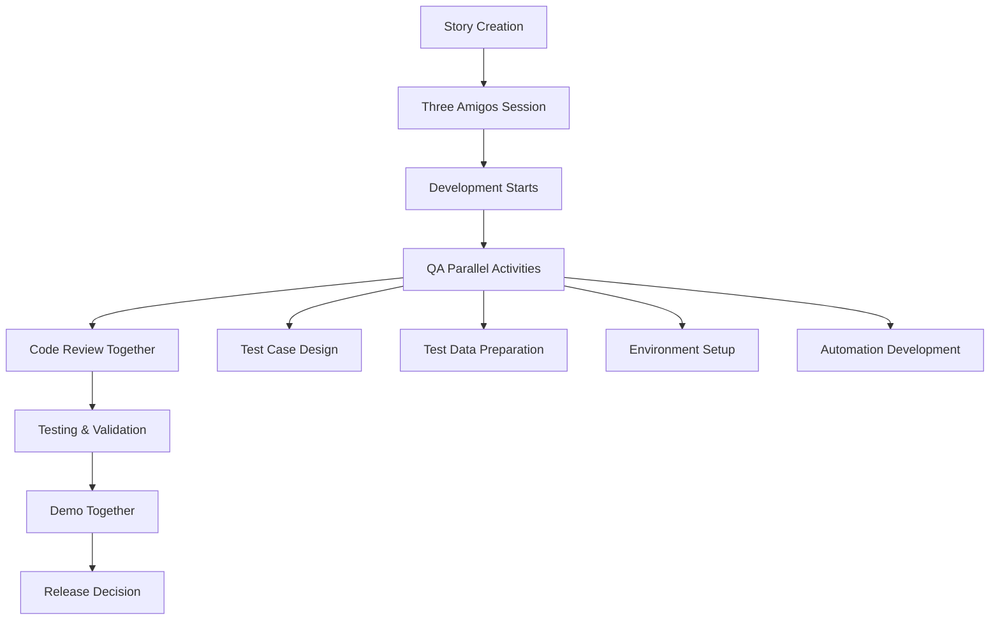

# 🤝 Team Collaboration Guide for QA Professionals

> Building bridges, not walls: Effective collaboration strategies for quality excellence

## 📋 Overview

### Purpose and Scope
This guide provides QA professionals with proven strategies for building effective relationships across all team roles, fostering collaborative quality ownership, and creating an environment where quality becomes everyone's responsibility rather than just QA's burden.

### Target Audience
- QA Engineers and Test Leads
- QA Managers and Directors
- Scrum Masters and Agile Coaches
- Development Team Leads
- Product Owners and Product Managers

### Key Benefits
- **Improved Quality Outcomes:** Shared responsibility leads to better results
- **Faster Delivery:** Reduced handoff delays and miscommunication
- **Enhanced Team Morale:** Collaborative environment reduces friction
- **Knowledge Sharing:** Cross-functional learning accelerates team growth
- **Sustainable Practices:** Long-term success through relationship building

## 🏛️ Fundamental Principles

### Core Collaboration Concepts
1. **Shared Ownership:** Quality is everyone's responsibility
2. **Transparent Communication:** Open, honest, and frequent dialogue
3. **Mutual Respect:** Valuing different perspectives and expertise
4. **Common Goals:** Aligning individual efforts with team objectives
5. **Continuous Learning:** Growing together through knowledge sharing

### The QA Collaboration Mindset
```markdown
## From Gatekeeper to Enabler

### Traditional QA Mindset
- "I find bugs and reject poor quality"
- "Testing happens after development"
- "QA is responsible for quality"
- "We validate what developers build"

### Collaborative QA Mindset
- "I help prevent bugs and enable quality"
- "Quality considerations happen throughout development"
- "Everyone is responsible for quality"
- "We build quality together from the start"
```

### Anti-Patterns to Avoid
❌ **Quality Police** - Enforcing rules without explaining value
❌ **Ivory Tower Testing** - Working in isolation from the team
❌ **Blame Game** - Pointing fingers instead of solving problems
❌ **Last-Minute Hero** - Only engaging when things go wrong
❌ **Technical Superiority** - Using knowledge to intimidate rather than educate

## 👥 Stakeholder-Specific Collaboration

### 1. Working with Developers

#### Building Developer Relationships

**Understanding Developer Perspectives:**
```markdown
## Developer Challenges QA Can Help Address

### Common Developer Pain Points
- Tight deadlines and pressure to deliver
- Complex technical requirements
- Changing specifications
- Debug difficult issues in testing
- Balance feature development with technical debt

### How QA Can Support
- Early involvement in requirement clarification
- Pair programming on complex features
- Providing clear, actionable bug reports
- Sharing user journey insights
- Collaborating on testable code design
```

**Effective Communication Strategies:**
```javascript
// ❌ Poor Bug Report
"Login doesn't work"

// ✅ Excellent Bug Report
{
  title: "Login fails with 500 error for users with special characters in email",
  severity: "High",
  environment: "QA Environment v2.1.3",
  steps: [
    "Navigate to /login",
    "Enter email: test+user@example.com",
    "Enter password: ValidPass123!",
    "Click 'Sign In' button"
  ],
  expected: "User successfully logged in and redirected to dashboard",
  actual: "500 Internal Server Error displayed",
  evidence: {
    screenshot: "login-error-screenshot.png",
    logs: "server-logs-excerpt.txt",
    networkTrace: "network-tab-export.har"
  },
  additionalInfo: {
    reproducibility: "100% with emails containing + character",
    impact: "Affects 15% of user base based on email patterns",
    workaround: "Users can login with alternate email format"
  }
}
```

#### Collaboration Techniques

**Pair Testing Sessions:**
```markdown
## Pair Testing with Developers

### Benefits
- Developer learns testing techniques
- QA understands implementation details
- Real-time issue resolution
- Knowledge transfer both ways

### Best Practices
1. **Rotate Partners:** Work with different developers regularly
2. **Set Clear Goals:** Define what you're exploring together
3. **Share Control:** Let both people drive and observe
4. **Document Insights:** Capture learnings for the team
5. **Follow Up:** Create action items and track progress

### Session Structure (90 minutes)
- **Setup (10 min):** Review feature and testing goals
- **Exploration (60 min):** Collaborative testing and discussion
- **Debrief (15 min):** Summarize findings and next steps
- **Follow-up (5 min):** Document and assign action items
```

**Code Review Collaboration:**
```markdown
## QA-Developer Code Review Partnership

### QA Brings to Reviews
- User journey perspective
- Edge case identification
- Testability assessment
- Risk analysis expertise

### Developers Bring to Reviews
- Technical implementation details
- Performance considerations
- Architecture understanding
- Framework-specific knowledge

### Collaborative Review Process
1. **Pre-Review Sync:** Quick discussion of changes and testing implications
2. **Independent Review:** Each person reviews with their perspective
3. **Joint Discussion:** Share findings and discuss solutions
4. **Consensus Building:** Agree on necessary changes
5. **Follow-up Testing:** QA validates implemented suggestions
```

#### Daily Collaboration Practices

**Standups and Sprint Activities:**
```markdown
## QA-Developer Daily Interactions

### Daily Standup Participation
- Share testing progress and blockers
- Highlight areas needing developer support
- Communicate test environment issues
- Coordinate on bug fixes and retesting

### Sprint Planning Collaboration
- Estimate testing effort for each story
- Identify testability requirements
- Plan testing approach and test data needs
- Discuss potential integration challenges

### Sprint Review Participation
- Demo testing activities and results
- Share quality metrics and insights
- Gather feedback on testing approach
- Celebrate collaborative successes
```

### 2. Product Owner Collaboration

#### Understanding Product Owner Needs

**Product Owner Perspectives:**
```markdown
## What Product Owners Value from QA

### Business Impact Focus
- Will this feature meet user needs?
- What's the risk of releasing now vs. later?
- How confident are we in the quality?
- What's the customer impact of any issues?

### Decision Support
- Clear risk assessment
- Data-driven quality insights
- Trade-off analysis
- Release readiness recommendations
```

**Effective PO Communication:**
```markdown
## Translating QA Insights for Product Owners

### ❌ Technical Focus
"We found 15 bugs in the payment module with 3 critical path failures"

### ✅ Business Impact Focus
"The payment feature has quality risks that could affect 20% of transactions,
potentially resulting in $50K daily revenue loss. We recommend addressing
the 3 critical issues before release, which would delay launch by 2 days
but reduce customer impact risk by 80%."

### ✅ Solution-Oriented Communication
"Here are three release options with different risk profiles:
1. Release now: High risk, potential customer impact
2. Fix critical issues (2 days): Low risk, minimal delay
3. Fix all issues (1 week): Very low risk, significant delay
I recommend option 2 based on our risk tolerance."
```

#### Collaboration Techniques

**Requirements Collaboration:**
```markdown
## QA-PO Requirements Partnership

### Three Amigos Sessions
- **Business Analyst/PO:** Defines business requirements
- **Developer:** Explains technical implementation approach
- **QA:** Identifies testing scenarios and acceptance criteria

### Session Outcomes
- Clear, testable acceptance criteria
- Identified edge cases and error scenarios
- Shared understanding of user journeys
- Risk assessment and mitigation strategies

### Example Collaboration
Story: "As a user, I want to reset my password"

**PO Perspective:** User needs quick, secure way to regain access
**Developer Perspective:** Secure token generation and email integration
**QA Perspective:** What happens with invalid emails, expired tokens, multiple requests?

**Collaborative Outcome:**
- Acceptance criteria includes security requirements
- Edge cases documented and addressed
- Test scenarios agreed upon upfront
- Success metrics defined
```

**Release Decision Support:**
```markdown
## Quality-Based Release Decisions

### Pre-Release Quality Dashboard
┌─────────────────────────────────────┐
│        Release Confidence           │
├─────────────────────────────────────┤
│ Overall Score: 85% ✅               │
│                                     │
│ Feature Completeness: 95% ✅        │
│ Test Coverage: 88% ✅               │
│ Critical Bugs: 0 ✅                 │
│ High Priority Bugs: 2 ⚠️           │
│ Performance: Within SLA ✅          │
│ Security: Passed ✅                 │
│                                     │
│ Recommendation: GO with monitoring  │
│ Risk Level: Low-Medium              │
└─────────────────────────────────────┘

### Risk Communication Template
**Feature:** User Payment Processing
**Quality Confidence:** 85%
**Key Risks:**
- 2 high-priority bugs affecting edge cases
- Impact: <5% of users, workarounds available
**Recommendation:** Proceed with enhanced monitoring
**Mitigation:** Hotfix plan ready, support team briefed
```

### 3. Stakeholder Communication

#### Executive and Management Communication

**Quality Metrics for Leadership:**
```markdown
## Executive Quality Dashboard

### Key Performance Indicators
- **Customer Satisfaction:** 4.2/5 (↑ from 3.8)
- **Production Incidents:** 2 this month (↓ from 8)
- **Release Velocity:** 2.3 releases/week (↑ from 1.5)
- **Quality Cost:** 18% of development cost (↓ from 25%)

### Strategic Impact
- **Competitive Advantage:** 99.9% uptime vs industry 99.5%
- **Customer Retention:** Quality improvements contributed to 15% retention increase
- **Market Expansion:** Quality confidence enabling faster feature rollouts
- **Technical Debt:** Reduced by 30% through preventive quality practices

### Investment ROI
- **Automation Investment:** $200K saved $800K in manual testing costs
- **Early Testing:** Prevented $1.2M in potential production issues
- **Team Efficiency:** 40% faster delivery through quality process improvements
```

**Executive Communication Template:**
```markdown
## Monthly Quality Report to Leadership

### Executive Summary
Quality initiatives delivered significant business value this quarter:
- Zero critical production incidents (target: <2)
- 99.95% system uptime (exceeded 99.9% SLA)
- $500K cost avoidance through early defect detection

### Strategic Highlights
1. **Customer Impact:** Quality improvements increased NPS by 12 points
2. **Operational Efficiency:** Automated testing reduced release cycle from 2 weeks to 3 days
3. **Risk Mitigation:** Prevented 2 potential security vulnerabilities pre-release
4. **Team Performance:** Cross-functional collaboration improved delivery speed by 35%

### Investment Requests
- **AI Testing Tools:** $150K investment with 6-month ROI
- **Performance Testing Infrastructure:** $75K for scalability confidence
- **Team Training:** $25K for advanced quality engineering skills

### Risks and Mitigation
- **Technical Debt:** 15% of sprint capacity allocated to prevention
- **Tool Modernization:** Planned upgrade to maintain competitive edge
- **Skills Gap:** Hiring plan for senior QA automation engineer
```

#### Cross-Functional Team Communication

**Agile Ceremony Participation:**
```markdown
## QA Value in Agile Ceremonies

### Sprint Planning
- **Contribution:** Testing effort estimation, risk identification
- **Value Add:** Prevent scope creep, ensure testability
- **Communication:** "This story will need 3 days testing including integration scenarios"

### Daily Standups
- **Contribution:** Testing progress, blockers, collaboration needs
- **Value Add:** Early warning system, team coordination
- **Communication:** "Payment testing blocked on test data; working with DevOps to resolve"

### Sprint Review
- **Contribution:** Quality demonstration, metrics sharing
- **Value Add:** Stakeholder confidence, transparency
- **Communication:** "Feature tested across 5 browsers with 98% pass rate; 1 minor UX issue noted"

### Retrospectives
- **Contribution:** Process improvement suggestions, quality insights
- **Value Add:** Continuous improvement, team learning
- **Communication:** "Pair testing sessions improved bug detection by 40%; suggest expanding"
```

## 🔄 Collaborative Processes & Workflows

### 1. Quality-Integrated Development Workflow



### 2. Bug Lifecycle Collaboration

```markdown
## Collaborative Bug Management

### Discovery Phase
- **QA:** Identifies and reproduces issue
- **Developer:** Available for immediate clarification
- **PO:** Provides business impact assessment

### Analysis Phase
- **QA:** Documents detailed steps and evidence
- **Developer:** Analyzes root cause
- **Team:** Discusses fix approach and impact

### Resolution Phase
- **Developer:** Implements fix
- **QA:** Validates fix and regression tests
- **PO:** Confirms business requirement met

### Verification Phase
- **QA:** Comprehensive testing
- **Developer:** Code review of fix
- **Team:** Release decision collaboration
```

### 3. Knowledge Sharing Workflows

**Regular Learning Sessions:**
```markdown
## Collaborative Learning Program

### Weekly Tech Talks (30 min)
- **Week 1:** Developer presents new framework features
- **Week 2:** QA shares testing technique or tool
- **Week 3:** PO discusses user feedback insights
- **Week 4:** Team retrospective on collaboration

### Monthly Deep Dives (60 min)
- **Cross-training:** QA learns code, Developers learn testing
- **Problem-solving:** Collaborative solution design
- **Innovation time:** Experiment with new approaches
- **Best practice sharing:** Success stories and lessons learned

### Quarterly Workshops (Half-day)
- **Quality strategy planning**
- **Process improvement sessions**
- **Tool evaluation and selection**
- **Team building and communication skills**
```

## 🛠️ Communication Tools & Techniques

### Digital Collaboration Tools

```markdown
## Tool Stack for Team Collaboration

### Real-time Communication
- **Slack/Teams:** Daily coordination, quick questions
- **Video Calls:** Pair sessions, complex discussions
- **Screen Sharing:** Bug reproduction, knowledge transfer

### Asynchronous Collaboration
- **JIRA/Azure DevOps:** Ticket collaboration, requirements tracking
- **Confluence/Notion:** Documentation, process sharing
- **GitHub/GitLab:** Code review, pull request discussions

### Specialized QA Tools
- **TestRail/Xray:** Test case collaboration and review
- **Bug tracking:** Shared bug lifecycle management
- **Test Automation:** Collaborative automation development
- **Reporting:** Shared dashboards and metrics
```

### Communication Templates

**Daily Standup Template:**
```markdown
## QA Standup Communication

### Yesterday's Accomplishments
- Completed testing for user authentication feature
- Found and reported 2 issues in payment flow
- Pair tested with [Developer] on search functionality

### Today's Plans
- Verify fixes for authentication issues
- Begin testing checkout process integration
- Review automation test coverage for new features

### Blockers/Support Needed
- Need staging environment refresh for realistic testing
- Require clarification on mobile app behavior spec
- Would benefit from [Developer] walkthrough of API changes

### Collaboration Opportunities
- Available for pair testing on complex integration scenarios
- Can demo testing approaches to team if helpful
- Offering automation training session for interested developers
```

**Bug Report Communication:**
```markdown
## Collaborative Bug Report Template

### Bug Summary
**Title:** Clear, specific description
**Severity:** Business impact assessment
**Priority:** Release impact consideration

### Technical Details
**Environment:** Testing context
**Steps to Reproduce:** Clear instructions
**Expected vs Actual:** Behavioral comparison
**Evidence:** Screenshots, logs, recordings

### Collaboration Information
**Impact Analysis:** Who/what is affected
**Business Context:** User journey impact
**Suggested Solution:** If apparent from testing
**Testing Notes:** Additional scenarios to consider

### Developer Support
**Available for:** Live reproduction, clarification
**Timeline:** Urgency and testing schedule
**Related Work:** Connected features or changes
```

## 🎯 Conflict Resolution & Problem Solving

### Common Collaboration Challenges

#### Challenge 1: Quality vs. Speed Tension
```markdown
## Scenario: Pressure to Skip Testing

### Situation
"We need to release this feature tomorrow for the demo.
Can we skip some testing to save time?"

### QA Response Strategy
1. **Acknowledge the pressure:** "I understand the demo is critical"
2. **Assess real risk:** "Let me identify the minimum testing needed"
3. **Propose alternatives:** "We can do core path testing in 4 hours"
4. **Offer collaboration:** "I can pair with dev to test while coding"
5. **Document decisions:** "Let's document what we're deferring"

### Collaborative Solution
- Focus testing on demo scenarios
- Create quick regression test for core paths
- Plan comprehensive testing post-demo
- Have developer and QA test together
- Document risks and mitigation plan
```

#### Challenge 2: Disagreement on Bug Severity
```markdown
## Scenario: Severity Disagreement

### Situation
QA: "This is a critical bug - users can't complete checkout"
Developer: "It's minor - only affects a specific browser version"

### Resolution Approach
1. **Gather data:** Usage statistics for affected browser
2. **Business impact:** Revenue impact calculation
3. **User experience:** Customer journey disruption assessment
4. **Technical effort:** Fix complexity and risk evaluation
5. **Stakeholder input:** Product owner decision support

### Collaborative Decision Framework
- **Data-driven discussion:** Facts, not opinions
- **Multiple perspectives:** Technical, business, user viewpoints
- **Risk assessment:** Probability × Impact analysis
- **Solution options:** Fix now, workaround, defer with monitoring
- **Consensus building:** Agreement on approach and timeline
```

#### Challenge 3: Communication Breakdown
```markdown
## Scenario: Team Communication Issues

### Warning Signs
- Information silos forming
- Repeated misunderstandings
- Blame assignments increasing
- Quality issues escalating

### Intervention Strategies
1. **Team Health Check:** Anonymous feedback collection
2. **Process Review:** Identify communication gaps
3. **Facilitated Discussion:** Neutral party guides conversation
4. **Improved Practices:** New communication protocols
5. **Regular Check-ins:** Monitor improvement progress

### Prevention Measures
- **Clear roles and responsibilities**
- **Regular retrospectives**
- **Open feedback culture**
- **Conflict resolution training**
- **Team building activities**
```

## 📊 Measuring Collaboration Success

### Collaboration Metrics

```markdown
## Team Collaboration Health Dashboard

### Communication Metrics
- **Cross-team interactions:** 25 per week (target: 20+)
- **Pair programming sessions:** 8 per sprint (target: 6+)
- **Knowledge sharing events:** 3 per month (target: 2+)
- **Collaborative problem solving:** 12 instances (target: 10+)

### Quality Outcomes
- **Defect detection in development:** 60% (up from 40%)
- **Rework cycles:** 1.2 per story (down from 2.1)
- **Release confidence:** 92% (up from 78%)
- **Customer satisfaction:** 4.3/5 (up from 3.9)

### Team Health Indicators
- **Team satisfaction score:** 8.5/10
- **Cross-functional knowledge:** 75% coverage
- **Conflict resolution time:** <2 days average
- **Innovation proposals:** 5 per quarter from QA
```

### Success Stories Tracking

```markdown
## Collaboration Success Examples

### Prevented Production Issue
**Situation:** QA-Developer pair testing found integration issue
**Impact:** Prevented potential 4-hour outage
**Collaboration:** Real-time problem-solving, shared ownership
**Learning:** Expanded pair testing to all critical integrations

### Improved Feature Design
**Situation:** QA user journey insights improved UI design
**Impact:** 15% increase in feature adoption
**Collaboration:** QA-PO-UX team workshop
**Learning:** Include QA in all design reviews

### Accelerated Delivery
**Situation:** Parallel development and testing approach
**Impact:** 30% reduction in delivery time
**Collaboration:** Developer-QA sprint planning
**Learning:** Made parallel work the default approach
```

## 🚀 Advanced Collaboration Techniques

### Innovation and Experimentation

```markdown
## Collaborative Innovation Program

### Monthly Innovation Time
- **20% Time:** Team members explore quality improvements
- **Cross-training:** QA learns development, developers learn testing
- **Proof of Concepts:** Test new tools and approaches together
- **Knowledge Sharing:** Present findings to broader team

### Experimentation Framework
1. **Hypothesis:** What do we think will improve quality/speed?
2. **Design:** How will we test this assumption?
3. **Execute:** Run controlled experiment
4. **Measure:** Collect data on impact
5. **Decide:** Adopt, adapt, or abandon approach

### Innovation Examples
- **AI-Assisted Testing:** Developer-QA team explores automated test generation
- **Performance Optimization:** Joint investigation of bottlenecks
- **User Experience Testing:** Collaborative usability research
- **Process Automation:** Team-designed workflow improvements
```

### Scaling Collaboration

```markdown
## Scaling Quality Collaboration

### Team Level (5-10 people)
- Daily standups with quality focus
- Sprint retrospectives on collaboration
- Regular pair programming and testing
- Shared quality goals and metrics

### Department Level (20-50 people)
- Quality champions network
- Cross-team knowledge sharing
- Standardized collaboration practices
- Quality community of practice

### Organization Level (100+ people)
- Quality engineering culture
- Executive quality sponsorship
- Quality metrics in business reviews
- Investment in collaboration tools and training
```

## 📋 Quick Reference Guides

### Collaboration Checklist

```markdown
## Daily Collaboration Checklist

### Morning
- [ ] Check team chat for overnight issues
- [ ] Review today's development commits
- [ ] Identify collaboration opportunities
- [ ] Plan pair testing or review sessions

### Throughout Day
- [ ] Participate actively in standups
- [ ] Respond promptly to questions/requests
- [ ] Share discoveries and insights immediately
- [ ] Offer help proactively, not just when asked

### End of Day
- [ ] Update shared dashboards and metrics
- [ ] Communicate tomorrow's priorities
- [ ] Document important discoveries or decisions
- [ ] Plan next day's collaboration activities
```

### Communication Guidelines

```markdown
## QA Communication Best Practices

### Written Communication
- **Be specific:** Include details, examples, evidence
- **Be timely:** Respond within agreed timeframes
- **Be helpful:** Suggest solutions, not just problems
- **Be respectful:** Professional tone, assume positive intent

### Verbal Communication
- **Listen actively:** Understand before seeking to be understood
- **Ask questions:** Clarify rather than assume
- **Share context:** Help others understand your perspective
- **Be concise:** Respect others' time and attention

### Documentation
- **Keep it current:** Update as processes evolve
- **Make it accessible:** Easy to find and understand
- **Include examples:** Concrete illustrations of concepts
- **Get feedback:** Ensure it serves the intended audience
```

### Relationship Building

```markdown
## Building Strong Team Relationships

### With Developers
- Learn about their technical challenges
- Share user journey insights
- Collaborate on code reviews
- Celebrate technical achievements

### With Product Owners
- Understand business priorities
- Translate quality into business impact
- Support decision-making with data
- Align testing with business goals

### With Stakeholders
- Communicate in business terms
- Provide confident quality assessments
- Be transparent about risks
- Deliver on commitments consistently
```

---

## 🎯 Key Takeaways

1. **Collaboration is a Skill** - It requires intentional practice and development
2. **Quality is Shared** - Success comes from team ownership, not individual heroics
3. **Communication is Key** - Clear, frequent, respectful dialogue builds trust
4. **Different Perspectives Add Value** - Diverse viewpoints create better solutions
5. **Relationships Enable Success** - Strong partnerships accelerate quality outcomes
6. **Continuous Improvement** - Collaboration practices must evolve with the team
7. **Measure and Adjust** - Track collaboration health and adapt approaches

---

*"The strength of the team is each individual member. The strength of each member is the team."*

**Remember:** Great software is built by great teams working together, not great individuals working alone. Your role as a QA professional is not just to ensure quality—it's to enable quality through collaboration.