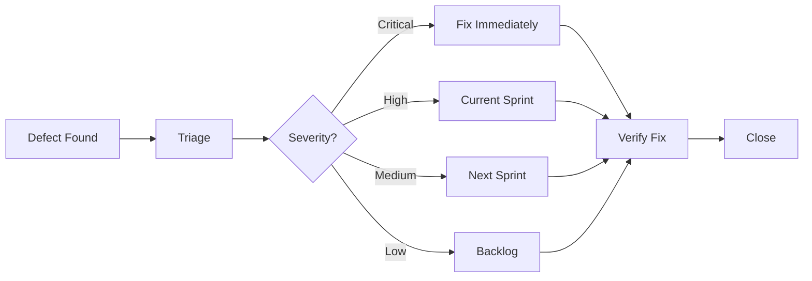
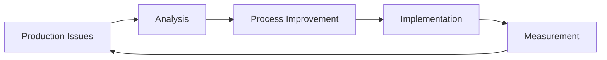

# 🔄 SDLC Testing Best Practices

> Integrating quality excellence throughout the Software Development Lifecycle

## 📋 Overview

### Purpose and Scope
This guide provides comprehensive best practices for integrating testing activities throughout every phase of the Software Development Lifecycle (SDLC). It enables QA professionals to shift left, prevent defects, and ensure quality is built into the product from conception to retirement.

### Target Audience
- QA Engineers and Test Managers
- Development Team Leads
- Product Owners and Business Analysts
- DevOps Engineers
- Project Managers

### Key Benefits
- **Early Defect Detection:** Catch issues when they're cheapest to fix
- **Reduced Time-to-Market:** Parallel development and testing activities
- **Higher Quality Products:** Quality built-in, not inspected out
- **Better Team Collaboration:** Shared responsibility for quality
- **Cost Optimization:** Prevention costs less than detection and correction

## 🏛️ Fundamental Principles

### Core Concepts
1. **Shift-Left Testing:** Start testing activities as early as possible
2. **Continuous Testing:** Testing is ongoing, not a phase
3. **Quality Gates:** Defined criteria for advancing between phases
4. **Risk-Based Approach:** Focus effort where it matters most
5. **Collaborative Quality:** Entire team owns quality outcomes

### Industry Standards
- IEEE 829 (Test Documentation Standards)
- ISO/IEC 25010 (Software Quality Model)
- ISTQB Guidelines
- Agile Testing Manifesto
- DevOps Quality Practices

### Common Anti-Patterns to Avoid
❌ **Testing only at the end**
❌ **QA as a separate, isolated phase**
❌ **No quality criteria for phase transitions**
❌ **Testing without understanding requirements**
❌ **Manual testing everything**
❌ **No test environment strategy**

## 📊 SDLC Phases & Testing Integration

### Phase 1: Requirements & Planning

#### 🎯 Testing Objectives
- Ensure testable requirements
- Identify quality risks early
- Plan test strategy and approach
- Establish quality criteria

#### 🔍 Key Activities

**Requirements Review & Analysis:**
```markdown
## Requirements Testing Checklist

### Completeness
- [ ] All functional requirements documented
- [ ] Non-functional requirements specified
- [ ] Acceptance criteria defined
- [ ] Edge cases and exceptions covered

### Clarity & Testability
- [ ] Requirements are unambiguous
- [ ] Measurable success criteria exist
- [ ] Test scenarios can be derived
- [ ] Dependencies clearly identified

### Quality Attributes
- [ ] Performance requirements specified
- [ ] Security requirements documented
- [ ] Usability criteria defined
- [ ] Compatibility requirements listed
```

**Risk Assessment Framework:**
```markdown
## Risk Analysis Matrix

| Risk Factor | Probability (1-5) | Impact (1-5) | Risk Score | Mitigation Strategy |
|-------------|-------------------|--------------|------------|-------------------|
| Complex Integration | 4 | 5 | 20 | Prototype early, incremental testing |
| New Technology | 3 | 4 | 12 | Spike testing, training |
| Tight Timeline | 5 | 3 | 15 | Automated testing priority |
| External Dependencies | 3 | 4 | 12 | Service mocking, contract testing |
```

**Test Strategy Development:**
- Define test levels (Unit, Integration, System, UAT)
- Select testing types based on risk assessment
- Plan automation approach
- Identify test environments needed
- Estimate test effort and timeline

#### 📋 Deliverables
- ✅ Requirements Review Report
- ✅ Test Strategy Document
- ✅ Risk Assessment Matrix
- ✅ Test Estimation
- ✅ Quality Plan

---

### Phase 2: Design & Architecture

#### 🎯 Testing Objectives
- Validate architectural decisions
- Ensure design supports testability
- Plan test automation architecture
- Design test data strategy

#### 🔍 Key Activities

**Design Review Participation:**
```markdown
## Design Review Checklist for QA

### Testability Assessment
- [ ] Components are loosely coupled
- [ ] Clear interfaces defined
- [ ] Error handling designed
- [ ] Logging and monitoring planned

### Test Architecture Planning
- [ ] Test automation strategy defined
- [ ] Test environments planned
- [ ] Test data approach designed
- [ ] CI/CD integration considered

### Quality Attributes Design
- [ ] Performance requirements addressed
- [ ] Security controls designed
- [ ] Accessibility considerations included
- [ ] Scalability factors planned
```

**Test Environment Planning:**
```markdown
## Test Environment Strategy

### Environment Tiers
| Environment | Purpose | Data | Refresh | Access |
|-------------|---------|------|---------|--------|
| DEV | Development testing | Synthetic | Daily | Dev Team |
| QA | Functional testing | Subset | Weekly | QA Team |
| STAGE | Pre-production | Production-like | Release | Stakeholders |
| PROD | Live monitoring | Real | N/A | Limited |

### Infrastructure Requirements
- Server specifications per environment
- Database setup and configuration
- Network access and security
- Monitoring and logging setup
```

**Test Automation Architecture:**
```markdown
## Automation Framework Design

### Layer Architecture
```
┌─────────────────────────┐
│     Test Scripts        │
├─────────────────────────┤
│     Page Objects        │
├─────────────────────────┤
│     Common Utilities    │
├─────────────────────────┤
│     Configuration       │
└─────────────────────────┘
```

### Framework Components
- Test runner configuration
- Reporting mechanisms
- Data management
- Cross-browser support
- Parallel execution capability
```

#### 📋 Deliverables
- ✅ Design Review Sign-off
- ✅ Test Environment Plan
- ✅ Test Automation Architecture
- ✅ Test Data Strategy
- ✅ Non-Functional Test Plan

---

### Phase 3: Development & Implementation

#### 🎯 Testing Objectives
- Support developers with testing guidance
- Implement test automation in parallel
- Conduct continuous integration testing
- Maintain quality feedback loops

#### 🔍 Key Activities

**Developer Collaboration:**
```markdown
## Development Phase QA Activities

### Daily Activities
- [ ] Participate in daily standups
- [ ] Review code commits for testability
- [ ] Support unit test development
- [ ] Validate story completion criteria

### Weekly Activities
- [ ] Demo test automation progress
- [ ] Review sprint testing goals
- [ ] Update test documentation
- [ ] Assess risk and quality metrics
```

**Test-Driven Development Support:**
```javascript
// Example: TDD Cycle Support
describe('User Registration', () => {
  // Red: Write failing test first
  it('should create user with valid data', () => {
    const userData = { email: 'test@example.com', password: 'Test123!' };
    const result = userService.createUser(userData);
    expect(result.success).toBe(true);
    expect(result.user.id).toBeDefined();
  });

  // Green: Implement minimal code to pass
  // Refactor: Improve code quality
});
```

**Continuous Integration Testing:**
```yaml
# CI Pipeline Integration
stages:
  - validate:
      - lint
      - security-scan
      - unit-tests

  - build:
      - compile
      - package
      - docker-build

  - test:
      - integration-tests
      - component-tests
      - contract-tests

  - quality-gate:
      - coverage-check (>80%)
      - performance-baseline
      - security-validation
```

**Automation Implementation:**
```markdown
## Automation Development Approach

### Sprint Planning
1. Identify automatable scenarios
2. Prioritize based on risk and frequency
3. Estimate automation effort
4. Plan parallel development

### Implementation Strategy
- Page Object Model for UI tests
- API-first testing approach
- Data-driven test design
- Maintainable test architecture
```

#### 📋 Deliverables
- ✅ Automated Test Suite (Growing)
- ✅ CI/CD Integration
- ✅ Test Execution Reports
- ✅ Code Review Feedback
- ✅ Sprint Test Summary

---

### Phase 4: System Testing & Integration

#### 🎯 Testing Objectives
- Validate complete system functionality
- Verify non-functional requirements
- Execute comprehensive test scenarios
- Prepare for production deployment

#### 🔍 Key Activities

**Comprehensive Test Execution:**
```markdown
## System Testing Checklist

### Functional Testing
- [ ] End-to-end user workflows
- [ ] Integration between components
- [ ] Data flow validation
- [ ] Error handling scenarios

### Non-Functional Testing
- [ ] Performance testing (load, stress, volume)
- [ ] Security testing (authentication, authorization)
- [ ] Usability testing
- [ ] Compatibility testing (browsers, devices)

### Regression Testing
- [ ] Automated regression suite execution
- [ ] Manual exploratory testing
- [ ] Bug fix verification
- [ ] Performance regression checks
```

**Test Management:**
```markdown
## Test Execution Tracking

### Daily Metrics
- Test cases executed: 125/150 (83%)
- Pass rate: 118/125 (94%)
- Defects found: 7 (2 Critical, 3 High, 2 Medium)
- Automation coverage: 78%

### Weekly Reports
- Overall progress vs. plan
- Quality trends and analysis
- Risk assessment updates
- Resource utilization
```

**Defect Management Process:**


#### 📋 Deliverables
- ✅ Test Execution Report
- ✅ Defect Report & Analysis
- ✅ Performance Test Results
- ✅ Security Test Report
- ✅ Go/No-Go Recommendation

---

### Phase 5: User Acceptance Testing (UAT)

#### 🎯 Testing Objectives
- Validate business requirements fulfillment
- Ensure user satisfaction and usability
- Confirm production readiness
- Obtain stakeholder sign-off

#### 🔍 Key Activities

**UAT Preparation:**
```markdown
## UAT Readiness Checklist

### Environment Setup
- [ ] UAT environment configured
- [ ] Production-like data loaded
- [ ] User accounts created and tested
- [ ] Training materials prepared

### Test Scenarios
- [ ] Business workflows documented
- [ ] Acceptance criteria mapped
- [ ] Test data prepared
- [ ] Success criteria defined
```

**Stakeholder Collaboration:**
```markdown
## UAT Execution Framework

### Roles & Responsibilities
- **Business Users:** Execute real-world scenarios
- **Product Owner:** Validate acceptance criteria
- **QA:** Facilitate testing, document issues
- **Development:** Support and fix critical issues

### Communication Plan
- Daily: UAT status updates
- Weekly: Stakeholder review meetings
- Issues: Immediate escalation for blockers
- Final: Go-live readiness assessment
```

**Production Readiness Assessment:**
```markdown
## Production Readiness Criteria

### Technical Readiness
- [ ] All critical defects resolved
- [ ] Performance benchmarks met
- [ ] Security requirements validated
- [ ] Disaster recovery tested

### Business Readiness
- [ ] User training completed
- [ ] Support documentation ready
- [ ] Business processes updated
- [ ] Rollback plan prepared
```

#### 📋 Deliverables
- ✅ UAT Test Results
- ✅ Business Sign-off
- ✅ Production Readiness Report
- ✅ Known Issues Documentation
- ✅ Go-Live Approval

---

### Phase 6: Deployment & Production

#### 🎯 Testing Objectives
- Validate successful deployment
- Monitor production health
- Ensure smooth transition
- Establish production testing practices

#### 🔍 Key Activities

**Deployment Validation:**
```markdown
## Deployment Testing Checklist

### Smoke Testing
- [ ] Application starts successfully
- [ ] Core functionality accessible
- [ ] Database connectivity verified
- [ ] Integration points working

### Production Verification
- [ ] User authentication working
- [ ] Critical business workflows functional
- [ ] Performance within SLA
- [ ] Monitoring and alerting active
```

**Production Monitoring Setup:**
```yaml
# Production Monitoring Configuration
monitoring:
  health_checks:
    - endpoint: /health
      frequency: 30s
      timeout: 5s

  performance_metrics:
    - response_time_p95: <500ms
    - error_rate: <0.1%
    - availability: >99.9%

  business_metrics:
    - user_registrations: track
    - transaction_volume: track
    - feature_usage: track
```

**Production Testing Practices:**
```markdown
## Production Testing Strategy

### Continuous Monitoring
- Real User Monitoring (RUM)
- Synthetic transaction monitoring
- Performance baseline tracking
- Error rate monitoring

### Safe Testing Practices
- Feature flags for gradual rollout
- Canary deployments
- A/B testing framework
- Blue-green deployment validation
```

#### 📋 Deliverables
- ✅ Deployment Verification Report
- ✅ Production Monitoring Setup
- ✅ Post-Deployment Summary
- ✅ Lessons Learned Document
- ✅ Handover to Support

---

### Phase 7: Maintenance & Evolution

#### 🎯 Testing Objectives
- Maintain production quality
- Support ongoing enhancements
- Evolve testing practices
- Continuous improvement

#### 🔍 Key Activities

**Ongoing Quality Assurance:**
```markdown
## Maintenance Phase Testing

### Regular Activities
- [ ] Production incident analysis
- [ ] Test suite maintenance and updates
- [ ] Performance trend analysis
- [ ] Security vulnerability assessments

### Continuous Improvement
- [ ] Test process optimization
- [ ] Automation expansion
- [ ] Team skill development
- [ ] Tool and technology updates
```

**Feedback Loop Implementation:**


## 🛠️ Tools and Technologies

### Testing Tools by Phase

| Phase | Category | Recommended Tools |
|-------|----------|-------------------|
| **Requirements** | Analysis | JIRA, Confluence, Miro |
| **Design** | Modeling | Lucidchart, Draw.io |
| **Development** | Unit Testing | Jest, NUnit, JUnit |
| **Integration** | API Testing | Postman, REST Assured |
| **System** | UI Testing | Playwright, Selenium |
| **Performance** | Load Testing | K6, JMeter |
| **Security** | Sec Testing | OWASP ZAP, SonarQube |
| **Production** | Monitoring | Datadog, New Relic |

### CI/CD Integration Tools
```yaml
# Tool Integration Example
pipeline:
  quality_gates:
    - stage: "commit"
      tools: [sonarqube, eslint]
    - stage: "build"
      tools: [unit_tests, security_scan]
    - stage: "deploy"
      tools: [integration_tests, smoke_tests]
    - stage: "production"
      tools: [monitoring, alerts]
```

## 🚨 Common Challenges & Solutions

### Challenge 1: Late Testing Discovery
**Problem:** Issues found late in SDLC are expensive to fix
**Solution:**
- Implement shift-left testing practices
- Create quality gates between phases
- Use static analysis and early validation
- Involve QA in requirements and design phases

### Challenge 2: Inadequate Test Environments
**Problem:** Test environments don't match production
**Solution:**
- Infrastructure as Code (IaC) approach
- Environment parity across all stages
- Automated environment provisioning
- Regular environment refresh cycles

### Challenge 3: Poor Communication
**Problem:** Misalignment between teams and stakeholders
**Solution:**
- Daily quality standups
- Shared quality dashboards
- Regular demo and review sessions
- Clear escalation procedures

### Challenge 4: Technical Debt in Testing
**Problem:** Test maintenance becomes overwhelming
**Solution:**
- Regular test suite health checks
- Refactoring automation code
- Removing obsolete tests
- Improving test design patterns

## 📊 Metrics and Measurement

### Quality Metrics by Phase

```markdown
## SDLC Quality Dashboard

### Requirements Phase
- Requirements review coverage: 100%
- Testability score: 8.5/10
- Risk identification: 15 risks catalogued

### Development Phase
- Unit test coverage: 85%
- Code review participation: 100%
- Defect injection rate: 0.5 per day

### Testing Phase
- Test execution rate: 95%
- Defect detection efficiency: 90%
- Automation coverage: 75%

### Production Phase
- Deployment success rate: 98%
- Production incident rate: 0.1%
- Mean time to recovery: 2 hours
```

### KPIs to Track

| Metric | Formula | Target | Frequency |
|--------|---------|--------|-----------|
| **Defect Escape Rate** | Production bugs / Total bugs × 100 | under 5% | Weekly |
| **Test Coverage** | Covered requirements / Total × 100 | over 80% | Daily |
| **Automation ROI** | Time saved / Investment × 100 | over 200% | Monthly |
| **MTTR** | Σ Recovery time / Incidents | under 2 hours | Weekly |

## 🚀 Advanced Topics

### DevOps Integration
- Continuous testing in pipelines
- Infrastructure testing practices
- Configuration management testing
- Container and microservices testing

### AI/ML in Testing
- Intelligent test generation
- Predictive defect analysis
- Self-healing test automation
- Risk-based test selection

### Future Trends
- Shift-right testing practices
- Chaos engineering adoption
- API-first testing approaches
- Cloud-native testing strategies

## 📋 Quick Reference

### Phase Transition Checklist
```markdown
## Ready to Move Forward?

### From Requirements to Design
- [ ] All requirements reviewed and approved
- [ ] Test strategy approved
- [ ] Risks identified and mitigated
- [ ] Quality criteria established

### From Design to Development
- [ ] Architecture reviewed for testability
- [ ] Test environments planned
- [ ] Automation approach defined
- [ ] Non-functional requirements specified

### From Development to Testing
- [ ] Code complete and reviewed
- [ ] Unit tests written and passing
- [ ] CI/CD pipeline functional
- [ ] Test environment ready

### From Testing to UAT
- [ ] System testing completed
- [ ] Critical defects resolved
- [ ] Performance validated
- [ ] Documentation updated

### From UAT to Production
- [ ] Business acceptance received
- [ ] Production environment verified
- [ ] Rollback plan tested
- [ ] Support team trained
```

### Emergency Procedures
```markdown
## Production Issue Response

### Immediate Actions (0-15 minutes)
1. Assess impact and severity
2. Implement immediate workaround if available
3. Notify stakeholders
4. Begin root cause analysis

### Short-term Actions (15-60 minutes)
1. Deploy hotfix if ready
2. Update monitoring and alerts
3. Communicate status to users
4. Document timeline and actions

### Long-term Actions (1+ hours)
1. Complete root cause analysis
2. Implement permanent fix
3. Update processes to prevent recurrence
4. Conduct post-mortem review
```

---

## 🎯 Key Takeaways

1. **Quality is Everyone's Responsibility** - Not just QA's job
2. **Shift-Left for Maximum Impact** - Early involvement saves time and money
3. **Continuous Testing Mindset** - Testing happens throughout, not at the end
4. **Risk-Based Prioritization** - Focus effort where it matters most
5. **Metrics Drive Improvement** - Measure what matters and act on insights
6. **Collaboration is Critical** - Success depends on team communication
7. **Automation Enables Speed** - But strategy determines success

---

*"Quality is not an act, it is a habit. Excellence in SDLC testing comes from consistently applying these practices across every phase of development."*

**Remember:** The goal isn't perfect software—it's software that perfectly serves its users while meeting business objectives within acceptable risk levels.